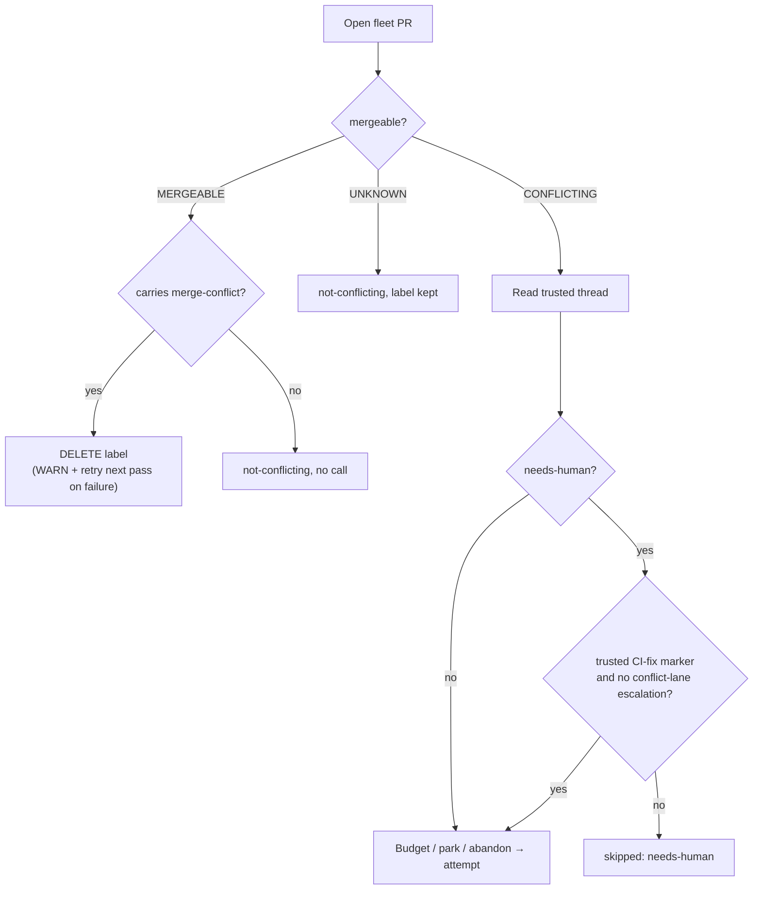

# PR Summary — Issue #2728

## Summary

The merge-conflict scan now resolves conflicts on a fleet PR whose
`needs-human` came from the fleet's own CI-fix escalation. It also clears a
stale `merge-conflict` label from any PR that GitHub reports as `MERGEABLE`.
Closes #2728 (part of #2683).

On GRQ-AutoTrader#1492, `decidePr` skipped the PR at the `needs-human` gate.
A PR that had stopped conflicting returned `not-conflicting` before any label
was read, so its stale label was never removed.

- **`lib/conflict_needs_human_gate.ts`** (new): `isCiFixEscalationOnly` looks
  only at trusted (fleet-authored) comments. It returns `true` when a comment
  carries a well-formed `vibe-ci-fix-attempt` marker and no comment carries the
  conflict lane's own `needs-human-escalation: merge-conflict-…` dedup marker.
  The marker prefix comes from the live `buildDedupMarker`, and the module
  fails loudly if that format changes.
- **`lib/pr_merge_conflict_scan.ts`**:
  - The `needs-human` check now runs after the trusted thread is read, and the
    gate above lets the PR through. The budget, disruption bound, park and
    abandon rungs apply unchanged.
  - On `MERGEABLE` only, `clearStaleConflictLabel` removes `merge-conflict` if
    the label is present. It reads labels from the listing, and falls back to
    `fetchPrLabels` only when the listing has none. A failed DELETE is logged
    as a WARN and retried on the next pass; it is not a scan error.
  - `PR_FIELDS` gains `labels`.
- **`lib/pr_maintenance.ts`**: `labels` is added to `PR_MAINTENANCE_LIST_FIELDS`
  and `labels?` to `PrEntry`.
- **Docs**: `docs/workflows/merge-conflicts.md` updates:
  - the scope exception;
  - a "stale label is cleared" paragraph;
  - the `not-conflicting` and `needs-human` rows of the reason table.
- **`docs/audits/lib-sweep-coverage.json`**: registers the new module.

## Evidence

- `worker/deno/tests/pr_merge_conflict_scan_test.ts` has 9 new
  `findConflictingPr` tests for Issue #2728. Together they cover:
  - the resolve path;
  - the no-marker, outsider-marker and own-escalation skips;
  - label clearing, via both the listing and the fallback read;
  - no DELETE when the label is absent;
  - `UNKNOWN` keeping its label;
  - a failed DELETE that lets the pass continue.
- `worker/deno/tests/conflict_needs_human_gate_test.ts` has 5 unit tests for
  `isCiFixEscalationOnly`.

## Reproduction

- **symptom** — the merge-conflict scan skipped a conflicting fleet PR as
  `needs-human` even when that label came only from the fleet's own CI-fix
  escalation, and it never cleared a stale `merge-conflict` label from a PR
  GitHub reported as `MERGEABLE` (seen on GRQ-AutoTrader#1492).
- **status** — `verified` — the regression tests were observed failing
  against the unfixed code and passing after the fix (details below).
- **regression test** —
  `tests/pr_merge_conflict_scan_test.ts::findConflictingPr - resolves a needs-human PR the CI-fix lane escalated (Issue #2728)`
  and
  `tests/pr_merge_conflict_scan_test.ts::findConflictingPr - clears a stale merge-conflict label from a mergeable PR (Issue #2728)`
- **Before (red):** `lib/pr_merge_conflict_scan.ts` and `lib/pr_maintenance.ts`
  were restored to `origin/main`. Then
  `deno task test:unit tests/pr_merge_conflict_scan_test.ts` ran:
  `76 passed | 4 failed`. The four failures were:
  - `resolves a needs-human PR the CI-fix lane escalated`: skipped as
    `needs-human`.
  - `clears a stale merge-conflict label from a mergeable PR`: no DELETE.
  - `reads the stale label from the listing when it carries labels`: no DELETE.
  - `a failed label DELETE is logged and the pass continues`: no WARN.
- **After (green):** with the fix in place, the same file passes
  `80 passed | 0 failed`.
- The skip-preservation tests (no marker, outsider marker, own escalation,
  no-label, `UNKNOWN`) pass both before and after the fix, by design: they pin
  behaviour the fix must not change.

## Acceptance Criteria

<!-- vibe-spec-review inputs="diff+issue-body" -->

- **met** — A conflicting fleet PR carrying `needs-human` and a trusted comment with a `vibe-ci-fix-attempt` marker is selected for resolution, not skipped — evidence: `worker/deno/lib/pr_merge_conflict_scan.ts:1636`, `worker/deno/lib/conflict_needs_human_gate.ts:50`, `tests/pr_merge_conflict_scan_test.ts::findConflictingPr - resolves a needs-human PR the CI-fix lane escalated (Issue #2728)` — reviewer: met
- **met** — A conflicting fleet PR carrying `needs-human` and no fleet CI-fix marker is still skipped with `kind: "needs-human"` — evidence: `tests/pr_merge_conflict_scan_test.ts::findConflictingPr - a needs-human PR with no CI-fix marker is still skipped (Issue #2728)`, `tests/conflict_needs_human_gate_test.ts::isCiFixEscalationOnly - no CI-fix marker keeps the skip` — reviewer: met
- **met** — The same PR, with the marker only in a comment from a non-fleet login, is still skipped — evidence: `tests/pr_merge_conflict_scan_test.ts::findConflictingPr - a CI-fix marker from an outsider does not lift the skip (Issue #2728)` — reviewer: met
- **met** — A conflicting PR whose `needs-human` came from the conflict lane's own escalation is still skipped — evidence: every conflict-lane escalation key opens `merge-conflict-` (`pr_merge_conflict_processor.ts:2439`, `conflict_abandon_restart.ts:637`, `pr_merge_conflict_scan.ts:1867`); `tests/pr_merge_conflict_scan_test.ts::findConflictingPr - the conflict lane's own escalation keeps the skip (Issue #2728)`, `tests/conflict_needs_human_gate_test.ts::isCiFixEscalationOnly - the conflict lane's own escalation keeps the skip` — reviewer: met
- **met** — A `MERGEABLE` PR carrying both `merge-conflict` and `needs-human` has `merge-conflict` removed after one pass — evidence: `worker/deno/lib/pr_merge_conflict_scan.ts:875`, `tests/pr_merge_conflict_scan_test.ts::findConflictingPr - clears a stale merge-conflict label from a mergeable PR (Issue #2728)`, `tests/pr_merge_conflict_scan_test.ts::findConflictingPr - reads the stale label from the listing when it carries labels (Issue #2728)` — reviewer: met
- **met** — A `MERGEABLE` PR without the label makes no DELETE call, and an `UNKNOWN` PR keeps its label — evidence: `tests/pr_merge_conflict_scan_test.ts::findConflictingPr - a mergeable PR without the label issues no DELETE (Issue #2728)`, `tests/pr_merge_conflict_scan_test.ts::findConflictingPr - an UNKNOWN PR keeps its merge-conflict label (Issue #2728)` — reviewer: met
- **met** — A failed DELETE is logged and the pass continues to the next PR — evidence: `tests/pr_merge_conflict_scan_test.ts::findConflictingPr - a failed label DELETE is logged and the pass continues (Issue #2728)` — reviewer: met
- **met** — `docs/workflows/merge-conflicts.md` describes both behaviours — evidence: `docs/workflows/merge-conflicts.md` ("Not in scope" exception, "A stale label is cleared" paragraph, reason-table rows) — reviewer: met
- **met** — The Deno quality gate (fmt, lint, check, test) passes — evidence: `./quality.sh` on a clean detached worktree of HEAD: fmt, lint and type check passed, and deno tests gave 24442 passed / 2 failed. Both failures are in `cache_secret_redaction_1261_test.ts`, which refuses a checkout under `/tmp`. That file passes `7 passed | 0 failed` from the real worktree. — reviewer: met
- **unrequested** — New module `lib/conflict_needs_human_gate.ts` with its own test file — reviewer: unrequested — reason: the issue placed the rule in `pr_merge_conflict_scan.ts`. It was split out so the gate can be unit-tested and the scan file does not grow further.
- **unrequested** — `docs/audits/lib-sweep-coverage.json` entry — reviewer: unrequested — reason: required by the new module, because `lib_sweep_coverage_test.ts` fails on any unlisted `lib/` module.
- **unrequested** — `PR_FIELDS` in `pr_merge_conflict_scan.ts` gains `labels` — reviewer: unrequested — reason: without it, the uncached listing has no labels and every `MERGEABLE` PR costs a label read. The issue asked to avoid that read.

## Standards Review

<!-- vibe-standards-review inputs="diff+CODING-STANDARDS.md" -->

- **violation** — Log levels / KISS: a routine WARN — evidence: `worker/deno/lib/pr_merge_conflict_scan.ts:1609` — reason: rated minor. Every pass now reads the thread of a conflicting `needs-human` PR before the skip. If a human has commented, the "ignored N comment(s) the fleet did not author" WARN can fire on every pass, and a failed read shows as `scan-error` rather than `needs-human`. The issue asked for the read to move up. Left as is.
- **violation** — Commit messages cite the wrong issue — evidence: commits `77645465`, `0b6d7ad5` ("Issue #4170") — reason: rated minor. These are the worker's WIP checkpoints, which are squashed into the PR commit that references #2728.
- **violation** — Tests should check outcomes, not requests — evidence: `worker/deno/tests/pr_merge_conflict_scan_test.ts:2174` (asserts that no `pr view … labels` call is made) — reason: nit. Kept, because avoiding that read is the behaviour the issue asks for.
- **clean** — Every changed file was checked and passed:
  - Australian English.
  - Module headers.
  - DRY: reuses `buildDedupMarker` and `parseCiFixAttemptMarkers`.
  - Fail loud: the marker-format self-check, and the WARN with context on a failed DELETE.
  - Tests call real code through the gh fake, with no source-text reading and no shared global state. They cover the happy, error and forged-marker cases.
  - Strict TypeScript with no `any`.
  - The lib-sweep registration.
  - Docs updated with the code.
  - No hidden files.
  - `deno fmt --check` and `deno lint` pass on the changed files.

## Test Plan

- `deno test` on `tests/pr_merge_conflict_scan_test.ts`,
  `tests/conflict_needs_human_gate_test.ts` and the listing and cache tests
  that use `PR_MAINTENANCE_LIST_FIELDS` all pass.
- `deno fmt --check`, `deno lint` and `deno check` pass on the changed files.
- `./quality.sh` ran on a clean worktree of HEAD. Every check passed except
  two `/tmp`-location artefacts in `cache_secret_redaction_1261_test.ts`, which
  pass in place. In this worktree the gate also trips on the unstaged
  `.claude/skills/review-fleet-prs/` deletions that were already there before
  this change.
