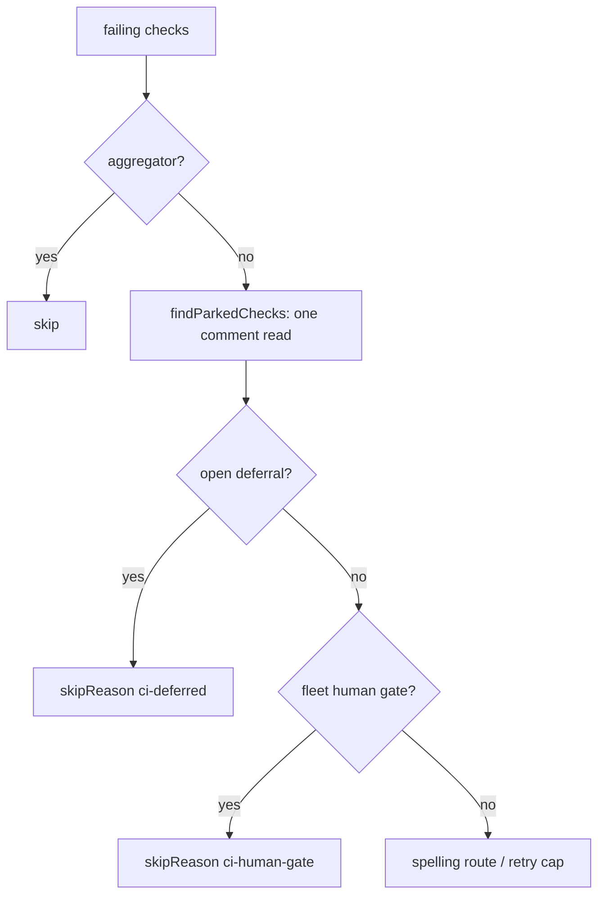

# PR Summary — Issue #2744

## Summary

When a check needs a human to approve it, `_parkHumanGate` (#2727) posts a
fleet-authored `<!-- vibe-ci-human-gate check="…" -->` marker. Until now,
`findFailedCiChecks` ignored that marker. It kept returning the parked check
every cycle until the retry cap fired `CI check exceeded max retries`.

With this change, `findFailedCiChecks` honours the marker:

- **One comment read.** The new `findParkedChecks` in `ci_fix_pr_markers.ts`
  reads the PR's comments once. From that read it returns both the open
  deferrals (#1881) and the fleet markers from `collectFleetCiFixMarkers`.
  `findOpenDeferrals` is now a thin wrapper around it.
- **Skip at info level.** A failing check that `findHumanGate` matches is
  skipped with one `logger.skipReason("ci-human-gate", …)`. The skip happens
  before the retry cap, so no max-retries warning can fire for it.
- **Fleet only.** A gate marker written by someone outside the fleet is
  dropped by `collectFleetCiFixMarkers`, so it does not park the check.
- **Fail towards scanning.** If the comment read fails, the markers come back
  empty and an error is logged. Every failing check is then scanned as usual.

`docs/INTERNALS.md` gains a step 6 for the human-gate skip, and the later
steps are renumbered, which also fixes the old duplicate step 6.

Closes #2744

- [x] Tests for gate skip, non-fleet marker, no max-retries warning, read error, shared read
- [x] `findParkedChecks` + gate skip in `findFailedCiChecks`
- [x] `docs/INTERNALS.md` updated
- [x] Fast checks and `./quality.sh` passed
- [x] Spec and standards review

## Evidence

This is a backend change with no user interface, so the tests are the
evidence. They run `findFailedCiChecks` and `findParkedChecks` against a
stubbed `gh` runner.



```text
$ deno test --allow-all tests/pr_maintenance_ci_deferral_test.ts
ok | 19 passed | 0 failed
```

The 143 tests in the related CI-fix and PR-maintenance suites also pass.
`./quality.sh < /dev/null` PASSED in a clean worktree. It was run there
because the working tree holds unrelated deletions of `.claude/skills/…`.

## Acceptance Criteria

<!-- vibe-spec-review inputs="diff+issue-body" -->

- **A PR whose failing check has a fleet gate marker does not return that
  check; another failing check on the same PR is still returned.** The test
  "a check the fleet parked as a human gate is not returned; a sibling failure
  on the same PR is" covers it. — reviewer: met
- **A gate marker written outside the fleet does not skip the check.** The
  test "a human-gate marker authored outside the fleet does not park the
  check" covers it. — reviewer: met
- **No `exceeded max retries` warning fires for a parked gate check.** The
  test "a parked human-gate check raises no max-retries warning" uses
  `maxRetries: 0`. — reviewer: met
- **If the comment read fails, the check stays unskipped and an error is
  logged.** The test "an unreadable comment thread leaves a gate check
  scanned and is logged" covers it. — reviewer: met
- **`findParkedChecks` refactor and shared-read test.** The issue did not ask
  for this. Reusing the read means there is no second API call. —
  reviewer: unrequested

## Standards Review

<!-- vibe-standards-review inputs="diff+CODING-STANDARDS.md" -->

The reviewer found no blocking violations and raised two minor points:

- **Fixed:** the `@returns` doc comment on `findParkedChecks` overstated when
  the markers are empty. They are empty only when the comment read failed.
- **Kept on purpose:** the `findOpenDeferrals` wrapper stays so the #1881
  tests keep working unchanged. It is a one-line delegation.

The error level for an unreadable comment thread was already there before
this change, and the issue asks for an error log.

The reviewer confirmed:

- Australian English is used.
- The tests run real code.
- The new public function has happy-path and error-path tests.
- Failures are loud.
- The skip is logged at info level.
- The docs were updated.

**Pre-PR security self-check:**

- There is no new external input.
- No secrets are staged.
- There is no new shell, SQL or filesystem surface. The `gh` calls reuse the
  existing paginated read.
- A marker's author is checked against the fleet logins, so a marker from
  outside the fleet cannot park a check.

## Test Plan

- `deno test --allow-all tests/pr_maintenance_ci_deferral_test.ts`: 19 pass,
  7 of them new.
- The two tests "a check the fleet parked…" and "…raises no max-retries
  warning" fail without the `gatedNames` skip, because the gated check is
  returned.
- `./quality.sh < /dev/null` passes.
