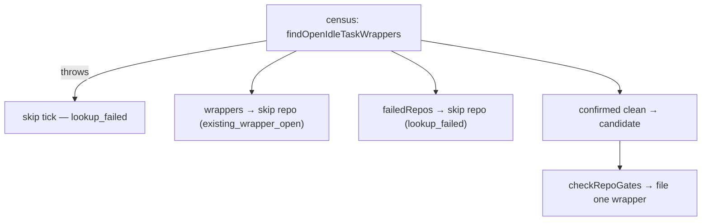

## Summary

The open-idle-task lookup now fails closed. Closes #2750.

- `findExistingIdleTaskIssue` throws, naming the repo, when `gh` output is not
  JSON or is not an array. Only a well-formed `[]` means "no open wrapper".
  Parsing lives in the new exported `parseOpenIdleTaskIssues`, so S2's raise
  gate can reuse it.
- `findOpenIdleTaskWrappers` returns `{ wrappers, failedRepos }`.
  `findAnyOpenIdleTaskWrapper` throws rather than returning `null` while any
  repo's lookup failed.
- `maybe-file-idle-task` Step 1b drops every lookup-failed repo from the
  candidate set and logs
  `[idle-task] repo=<repo> action=skipped reason=lookup_failed`. A census that
  throws files nothing that tick (`reason=lookup_failed`). `checkRepoGates`
  `dedup_failed` handling is unchanged.
- The JSDoc and docs that called a failed lookup "assume clean" or
  "fail-open" are updated: `docs/IDLE-TASK-FRAMEWORK.md` (Overview, the
  census sections, the gate table, the cadence Mermaid chart) and
  `DESIGN-PRINCIPLES.md`.

## Evidence

This is a backend/CLI change with nothing to screenshot. It is covered by the
tests below. The 478 tests in every file that exercises the idle-task lookup or
the filer pass.

## Reproduction

- **symptom** — when a repo's `gh issue list --label idle-task` lookup failed
  or printed malformed output, the filer treated that repo as clean and could
  file a second idle task into it
- **status** — `verified` — the new regression tests were run against the
  unfixed code in a base worktree and failed. For example, the filer test filed
  into `org/idle-bad`. They pass after the fix.
- **regression test** —
  `worker/deno/tests/maybe_file_idle_task_test.ts::maybe-file-idle-task - a repo whose wrapper lookup fails is skipped with reason=lookup_failed and a clean repo is filed (Issue #2750)`
  and
  `worker/deno/tests/idle_task_issue_test.ts::findExistingIdleTaskIssue - throws, naming the repo, when gh output is not valid JSON`

## Acceptance Criteria

<!-- vibe-spec-review inputs="diff+issue-body" -->

- **met** — `findExistingIdleTaskIssue` throws on non-JSON `gh` output and on a non-array JSON value; returns `null` only for a well-formed empty list — evidence: `worker/deno/tests/idle_task_issue_test.ts::findExistingIdleTaskIssue - throws, naming the repo, when gh output is a non-array JSON value`, `::parseOpenIdleTaskIssues - a well-formed empty list is empty` — reviewer: met
- **met** — The census returns the set of repos whose lookup failed; none of them is ever treated as clean — evidence: `worker/deno/tests/idle_task_issue_test.ts::findOpenIdleTaskWrappers - reports failed repos separately from wrappers and clean repos` — reviewer: met
- **met** — The filer never files into a repo whose lookup failed, and logs `[idle-task] repo=<repo> action=skipped reason=lookup_failed` — evidence: `worker/deno/tests/maybe_file_idle_task_test.ts::maybe-file-idle-task - a repo whose wrapper lookup fails is skipped with reason=lookup_failed and a clean repo is filed (Issue #2750)` — reviewer: met
- **met** — A census-wide failure files nothing that tick — evidence: `worker/deno/tests/maybe_file_idle_task_test.ts::maybe-file-idle-task - a census that throws files nothing that tick (Issue #2750)` — reviewer: met
- **met** — Other repos in the same census remain eligible when one repo's lookup fails — evidence: the same filer test as above files into `org/idle-good` — reviewer: met
- **met** — No JSDoc or doc text still describes a failed lookup as "assume clean" — evidence: `worker/deno/lib/idle_task_issue.ts`, `docs/IDLE-TASK-FRAMEWORK.md`, `DESIGN-PRINCIPLES.md` — reviewer: partial — reason: the reviewer flagged the "same fail-open shape as `cross_repo_check_failed`" sentence in `docs/IDLE-TASK-FRAMEWORK.md` and the census sections that did not mention `lookup_failed`; all of these are fixed in this diff
- **unrequested** — when every repo is either held or failed, the whole-tick skip reports `reason=lookup_failed ... failed=<n>` instead of `existing_wrapper_open` — reviewer: unrequested — reason: an unknown repo must not be reported as holding a wrapper; covered by `::every repo either held or lookup-failed reports reason=lookup_failed (Issue #2750)`
- **unrequested** — the `lookup_failed` log lines also carry `template=`, `scope=` and `message=` fields — reviewer: unrequested — reason: they keep the existing log conventions, and the required prefix is emitted verbatim
- **unrequested** — the stale fail-open comments in `idle_task_activity.ts` and `idle_task_freshness.ts` are edited — reviewer: unrequested — reason: both described the lookup as fail-open, which criterion 6 rules out
- **unrequested** — test fixture updates (census stubs return `{ wrappers, failedRepos }`; `makeMockGh` answers the census call with `[]`) — reviewer: unrequested — reason: required by the new return type and the fail-closed parse

## Standards Review

<!-- vibe-standards-review inputs="diff+CODING-STANDARDS.md" -->

- **violation** — A Code Change Owes a Docs Change: the operator manual still compared `history_read_failed` to a fail-open `cross_repo_check_failed`, and its census sections, gate table and Mermaid chart did not mention `lookup_failed` — evidence: `docs/IDLE-TASK-FRAMEWORK.md:1764`, `:668`, `:760`, `:1472`, `:1928` — reason: fixed in this diff, and `DESIGN-PRINCIPLES.md` was updated as well
- **clean** — fail-loud behaviour, the verbatim log line, the DRY shared parser, tests that call real code with happy, error and edge paths, Australian English, and no hidden files staged. Optional: two over-long JSDoc lines were rewrapped here.

## Test Plan

- `worker/deno/tests/idle_task_issue_test.ts`
  - "returns null when gh output is not valid JSON" is replaced by a test that
    expects a throw. The behaviour change is deliberate and is what the issue
    asks for.
  - "all repos erroring returns null (treated as clean)" is replaced by a test
    that expects a throw.
  - New: the non-array (`{}`) throw test, the `parseOpenIdleTaskIssues` tests,
    the one-failed-repo `findAnyOpenIdleTaskWrapper` test, and the
    `findOpenIdleTaskWrappers` `failedRepos` tests.
- `worker/deno/tests/maybe_file_idle_task_test.ts`
  - Three new Issue #2750 filer tests.
  - `makeMockGh` now answers the census call with `[]`, as real `gh` does.
- `worker/deno/tests/idle_task_capacity_1083_test.ts` and
  `worker/deno/tests/idle_filer_gate_wiring_1050_test.ts`: updated for the
  census shape, including an assertion that `failedRepos` holds the failed repo.

🤖 Generated with [Claude Code](https://claude.com/claude-code)
