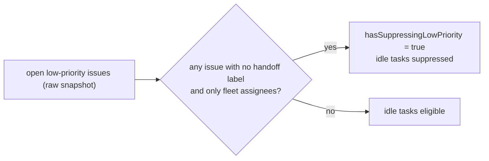

# PR Summary — Issue #2751

## Summary

Closes #2751

An open `low-priority` issue waiting on a human no longer hides its repo's idle
tasks. The per-repo suppression now uses a new flag,
`hasSuppressingLowPriority`, instead of the raw `issues.length > 0`. The flag
counts only issues that are not waiting on a human.

"Waiting on a human" means the issue carries one of the six handoff labels
(`failed`, `refine-issue`, `planning`, `question`, `needs-revision`,
`needs-human`) or has an assignee outside the fleet set
(`resolveFleetMaintenanceAuthorSet`).

Dependency-blocked, PR-blocked and fleet-assigned issues still suppress. The
flag is taken from the raw list before `cleanStaleLabels` and the per-issue
skips run. `work-on` suppression is unchanged.

- [x] `collect_low_priority_candidates.ts`: new `hasWorkableLowPriority` helper
      and `hasSuppressingLowPriority` flag
- [x] `find_oldest_issue.ts`: uses the new flag
- [x] `issue_priority.ts`: JSDoc and comment updated
- [x] `docs/workflows/issue-processing.md`: rule documented
- [x] Regression tests

## Evidence

- Targeted tests in `collect_low_priority_candidates_test.ts`,
  `find_oldest_issue_low_priority_test.ts` and the related selection suites: 107
  passed, 0 failed.
- Full `./quality.sh` on a clean checkout of the commit:
  `Result: PASSED (with
  skipped checks)`. The only skip was
  `config integration`.
- In the shared worktree, the gate's deno test and type-check steps fail because
  five files under `.claude/skills/review-fleet-prs/` were deleted locally. That
  deletion is unrelated to this change, and those files are not part of this PR.

## Reproduction

- **Symptom:** a repo whose only open `low-priority` issue carries `needs-human`
  (or another handoff label, or a human assignee) never had an idle task
  selected, because any open low-priority issue suppressed idle tasks.
- **Status:** `verified`. The new tests failed before the fix (16 failed in the
  red run) and pass after it.
- **Regression tests:**
  - `find_oldest_issue_low_priority_test.ts`: "a needs-human low-priority issue
    no longer hides the repo's idle task (Issue #2751)"
  - `collect_low_priority_candidates_test.ts`: table-driven #2751 cases for each
    handoff label, human assignees, fleet assignees, the PR-blocked case, a
    mixed list and an empty list

## Acceptance Criteria

<!-- vibe-spec-review inputs="diff+issue-body" -->

- A repo whose only low-priority issue has `needs-human` gets its idle task
  selected — reviewer: met
- Each of the six handoff labels lifts the suppression — reviewer: met
- A human (non-fleet) assignee lifts the suppression — reviewer: met
- A dependency-blocked issue still suppresses — reviewer: met
- PR-blocked and fleet-assigned issues still suppress — reviewer: met
- `work-on` suppression is unchanged — reviewer: met
- A claimable `Finish #N:` low-priority issue is still selected ahead of idle
  tasks — reviewer: met
- `docs/workflows/issue-processing.md` documents the rule — reviewer: met
- Fleet set resolved before the flag; snapshot taken before `cleanStaleLabels`
  and the skips — reviewer: met
- `issue_priority.ts` JSDoc updated — reviewer: met
- Failure-detection tests in the named files — reviewer: partial — reason: the
  required cases are all present in `collect_low_priority_candidates_test.ts`
  and `find_oldest_issue_low_priority_test.ts`. `issue_priority_test.ts` gets no
  new case because `selectHighestPriority` did not change (comments only), and
  the issue does not require one there.
- Extra edge-case tests: human beside a fleet assignee, a fleet login in
  different casing, a waiting issue beside a workable one, and no open issues —
  reviewer: unrequested — reason: these cover edge cases of the new flag, as the
  repo's test-coverage standard requires.
- `hasOpenIssues` is kept alongside the new flag — reviewer: unrequested —
  reason: it mirrors `collect_work_on_candidates.ts` and existing tests assert
  on it. It no longer gates idle tasks, and its JSDoc now says so.

## Standards Review

<!-- vibe-standards-review inputs="diff+CODING-STANDARDS.md" -->

Violations:

- `worker/deno/lib/collect_low_priority_candidates.ts:81` — `hasOpenIssues` is
  no longer read by production code. Reason for keeping it: it matches the
  `work-on` collector's result shape, and existing tests assert on it. Removing
  it is outside the scope of #2751.
- `worker/deno/lib/issue_priority.ts:208-214` — the handoff label names are
  repeated in the JSDoc. Reason for keeping them: the issue asks for this JSDoc
  to describe the rule, and the code takes the set from `filterLabels`, so the
  runtime behaviour cannot drift.
- `worker/deno/lib/issue_priority.ts:628-629` — a leftover short line in a
  reflowed comment. Fixed in the follow-up commit.

Clean areas:

- Australian English throughout.
- Tests call `collectLowPriorityCandidates` and `findOldestIssue` with a mocked
  `gh`; none grep the source.
- No existing tests removed.
- DRY: the code reuses `filterLabels` and `resolveFleetMaintenanceAuthorSet`.
- KISS: one small pure helper, with no new dependency.
- The docs change in the same PR as the code.
- No errors are swallowed.

## Test Plan

- [x] Red run: the new tests failed before the fix
- [x] `deno task test:unit tests/collect_low_priority_candidates_test.ts
      tests/find_oldest_issue_low_priority_test.ts`
      (and related selection suites) are green
- [x] `./quality.sh < /dev/null` passed on a clean checkout
