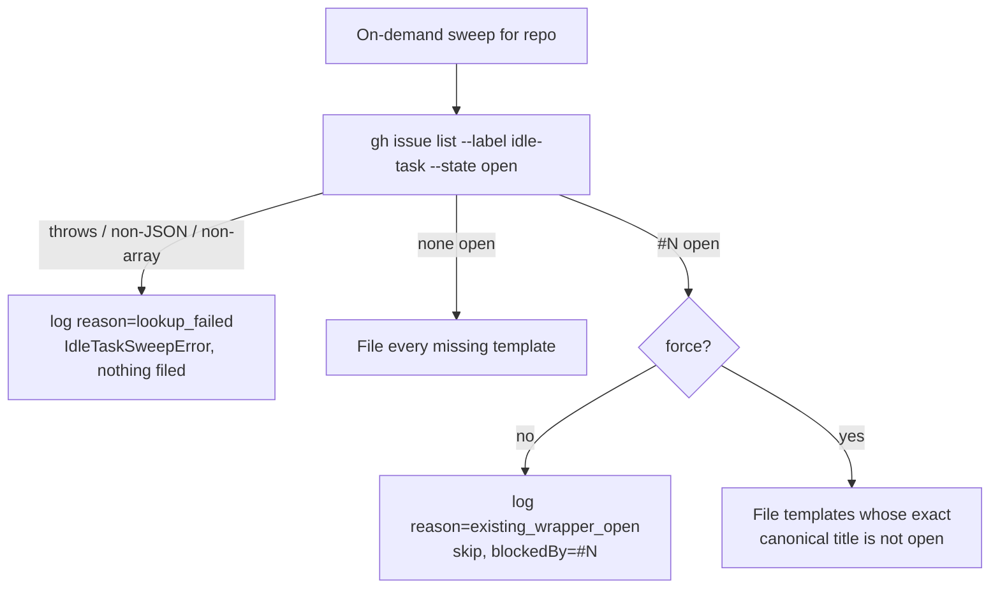

# PR Summary — Issue #2752

## Summary

Closes #2752

Every on-demand idle-task raise (`create-all-idle-task-wrappers`, raise-all,
Boy Scout, single-template, `seed-idle-tasks:` and `add-repo:`) now runs one
fail-closed lookup of open `idle-task` issues per sweep. If **any** is open —
whatever its title or extra labels, including `Finish #N:` hand-offs — nothing
is filed and the log reads
`[idle-task] repo=<repo> issue=<n> action=skipped reason=existing_wrapper_open`.
A lookup that fails returns an `IdleTaskSweepError` and logs
`reason=lookup_failed`. An optional `force` dep bypasses the gate but keeps
exact canonical-title dedup; the CLI `--force` flag is the follow-up sub-issue.

- [x] Replace `defaultFindExistingWrapperTitles` with `defaultFindOpenIdleTaskIssues` (reuses `parseOpenIdleTaskIssues`)
- [x] Gate before any write (label ensure moved after the gate), checked once per sweep
- [x] `force` bypass with exact-title dedup
- [x] Seed-idle-tasks and add-repo surface the skip log
- [x] Tests and docs (`IDLE-TASK-FRAMEWORK.md`, `ADD-REPO.md`)
- [x] `degraded_delivery.ts` untouched

## Evidence

Backend-only change — no visual surface, so no screenshots. Evidence is the
test suite:

- `worker/deno/tests/create_all_idle_task_wrappers_test.ts` — gate tests
  (non-canonical title, `needs-human`/`Finish #N:`, `failed`, `--state open`,
  three lookup-failure shapes, clean repo, `force`, blocked outcome table).
- `worker/deno/tests/process_seed_idle_tasks_test.ts` — blocked repo.
- `worker/deno/tests/process_add_repo_test.ts` — blocked repo.

## Reproduction

- **Symptom:** the on-demand sweep deduped only on exact canonical titles, so a
  repo holding a non-canonical or `Finish #N:` idle-task issue got a second
  wrapper filed; a failed lookup was swallowed as "nothing open".
- **Status:** `verified` — the new tests were written first and watched fail
  against the unfixed code (create-all: 7 failed; add-repo and seed blocked-repo
  cases both failed), then pass after the fix.
- **Regression test:**
  `create_all_idle_task_wrappers_test.ts` — "a non-canonical open idle-task
  title blocks the whole sweep" and "an open Finish #N: idle-task issue labelled
  needs-human blocks the whole sweep".

## Acceptance Criteria

<!-- vibe-spec-review inputs="diff+issue-body" -->

1. Non-canonical title blocks the sweep with no `gh issue create`.
   evidence: test "a non-canonical open idle-task title blocks the whole sweep" (zero creates, `blockedBy` #77).
   reviewer: met
2. `needs-human` / `failed` issue blocks.
   evidence: tests "…labelled needs-human blocks the whole sweep" and "…also labelled failed blocks the sweep".
   reviewer: met
3. `Finish #N:` issue blocks.
   evidence: same needs-human test asserts `blockedBy` #638, zero creates and the `existing_wrapper_open` log.
   reviewer: met
4. Closed issues never block; `--state open` asserted.
   evidence: test "the default lookup asks for open idle-task issues only" (one list call, `--state open`).
   reviewer: met
5. Lookup failure files nothing and returns an error with `lookup_failed`.
   evidence: parameterised test over non-JSON, non-array and thrown lookups.
   reviewer: met
6. Clean repo gets the full sweep.
   evidence: test "a clean repo still gets the full template set".
   reviewer: met
7. `force: true` passes the gate but skips exact canonical titles.
   evidence: test "force bypasses the gate but keeps exact-title dedup".
   reviewer: met
8. Seed-idle-tasks and add-repo skip a blocked repo and log `existing_wrapper_open`.
   evidence: blocked-repo tests in `process_seed_idle_tasks_test.ts` and `process_add_repo_test.ts`.
   reviewer: met
9. `degraded_delivery.ts` untouched.
   evidence: not in the diff.
   reviewer: met
10. Additions beyond the literal ask (`title` kept by the shared parser, blocked
    outcome-table reason, label ensure moved after the gate, shared test helper).
    evidence: `lib/idle_task_issue.ts`, `formatIdleTaskOutcomeTable`, `tests/support/open_idle_task_issues.ts`.
    reviewer: unrequested
    reason: each serves a stated requirement — `title` feeds the `force` path's exact-title dedup, moving the label ensure makes "nothing is filed" hold for writes too, and the table reason tells operators which issue blocked.

## Standards Review

<!-- vibe-standards-review inputs="diff+CODING-STANDARDS.md" -->

- violation: docs not updated — `docs/ADD-REPO.md` still said add-repo seeding bypasses the any-open gate.
  evidence: `docs/ADD-REPO.md` step 6 and the flowchart node.
  reason: fixed in this PR — step 6 and the node now describe the gate and both logs.
- violation: untested branch — `formatIdleTaskOutcomeTable`'s `existing_wrapper_open #N` reason.
  evidence: `lib/create_all_idle_task_wrappers.ts` `formatIdleTaskOutcomeTable`.
  reason: fixed — added "formatIdleTaskOutcomeTable - a blocked sweep names the blocking issue".
- violation: the `--state open` test asserts `gh` argument text.
  evidence: "the default lookup asks for open idle-task issues only".
  reason: kept — acceptance criterion 4 explicitly asks for `--state open` to be asserted in the captured args; the decision is covered by the gate tests.
- violation: PR summary missing from the commit.
  evidence: `docs/archive/pr-summaries/pr-summary-2752.md`.
  reason: fixed — this file.
- violation (borderline): `lookup_failed` logged at info.
  evidence: `process_add_repo.ts` and `process_seed_idle_tasks.ts` pass `log: logger.info`.
  reason: kept — the failure is surfaced loudly as the returned `IdleTaskSweepError`, which both commands report as a failure; the log sink is shared with the outcome table.
- violation (partial): tests whose "skips already open" meaning changed.
  evidence: raise-all, Boy Scout, raise-single and command tests.
  reason: noted here — those tests now pass because the any-open gate skips the sweep rather than per-title dedup; the create-all partial-skip and mid-sweep tests run under `force: true` with a comment explaining why. No test was removed.
- clean: Australian English.
- clean: tests call real functions; no source grepping.
- clean: fail loud — the swallowing `catch` is gone; lookup failure returns an error.
- clean: KISS/DRY — reuses `parseOpenIdleTaskIssues`.
- clean: no hidden files staged.

## Test Plan

- [x] `deno task test:unit` on the touched test files (create-all, seed, add-repo, raise-all, Boy Scout, raise-single, command tests)
- [x] `deno fmt`, `deno lint`, `deno check`
- [x] `markdownlint-cli2` on the changed docs
- [x] `./quality.sh`
