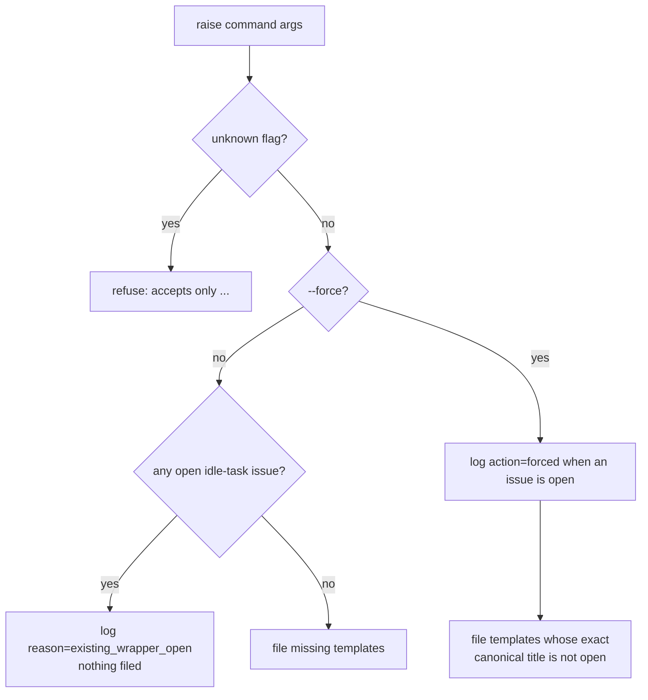

# PR Summary — Issue #2753

## Summary

Closes #2753

`raise-boy-scout-idle-tasks`, `raise-all-idle-tasks` and
`raise-single-idle-task` now accept `--force`, threaded through their libs into
`createAllIdleTaskWrappers`' `force` dep (Issue #2752). Without it, a repo
holding any open `idle-task` issue is skipped whole; with it, the sweep files
past the gate and logs `[idle-task] repo=<repo> issue=<n> action=forced`, while
exact canonical-title dedup still prevents duplicates. The
`create-all-idle-task-wrappers`, `process-seed-idle-tasks` and
`process-add-repo` commands never force. Each of the three commands now
refuses an unknown flag, so a misspelt `--forse` fails loud instead of running
unforced.

- [x] `--force` parsed with `coerceBooleanFlag` in all three commands
- [x] `force` threaded through `raise_all_idle_tasks.ts`, `raise_single_idle_task.ts` and `boy_scout_idle_tasks.ts`
- [x] `action=forced` log line in `createAllIdleTaskWrappers`
- [x] Unknown-option rejection and `--force` in each command's help text
- [x] `docs/IDLE-TASK-FRAMEWORK.md` sections for all three commands
- [x] Tests at command and lib level

## Evidence

Backend/CLI-only change — no visual surface, so no screenshots. Evidence is the
test suite:

- `worker/deno/tests/raise_all_idle_tasks_command_test.ts` and
  `raise_boy_scout_idle_tasks_command_test.ts` — blocked without `--force`,
  forced filing and log, no duplicate of an open canonical title, unknown flag
  refused, unreadable `--force` refused, help text.
- `worker/deno/tests/raise_single_idle_task_command_test.ts` (new) — the same
  set for raise-single.
- `worker/deno/tests/raise_all_idle_tasks_test.ts` and
  `raise_single_idle_task_test.ts` — lib-level "blocks the repo unless forced"
  and "force never duplicates the open canonical title".

## Acceptance Criteria

<!-- vibe-spec-review inputs="diff+issue-body" -->

1. Without `--force`, nothing is filed into a repo with an open idle task.
   evidence: tests "…an open idle task blocks the repo without --force" in all three command test files; lib tests "…blocks the repo unless forced" (`force=false`).
   reviewer: met
2. `--force` files past the gate and logs `action=forced`.
   evidence: tests "…--force files past the gate and logs action=forced" in all three command test files; lib tests (`force=true`) assert the log line.
   reviewer: met
3. `--force` never duplicates an open exact canonical title.
   evidence: tests "…--force never duplicates an open canonical title" (raise-all, Boy Scout) and "raiseSingleIdleTask - force never duplicates the open canonical title".
   reviewer: met
4. Unknown flag rejected; `--force` in each command's help.
   evidence: tests "…an unknown flag is refused before any filing" and "…help text documents --force" in all three command test files.
   reviewer: met
5. `docs/IDLE-TASK-FRAMEWORK.md` covers `--force` for all three commands.
   evidence: `--force` paragraphs in the Boy Scout, raise-all and raise-single sections, plus the create-all `force` bullet.
   reviewer: met
6. Unknown-option rejection added to the three commands.
   evidence: `KNOWN_OPTIONS` + `findUnknownOptions` in each `commands/raise_*.ts`.
   reviewer: unrequested
   reason: the criterion says unknown flags are "still" rejected, but these commands previously ignored them; without the check a misspelt `--forse` would silently run unforced, so it was added to make criterion 4 true.
7. Unreadable `--force` value refused; new `raise_single_idle_task_command_test.ts`.
   evidence: tests "…an unreadable --force is refused"; new test file.
   reviewer: unrequested
   reason: `coerceBooleanFlag` fails loud on a non-boolean value rather than reading it as "not forced"; raise-single had no command test file to extend.

## Standards Review

<!-- vibe-standards-review inputs="diff+CODING-STANDARDS.md" -->

- violation: the idle-task framework doc named `seed-idle-tasks` and `add-repo` (issue-title routes) as commands that never force.
  evidence: `docs/IDLE-TASK-FRAMEWORK.md` `force` bullet.
  reason: fixed — it now names the `process-seed-idle-tasks` and `process-add-repo` commands.
- violation: the force/unknown-option block is repeated in the three raise commands.
  evidence: `commands/raise_all_idle_tasks.ts`, `raise_boy_scout_idle_tasks.ts`, `raise_single_idle_task.ts`.
  reason: kept — each command's accepted-option list and message differ, and it matches the inline pattern already used by `export_branding.ts` and `bulk_triage_security.ts`; a shared helper across all of them is separate work.
- violation: `UNRELATED_OPEN` / `gatedDeps` duplicated in two command test files.
  evidence: `tests/raise_all_idle_tasks_command_test.ts`, `tests/raise_boy_scout_idle_tasks_command_test.ts`.
  reason: kept — three lines built on the shared `tests/support/open_idle_task_issues.ts`; each test file stays self-contained.
- violation: the help-text tests assert on the description string.
  evidence: "…help text documents --force" in the three command test files.
  reason: kept — acceptance criterion 4 requires `--force` in each command's help, and the description is the help surface `mod.ts` prints.
- clean: Australian English.
- clean: tests call real commands and functions; no source grepping.
- clean: fail loud — an unreadable `--force` and unknown flags are refused.
- clean: `force` defaults to false, so existing callers are unchanged.
- clean: docs updated in the same change; no hidden files staged.

## Test Plan

- [x] `deno task test:unit` on the touched test files (raise-all, Boy Scout, raise-single, lib and command tests)
- [x] `deno fmt --check`, `deno lint`, `deno check` on the changed TS files
- [x] `markdownlint-cli2` on the changed docs
- [ ] `./quality.sh`
