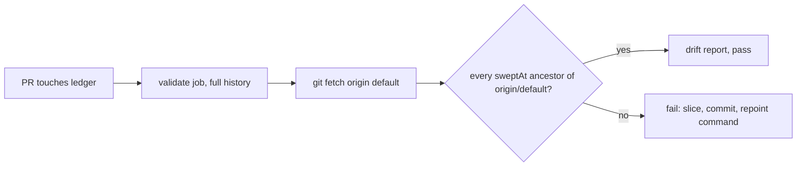

# PR Summary — Issue #2754

## Summary

Repointed the 34 coverage-ledger slices whose `sweptAt` was not on
`origin/main` and added a full-history CI guard, so a branch-only `sweptAt`
fails the PR that writes it. Closes #2754.

- `docs/audits/lib-sweep-coverage.json`: 33 slices whose `sweptAt` no longer
  resolved (squash-deleted feature-branch `HEAD`s), plus `top-up-2727`, whose
  commit still resolves via a live branch but is not an ancestor of
  `origin/main`. Each is now
  `git log --diff-filter=A -1 --format=%H origin/main -- <record>`. Only the
  34 `sweptAt` lines changed.
- `verifySweptAtsOnDefaultBranch` in `worker/deno/lib/lib_sweep_coverage.ts`
  reuses the injected `SweepGitRunner`. It fails on a missing or non-ancestor
  `sweptAt`, naming every offending slice, its commit and the repoint command.
  It fails loud when the default-branch ref itself cannot be resolved.
- `sweep-drift --default-branch <ref>` runs the guard before the drift report.
  The command is now config-optional, so CI can run it.
- `.github/workflows/validate-scripts.yml`: a new step in the `validate` job
  (`fetch-depth: 0`, runs on every PR via `quality.yml`) fetches the default
  branch and runs the guard. It follows the `milestone-resurrection`
  precedent.
- `docs/SECURITY-SCAN.md` states the rule: a top-up records
  `git merge-base origin/main HEAD`, never a branch commit. It also documents
  the CI check.

## Evidence

This is a CLI/CI change with no UI.

- Unfixed tree: `mod.ts sweep-drift --repo ../..` exits 1 with
  `slice top-up-2220 (#2220) could not be diffed from sweptAt bd01597…: fatal: bad object`.
- The new guard run over the old ledger exits 1 and lists
  `34 slice(s) record a sweptAt that is not on origin/main`, including
  `top-up-2727 … is not an ancestor of origin/main`.
- Fixed tree:
  `mod.ts sweep-drift --repo ../.. --default-branch origin/main` exits 0 over
  all 101 slices.

## Reproduction

- **symptom** — `sweep-drift` died with `SweepLedgerError … fatal: bad object`
  because top-up slices recorded squash-deleted feature-branch commits.
- **status** — `verified` — `sweep-drift` failed with that error on the unfixed
  tree (HEAD~1) and exits 0 after the repoint. The guard rejected the old
  ledger (34 slices named) and passes the repaired one.
- **regression test** —
  `worker/deno/tests/lib_sweep_coverage_test.ts::verifySweptAtsOnDefaultBranch - a branch-only sweptAt names the slice, the commit and the repoint command (Issue #2754)`

## Acceptance Criteria

<!-- vibe-spec-review inputs="diff+issue-body" -->

- **met** — Every `sweptAt` in the ledger resolves and is an ancestor of
  `origin/main` — evidence: `docs/audits/lib-sweep-coverage.json` (reviewer
  checked all 101 with `cat-file -e` and `merge-base --is-ancestor`) —
  reviewer: met
- **met** — `deno run … mod.ts sweep-drift` runs across the whole ledger
  without a `SweepLedgerError` — evidence:
  `mod.ts sweep-drift --repo ../.. --default-branch origin/main` exits 0 —
  reviewer: met
- **met** — Unit tests show that a non-ancestor `sweptAt` fails, naming the
  slice, the commit and the repoint command, and that the repaired ledger
  passes — evidence:
  `worker/deno/tests/lib_sweep_coverage_test.ts::verifySweptAtsOnDefaultBranch - a branch-only sweptAt names the slice, the commit and the repoint command (Issue #2754)`
  and `::verifySweptAtsOnDefaultBranch - the repaired ledger passes (Issue #2754)`
  — reviewer: met
- **met** — The CI step runs on pull requests in a job with full history —
  evidence: `.github/workflows/validate-scripts.yml` step
  "Sweep ledger sweptAt ancestry" in the `validate` job (`fetch-depth: 0`) —
  reviewer: met
- **met** — `./quality.sh` passes — evidence: full gate run in a clean
  worktree of the branch — reviewer: partial — reason: the reviewer's checkout
  had pre-existing, uncommitted deletions of `.claude/skills/review-fleet-prs/*`
  (not in this diff), which broke type check and tests. The gate was re-run in
  a clean worktree of this commit and passed.
- **unrequested** — the `sweep-drift --default-branch` option and
  `sweep-drift` added to mod.ts's config-optional lists — reviewer:
  unrequested — reason: this is how the CI step reaches the guard with no
  `.config.json`, following the issue's `mod.ts` command precedent.
- **unrequested** — extra tests (two command-level, one for an unresolvable
  default ref) and the `rev-parse --verify` pre-check — reviewer: unrequested —
  reason: fail-loud hardening, so a missing ref is never blamed on every slice
  and never passes.
- **unrequested** — the `repointCommand()` helper and the Mermaid diagram in
  `docs/SECURITY-SCAN.md` — reviewer: unrequested — reason: the helper keeps
  the documented remedy in one place (DRY) and the diagram follows the
  visual-docs standard; existing output is unchanged.

## Standards Review

<!-- vibe-standards-review inputs="diff+CODING-STANDARDS.md" -->

- **clean** — fail-loud handling (unresolvable ref, missing commit, unexpected
  `merge-base` exit, non-`SweepLedgerError` rethrown), exactly 34 repoints that
  match the documented rule, the CI step (read-only permissions,
  `persist-credentials: false`, full history), tests that call real code
  through an injected runner, Australian English, docs updated in the same
  change, no hidden files, and no new dependency. Optional note fixed here:
  the guard's message now uses `defaultRef` rather than a hard-coded
  `origin/main`.

## Test Plan

- `worker/deno/tests/lib_sweep_coverage_test.ts`: four new
  `verifySweptAtsOnDefaultBranch` tests (branch-only fails, missing plus
  multiple offenders, repaired ledger passes, unresolvable default ref fails
  loud).
- `worker/deno/tests/sweep_drift_command_test.ts`: two new
  `--default-branch` command tests (fails before the drift report, passes then
  reports).
- `./quality.sh` in a clean worktree.
