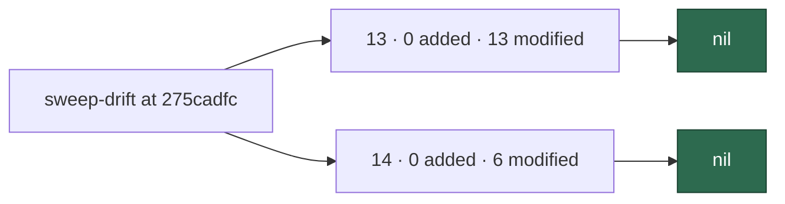

# PR Summary — Issue #2756

## Summary

Re-swept the drifted `commands/` and `setup/` modules (ledger slices 13 and
14) since the #2184 delta, and wrote the record. Both slices are nil: every
drifted module was read and no candidate survived refutation. Closes #2756.

- `docs/audits/security-sweep-2756-commands-setup-delta.md` (new): lists and
  triages all 13 drifted commands modules and 6 drifted setup modules, with
  per-slice nil results, refutations for the sharpest candidates (unprompted
  milestone-ruleset sync, operator-identity repo-settings hardening, the
  `--default-branch` ancestry guard), and a residual note.
- `docs/audits/lib-sweep-coverage.json`: slices 13 (#1218) and 14 (#1220)
  repointed to the new record with
  `sweptAt: 3a38b85a9de2531456c3e56784535903bf045ffa`
  (`git merge-base origin/main HEAD`). Only the two `ledger` and two `sweptAt`
  lines changed; no path list was edited.

## Evidence

Docs/ledger-only change; no UI.

- Drift at the old `sweptAt` (`275cadfc…`): slice 13 = 0 added / 13 modified /
  0 unowned, slice 14 = 0 added / 6 modified / 0 unowned — all 19 modules are
  named and triaged in the record.
- After the repoint, `mod.ts sweep-drift --repo "$(pwd)"` reports slice 13
  modified = `worker/deno/commands/sweep_drift.ts` only and slice 14 = 0 added /
  0 modified / 0 unowned. The single residual is the #2754 ancestry-guard hunk
  that landed after the merge-base — documented, not a miss.
- `mod.ts sweep-drift --repo "$(pwd)" --default-branch origin/main` exits 0:
  the new `sweptAt` passes the #2754 ancestry guard.

## Acceptance Criteria

<!-- vibe-spec-review inputs="diff+issue-body" -->

- **met** — every drifted commands/setup module listed and triaged — evidence:
  `docs/audits/security-sweep-2756-commands-setup-delta.md` Slice 13 table
  (13 modules) and Slice 14 table (6 modules) name all 19 modules with a band +
  disposition — reviewer: met
- **met** — `sweep-drift` reports no drift for those slices at the PR head —
  evidence: `mod.ts sweep-drift --repo "$(pwd)"` shows slice 13 modified =
  `sweep_drift.ts` only and slice 14 = 0/0/0; the record's "Residual" section
  explains the single recurring module — reviewer: met
- **met** — `lib_sweep_coverage_test.ts` and the `sweptAt` ancestry guard pass —
  evidence:
  `deno task test:unit tests/lib_sweep_coverage_test.ts tests/sweep_drift_command_test.ts`
  → 42 passed, 0 failed; `sweep-drift --default-branch origin/main` exits 0 —
  reviewer: met
- **met** — `./quality.sh` passes — evidence: full gate run in the worktree,
  `Result: PASSED (with skipped checks)` (config integration skipped as usual)
  — reviewer: met

## Standards Review

<!-- vibe-standards-review inputs="diff+CODING-STANDARDS.md" -->

- **clean** — Australian English (only `color:` inside mermaid `style`
  attributes, matching the #2755 sibling), markdownlint 0 issues, mermaid block
  validates, no hidden/forbidden files staged (the diff is exactly the two
  intended files), ledger JSON valid with only the `ledger`/`sweptAt` fields
  changed, record mirrors the #2755 sibling structure, and the commit carries
  the correct `Vibe-Coder-Run-Id` trailer. Note (non-blocking): the commit
  subject is the worker's periodic checkpoint message ("WIP checkpoint…"), not
  a descriptive subject, because the worker's `commitAndPushPending` snapshot
  committed and pushed the change mid-run; the run-id trailer is correct and no
  force-push is performed.

## Test Plan

- `deno task test:unit tests/lib_sweep_coverage_test.ts
  tests/sweep_drift_command_test.ts` — 42 passed, 0 failed.
- `deno run … mod.ts sweep-drift --repo "$(pwd)"` and
  `… --default-branch origin/main` — slice 13 residual `sweep_drift.ts` only,
  slice 14 empty, exit 0.
- `./quality.sh < /dev/null` — PASSED (with skipped checks).
