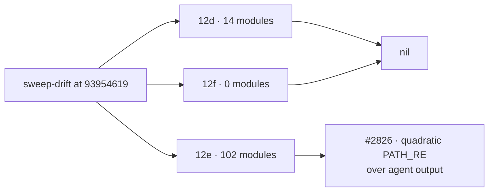

## Summary

This PR delta-sweeps the lib 12d–12f modules that changed since the #2183
record, and records the result in
`docs/audits/security-sweep-2757-lib-delta-12d-12f.md`. Closes #2757.

- `sweep-drift` reported **116** drifted modules against the #2183 `sweptAt`
  (`93954619`):
  - 12d: 2 added, 12 modified.
  - 12e: 3 added, 99 modified.
  - 12f: none.

  Every one is listed and triaged. Added modules were read in full; for modified
  modules, every hunk was read. The read was split across five parallel
  reviewers, balanced by diff size, and each candidate was re-verified before
  filing.
- **One survivor**, filed as #2826 (Low). `described_code_change.ts` `PATH_RE`
  backtracks quadratically over one long line of agent output: 80,000
  characters takes 6.5 s on the event loop.
- 12d and 12f are nil. The `graft ask` leading-dash query, the CLI-only
  `clarity_phase.ts` echo and five other candidates are refuted in the record.
  Both #2183 survivors (#2236, #2237) are closed by hunks in this window.
- `docs/audits/lib-sweep-coverage.json`: slices 12d, 12e and 12f now have
  `ledger` pointing at the new record, and `sweptAt` set to
  `3a38b85a9de2531456c3e56784535903bf045ffa`, which is
  `git merge-base origin/main HEAD`.

## Evidence

This is a docs and ledger change with no UI. At the PR head, `sweep-drift`
reports:

```text
## 12d (#1217)  added (0) modified (0) unowned (0)
## 12e (#1219)  added (0) modified (1): worker/deno/lib/lib_sweep_coverage.ts
## 12f (#1325)  added (0) modified (0) unowned (0)
```

The one 12e line is the #2754 ancestry guard. It sits on the milestone branch
but is not on `main` yet, so it lies between the merge-base `sweptAt` and HEAD.
No commit on `main` can cover it, and a branch commit would fail the ancestry
guard. Its hunk is triaged in the 12e table, and the drift clears once the
milestone lands. The #2183 record left the same residue.



## Acceptance Criteria

<!-- vibe-spec-review inputs="diff+issue-body" -->

- **met** — Every drifted 12d–12f module is listed and triaged — evidence: `docs/audits/security-sweep-2757-lib-delta-12d-12f.md` (116 rows, recomputed against the drift by both reviewers) — reviewer: met
- **partial** — At the PR head, `sweep-drift` reports no drift for 12d–12f — evidence: `sweep-drift` output above; 12d and 12f are clean — reviewer: partial — reason: 12e still shows `lib_sweep_coverage.ts`, the milestone-only #2754 change that no `main`-reachable `sweptAt` can cover; it is triaged in the record and clears when the milestone lands
- **met** — `lib_sweep_coverage_test.ts` and the `sweptAt` ancestry guard pass — evidence: `worker/deno/tests/lib_sweep_coverage_test.ts` passes; `sweep-drift --repo ../.. --default-branch origin/main` exits 0 — reviewer: met
- **met** — `./quality.sh` passes — evidence: full gate run on the final tree (see Test Plan) — reviewer: partial — reason: the reviewer did not run the gate ("not checked by me"); it was run here and passed

## Standards Review

<!-- vibe-standards-review inputs="diff+CODING-STANDARDS.md" -->

- **violation** — the issue's "no drift for 12d–12f at the PR head" criterion is not met literally — evidence: `docs/audits/lib-sweep-coverage.json` (12e `sweptAt`) — reason: stands; the merge-base rule and the ancestry guard together make the `lib_sweep_coverage.ts` residue unavoidable until #2754 reaches `main`. The record explains it and triages the hunk
- **clean** — ledger mechanics (full-SHA merge-base `sweptAt`, which is an ancestor of `origin/main`, and `ledger` paths that resolve), triage completeness, the finding filed as its own issue, no secrets, Australian English, Mermaid, markdownlint and `deno fmt`, and the run-id trailers. Optional notes: the PR summary was still to be written (now done), and the worker's own WIP checkpoint commit is left for squash-merge

## Test Plan

- `deno task test:unit tests/lib_sweep_coverage_test.ts tests/sweep_drift_command_test.ts`: 42 passed.
- `deno run … mod.ts sweep-drift --repo ../.. --default-branch origin/main`: the ancestry guard exits 0.
- `markdownlint-cli2` and `deno fmt` on the new record: clean.
- `./quality.sh < /dev/null`: see the gate result below.

🤖 Generated with [Claude Code](https://claude.com/claude-code)
