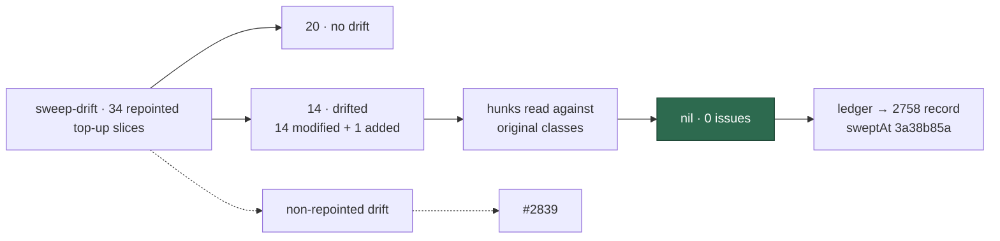

## Summary

This PR delta-sweeps the 34 top-up slices that #2754 repointed, and records the
result in `docs/audits/security-sweep-2758-top-up-delta.md`. Closes #2758.

- `sweep-drift` found drift in **14** of the 34 slices: 14 modified modules and
  1 added module (2496). The other **20** slices are marked "no drift". Every
  drifted hunk was read against the classes in the slice's original record, and
  the one added module was read in full.
- **Nil.** No finding survived, so no finding issue was filed. The refutations
  (graft_context, codegraph, stream machinery, issue executor, held-issue gate,
  provider outage and repo-settings hardening) are in the record.
- As the issue asks, the record notes that the scan already read
  `masked_instructions.ts`, `issue_executor_agents.ts`,
  `issue_executor_enforcement.ts` and `agent_marker_neutralisation.ts`.
- `docs/audits/lib-sweep-coverage.json`: the 14 swept slices now have `ledger`
  pointing at the new record, and `sweptAt` set to
  `3a38b85a9de2531456c3e56784535903bf045ffa`, which is
  `git merge-base origin/main HEAD`. The 20 slices with no drift keep their
  existing record.
- `sweep-drift` also shows drift in slices #2754 never repointed: ten chunk-12
  and chunk-13 slices, and 30 other top-up slices. These are outside this issue.
  The record lists them, and their delta sweep is tracked in #2839.

## Evidence

This is a docs and ledger change with no UI. At the PR head, `sweep-drift` exits
0 with no errors. None of the 34 repointed top-up slices shows a non-zero
`added`, `modified` or `unowned` count. Excerpt:

```text
## top-up-2098 (#2098) top-up: the graft_context host switch
sweptAt: dbebc0dcf072b092170e059c42fa520bfef8e6e5
added (0):
modified (0):
unowned (0):
## top-up-2099 (#2099) top-up: the Graft runner
sweptAt: 3a38b85a9de2531456c3e56784535903bf045ffa
added (0):
modified (0):
unowned (0):
## top-up-2496 (#2496) top-up: the unworkable chain-root report
sweptAt: 3a38b85a9de2531456c3e56784535903bf045ffa
added (0):
modified (0):
unowned (0):
```



## Acceptance Criteria

<!-- vibe-spec-review inputs="diff+issue-body" -->

- **met**: Every repointed top-up slice is listed. Evidence: the record's table
  has 34 rows (14 triaged, 20 "no drift"), matching the 34 slices in the issue.
  Reviewer: met.
- **partial**: At the PR head, `sweep-drift` reports no drift and no error for
  any top-up slice. Evidence: the `sweep-drift` output above; rc 0, no errors,
  and all 34 repointed slices are 0/0/0. Reviewer: partial. Reason: this is met
  for the repointed top-up slices this issue covers. Read literally, it is not,
  because 30 non-repointed top-up slices still drift. The record states the
  reading and lists them, and #2839 tracks their sweep.
- **met**: `lib_sweep_coverage_test.ts` and the `sweptAt` ancestry guard pass.
  Evidence:
  `deno task test:unit tests/lib_sweep_coverage_test.ts tests/sweep_drift_command_test.ts`
  gives 42 passed, and `sweep-drift --repo ../.. --default-branch origin/main`
  exits 0. Reviewer: partial. Reason: the reviewer could not see the output in
  the diff. It was run here and passed.
- **met**: `./quality.sh` passes. Evidence: the full gate ran on the final tree
  (see Test Plan). Reviewer: partial. Reason: the reviewer could not see the
  output in the diff. It was run here and passed.

## Standards Review

<!-- vibe-standards-review inputs="diff+CODING-STANDARDS.md" -->

- **violation (fixed)**: the `orgOwnerLookup` bullet had a nested backtick span
  that renders broken. Evidence:
  `docs/audits/security-sweep-2758-top-up-delta.md`, repo-settings hardening
  section. Reason: rewritten with double backticks.
- **violation (fixed)**: the out-of-scope list counted 12k, 12z, 12ac and 12ae
  as top-ups without saying why. Evidence: the "Out-of-scope drift" section.
  Reason: they are top-ups (their ledger titles start "top-up:"). The record now
  says so, and the chunk-12 list is in order.
- **clean**: Australian English, Mermaid, markdownlint and `deno fmt`, and
  anchors that resolve. No hidden files and no secrets are staged. The scope is
  limited to the 14 drifted slices, with out-of-scope drift sent to #2839.
  Counts are consistent across the table, the ledger, the diagram and the
  summary. The reviewer's "missing PR summary" note is resolved by this file.

## Test Plan

- `deno run -A worker/deno/mod.ts sweep-drift`: rc 0, no errors, no drift in any
  of the 34 repointed top-up slices.
- `deno task test:unit tests/lib_sweep_coverage_test.ts tests/sweep_drift_command_test.ts`:
  42 passed.
- `deno run --frozen … mod.ts sweep-drift --repo ../.. --default-branch origin/main`:
  the ancestry guard exits 0.
- `markdownlint-cli2` and `deno fmt` on the new record: clean.
- `timeout 900 ./quality.sh < /dev/null`: PASSED. The config integration check
  was skipped, which is standard.
