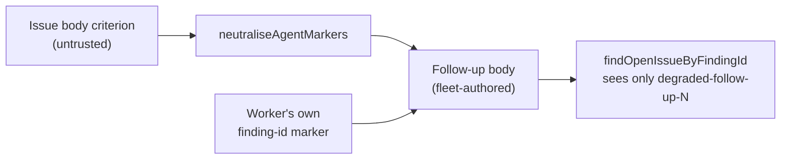

# PR Summary — Issue #2778

## Summary

Closes #2778.

A degraded (fallback-model) run files an `idle-task` follow-up under the fleet
account and copies the parent issue's acceptance criteria into it verbatim. A
criterion hiding `<!-- finding-id: X -->` therefore became a fleet-authored
finding-id marker. `findOpenIssueByFindingId` trusts that marker, so
`fileFindingOnce` would suppress the unrelated idle-task finding `X`. The fix
runs every criterion and every delivered line through `neutraliseAgentMarkers`
(Issue #2236) before rendering. Only the worker's own `degraded-follow-up-N`
marker stays live.



- [x] Regression test that fails on base and passes after the fix
- [x] Neutralise criteria (`shortfallLines`) and delivered lines
      (`buildDegradedFollowUpIssue`)
- [x] Docs: `docs/workflows/issue-processing.md`

## Spec

### Intent and Rationale

The follow-up body is fleet-authored, but its criteria come from an untrusted
issue body. Marker syntax copied from that body must not become a marker the
fleet appears to have written.

### Essential Design Decisions

- I reused `neutraliseAgentMarkers` rather than writing a finding-id-specific
  filter. It makes every HTML-comment delimiter inert, so markers named in the
  future are covered too, and the defused text stays visible to reviewers.
- Neutralisation happens at render time in `degraded_delivery.ts`. The verdict
  keeps the raw criterion text, so the closure-status matching that reads it is
  unchanged.

### Undiscoverable Facts

None.

## Evidence

- **Regression test:**
  `worker/deno/tests/degraded_delivery_test.ts::buildDegradedFollowUpIssue - #2778: a finding-id marker in a criterion or delivered line is inert`.
  It applies the same pattern as `FINDING_ID_RE` in `idle_task_snapshot.ts`
  and asserts that the only live finding-id is `degraded-follow-up-42`.
- **Fails before:** run against the unfixed `degraded_delivery.ts`, the test
  failed and the live ids included `forged-shortfall` and `forged-delivered`:

  ```text
  -     "forged-shortfall",
  -     "forged-delivered",
  FAILED | 27 passed | 1 failed
  ```

- **Passes after:** `deno task test:unit tests/degraded_delivery_test.ts
  tests/completion_phase_degraded_delivery_test.ts` gives `ok | 36 passed |
  0 failed`.
- **Trigger closed, no trivial bypass:** every `<!--` and `-->` in a criterion
  or delivered line is rewritten (`<!- -`, `- ->`), whatever the marker name,
  spacing or case. A longer run of dashes cannot re-form either delimiter. The
  issue title is never rendered into the body, and the degraded reason comes
  from the worker (model ids).
- **Docs sweep:** I grepped README.md and `docs/` (excluding the archive) for
  "degraded" and "follow-up". I updated the follow-up bullet in
  `docs/workflows/issue-processing.md`. The audit records
  (`docs/audits/security-sweep-*`) are point-in-time and stay unchanged.

## Reproduction

- **Symptom:** a criterion carrying `<!-- finding-id: X -->` produced a degraded
  follow-up whose body held a live, fleet-authored `finding-id: X` marker.
- **Status:** verified. The regression test reproduces it against the
  base-branch code.
- **Regression test:**
  `worker/deno/tests/degraded_delivery_test.ts::buildDegradedFollowUpIssue - #2778: a finding-id marker in a criterion or delivered line is inert`

## Test Plan

- `deno task test:unit tests/degraded_delivery_test.ts tests/completion_phase_degraded_delivery_test.ts < /dev/null`
- `./quality.sh < /dev/null`

## Security Self-Check

- [x] Input validation: untrusted criteria are neutralised before entering a
      fleet-authored body.
- [x] No secrets, hidden files or new dependencies.
- [x] Injection surface: unchanged (`gh` still receives the body as one argv
      element).
