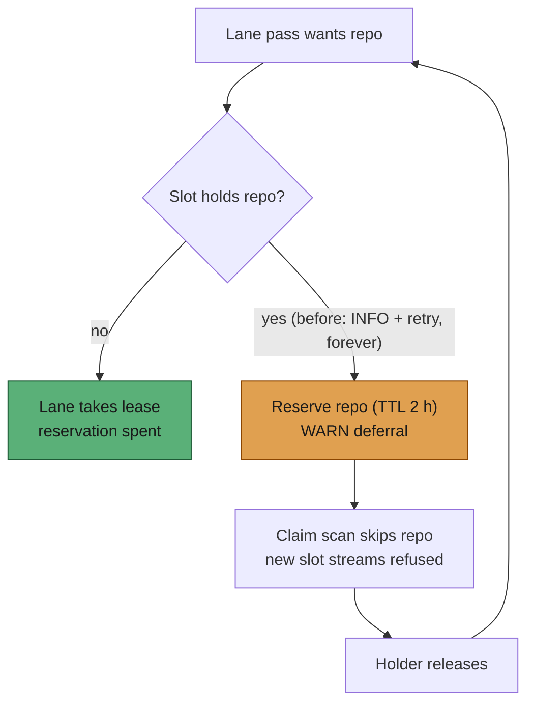

# Reserve a busy repository for the maintenance lane so its PRs are never starved

## Summary

Closes #2789.

GRQ-AutoTrader PRs #1631 and #1634 sat untouched because of how the
maintenance lane (`m1`) works. The lane runs PR feedback, spelling, CI fixes
and merge-conflict resolution, and it needs the repository to itself. Whenever
an issue slot held the repository, the lane logged
`Deferring … : an issue slot holds the repository` at INFO and tried again
next cycle.

On a busy repository the slots claim issue after issue, so a slot held it at
every lane pass. The PRs waited forever, and nothing louder than an INFO line
recorded it.

Fix, in `InFlightRepoRegistry` (`worker/deno/lib/in_flight_repos.ts`):

- **A refused lane reserves the repository.** While it is reserved, `tryAcquire`
  refuses any **new** slot stream of it, and `claimExcludedRepos()` (leased ∪
  reserved) keeps the claim scan off it. A slot already working there keeps
  its hold.
- **The lane wins it next.** When the holder releases, the lane's next pass
  takes the lease and the reservation is spent.
- **Bounded.** Each refused pass refreshes the reservation, which lapses
  `LANE_RESERVATION_TTL_MS` (2 h) after the last refusal. That is two default
  cycles, because the lane asks once per cycle. A PR fixed elsewhere cannot
  hold its repository hostage.
- **Loud.** The three deferral logs are now WARN and say the repository is
  reserved.

`run_core.ts` uses `claimExcludedRepos()` in both the scan exclusion and the
hook exclusion. The merge-conflict checkout lease benefits unchanged.



## Evidence

`worker/deno/tests/maintenance_lane_reservation_2789_test.ts` has seven tests.
It failed to compile before the fix (the export was missing) and passes after
it. The tests show:

- a refused lane reserves the repo, a sibling slot is refused on the default and
  milestone streams, the lane then wins, and after its release the slot wins
  (the regression);
- other repositories stay claimable;
- a slot's existing hold is untouched;
- the TTL lapses exactly at `LANE_RESERVATION_TTL_MS`, and each refusal
  refreshes it;
- a lane that wins first time never reserves;
- a lane refused by its own live lease does not reserve.

```text
deno task test:unit tests/maintenance_lane_reservation_2789_test.ts \
  tests/in_flight_repos_test.ts tests/stream_scoped_slot_exclusion_1091_test.ts \
  tests/maintenance_lane_test.ts tests/run_core_maintenance_lane_test.ts
ok | 37 passed | 0 failed
```

## Test Plan

- [x] New regression tests are green; the existing registry and lane suites
      are unchanged and green.
- [x] `deno fmt`, `deno lint` and `deno check` pass on the touched files.
- [x] `./quality.sh`.
- [ ] After deploy, GRQ-AutoTrader #1631 and #1634 get serviced. Expect a
      `[m1]` WARN `repository reserved for the maintenance lane`, then a
      feedback or CI-fix run.

## Checklist

- [x] Root cause found (lane lease starved by back-to-back slot claims).
- [x] Reservation in `InFlightRepoRegistry`, wired into the claim scan.
- [x] Deferral logs raised to WARN.
- [x] `DESIGN-PRINCIPLES.md` F10a and the `docs/workflows/README.md`
      maintenance-lane section updated.
- [x] Security self-check: no new external input, shell or HTTP surface; no
      secrets staged.
