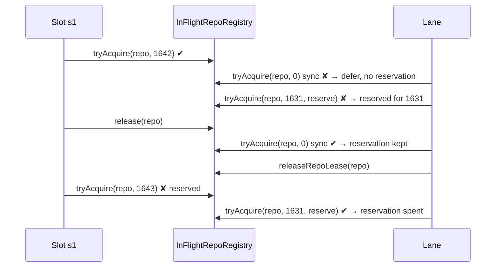

# Maintenance-lane reservation: PR passes opt in, and only the reserving PR spends it

## Summary

Closes #2793

This PR fixes two leaks in the #2789 lane reservation:

- **Opt-in reserve.** A refused lease reserves the repository only when the
  caller passes `{ reserve: true }`. The flag is threaded through
  `MaintenanceLaneBroker.tryAcquire` and `acquireMaintenanceRepoLease`. Only the
  five PR-servicing passes set it: PR feedback, spelling, CI fix, merge conflict
  and custom PR check. Milestone sync and self-heal (`leaseRepoFn`) lease every
  cloned repository each cycle, so they stay defer-only and no longer reserve
  every busy repository on the host.
- **Ref-owned spend.** A reservation records the ref that made it, and only a
  win by that ref clears it. A sync win (ref 0) or another PR's win keeps it. A
  full lane sequence that was not refused on the repository drops it through the
  new `InFlightRepoRegistry.releaseReservationsExcept(renewed)`, which logs
  `reservation released repo=…`. A sequence cut short by shutdown, the deadline
  or a rate limit keeps every reservation. The two-hour TTL remains the
  backstop.

Docs updated: `DESIGN-PRINCIPLES.md` F10a, plus the `docs/workflows/README.md`
lane-reservation bullets and sequence diagram.

Follow-up: #2795. The full-sequence drop also fires when a single-candidate pass
picked another repository that cycle. #2795 proposes dropping only on a positive
signal (the PR is closed or green).

## Evidence

- The new `worker/deno/tests/maintenance_lane_reservation_2793_test.ts` has 6
  tests, all passing:
  - opt-in and default defer-only;
  - the issue's scenario: sync win keeps the reservation, 1631 spends it;
  - another PR's win keeps it;
  - `releaseReservationsExcept`;
  - broker threading.
- `worker/deno/tests/run_core_maintenance_lane_test.ts` has two new
  `runCoreLoop` tests: a full sequence clears an unrenewed reservation, and one
  refused again keeps it.
- Related suites: 423 passed, 0 failed. `./quality.sh` passed, with the config
  integration step skipped.

## Acceptance Criteria

<!-- vibe-spec-review inputs="diff+issue-body" -->

1. Reserve only when the caller opts in with `{ reserve: true }`, threaded
   through `MaintenanceLaneBroker.tryAcquire` and `acquireMaintenanceRepoLease`.
   evidence: `LeaseOptions` in `lib/maintenance_lane.ts`;
   `tryAcquire(…, { reserve })` in `lib/in_flight_repos.ts`; test
   "acquireMaintenanceRepoLease - threads the reserve opt-in to the broker".
   reviewer: met
2. Set the flag only at the five PR-servicing call sites; sync and self-heal
   stay defer-only.
   evidence: `{ reserve: true }` at the PR feedback, spelling,
   CI fix, merge conflict and custom PR sites in
   `lib/run_core_production_deps.ts`; `leaseRepoFn` is unchanged.
   reviewer: met
3. A test proves that a refused sync-style lease leaves `reservedRepos()` empty.
   evidence: test "reservation opt-in - a refused sync-style lease (no reserve
   flag) does not reserve (Issue #2793)".
   reviewer: met
4. Record the reserving ref; clear only when that ref wins or a full pass
   sequence is not refused there; TTL is the other exit. evidence:
   `#reservations` map of `{ sinceMs, ref }`; `releaseReservationsExcept` called
   from `runMaintenanceLane` only when the sequence completes; tests "a full
   pass sequence that never asks for a reserved repo again clears it" and "a
   pass refused again in the sequence keeps its reservation".
   reviewer: partial
   reason: implemented as the issue words it. The reviewer noted that a
   single-candidate pass which picked another repository that cycle also counts
   as "not refused". That can drop a reservation for a PR that is still broken.
   The next refusal re-reserves it, so nothing starves. The docs now say this
   plainly, and #2795 tracks the positive-signal alternative.
5. A test covers the full scenario: a slot holds the repository, the lane is
   refused for 1631, the slot releases, ref 0 wins and releases, a slot is still
   refused, then 1631 wins.
   evidence: test "reservation owner - a sync win does
   not spend a PR pass's reservation (Issue #2793)".
   reviewer: met
6. The #2789 test helper `laneAcquire` now passes `reserve: true`. evidence:
   `tests/maintenance_lane_reservation_2789_test.ts`.
   reviewer: unrequested
   reason: reserving is opt-in now, so the #2789 tests must opt in to keep
   testing a PR pass's reservation.

## Standards Review

<!-- vibe-standards-review inputs="diff+CODING-STANDARDS.md" -->

- violation: the docs said a full-sequence drop means the PR "was fixed or
  closed elsewhere".
  evidence: `docs/workflows/README.md` lane-reservation
  bullets, `DESIGN-PRINCIPLES.md` F10a.
  reason: fixed. Both now say "not refused
  there" and note that the next refusal re-reserves. #2795 tracks the
  positive-signal release.
- violation: the PR summary was missing.
  evidence: `docs/archive/pr-summaries/`.
  reason: fixed by this file.
- violation: the new run-loop tests built the registry on the real clock.
  evidence: `tests/run_core_maintenance_lane_test.ts`.
  reason: fixed. Both use
  `new InFlightRepoRegistry(() => 0)`.
- violation: the broker-threading test is close to "asserts one function calls
  another".
  evidence: "acquireMaintenanceRepoLease - threads the reserve opt-in
  to the broker".
  reason: kept. It calls the real `acquireMaintenanceRepoLease`
  inside `runInMaintenanceLane` and asserts the observable options and return
  value at the broker seam. It does not inspect source.
- violation: the PR feedback call-site object literal was formatted
  inconsistently.
  evidence: `lib/run_core_production_deps.ts`.
  reason: fixed. It
  now uses the same `{ reserve: true }` one-liner as the other sites.
- violation: the docs overstate the WARN wording for some deferrals. evidence:
  custom PR check `detail` text.
  reason: kept. This predates #2789 and is out of
  scope.
- violation: the WIP checkpoint commit message names another issue. evidence:
  commit `27479566`.
  reason: kept. The worker's automatic checkpoint wrote that
  message. Rewriting pushed history would need a force-push.

## Test Plan

- [x] `deno task test:unit tests/maintenance_lane_reservation_2793_test.ts tests/maintenance_lane_reservation_2789_test.ts tests/run_core_maintenance_lane_test.ts`:
      22 passed.
- [x] Related suites: 423 passed, 0 failed.
- [x] `./quality.sh`: passed, with config integration skipped.
- [x] markdownlint is clean on `DESIGN-PRINCIPLES.md` and
      `docs/workflows/README.md`.
