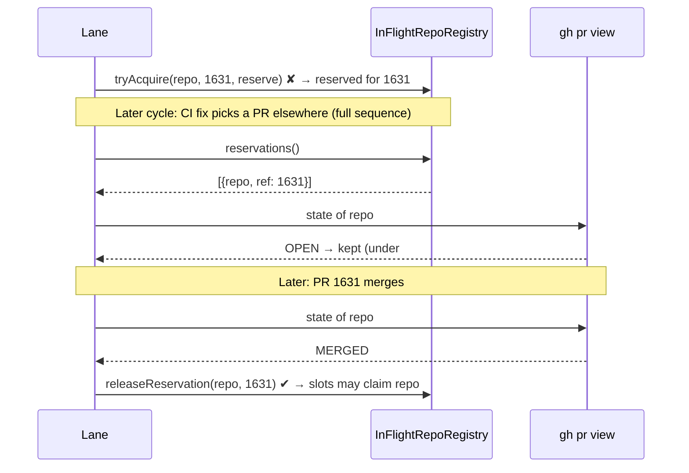

# Maintenance-lane reservation: drop only on a positive signal

## Summary

Closes #2795

> **Stacked on #2796.** This PR targets the #2793 branch. Rebase it onto the
> default branch once #2796 lands.

This PR deliberately reverses #2793's full-sequence drop. Under that rule, a
lane pass sequence that did not renew a reservation cleared it. The
single-candidate passes (CI fix, PR feedback) pick one PR per cycle, so a
reservation was also dropped when its PR was still broken, in either of two
cases:

- the pass picked a PR in another repository; or
- the pass failed before it reached the lease.

The drain could then restart.

A reservation now ends in one of three ways:

- **Its own PR wins the repository.** This is the ref-owned spend from #2793
  and is unchanged.
- **Positive signal.** After an uncut sequence, the lane asks the new optional
  `RunCoreDeps.isReservingPrClosed(repo, pr)` about each reservation. It drops
  the reservation only on `true`, meaning the PR is closed or merged, and logs
  `reservation released repo=… pr=…`. An open PR, an unknown state or a skipped
  pass keeps the reservation. An unreadable PR also keeps it, and that case is
  logged at ERROR. A sequence cut short by shutdown, the deadline, an abandoned
  pass or a rate limit reads nothing.
- **The two-hour TTL**, which is the backstop.

Green checks are deliberately not a signal. The PR-feedback and merge-conflict
passes reserve PRs whose checks are often green.

The implementation:

- **Registry.** `InFlightRepoRegistry.releaseReservationsExcept` is replaced by
  `reservations()` (a repo and ref list) and `releaseReservation(repo, ref)`.
  `releaseReservation` does nothing on a stale ref.
- **Production read.** The production dep reads `gh pr view --json state`.
  `CLOSED` or `MERGED` gives true, `OPEN` gives false, and anything else gives
  unknown.

Docs updated: `DESIGN-PRINCIPLES.md` F10a, plus the lane-reservation bullets and
sequence diagram in `docs/workflows/README.md`.

### Progress

- [x] Registry: `reservations()` and `releaseReservation(repo, ref)`
- [x] Lane: release on a positive signal after an uncut sequence only
- [x] Production dep `isReservingPrClosed` (`gh pr view --json state`)
- [x] Tests: registry and `runCoreLoop`, with the #2793 drop test reversed
- [x] Docs: F10a, the workflows README bullets and diagram

## Evidence

- The new `worker/deno/tests/maintenance_lane_reservation_2795_test.ts` has 6
  tests:
  - `reservations()`: the list, the empty case, and a lapsed reservation being
    pruned;
  - `releaseReservation`: a positive drop, a stale ref being refused, and an
    unreserved repository being a no-op.
- `worker/deno/tests/run_core_maintenance_lane_test.ts` has these `runCoreLoop`
  tests:
  - a full sequence that skipped the reserving PR keeps its reservation (this
    reverses the #2793 test);
  - a pass that fails before the lease keeps it;
  - a closed or merged PR releases it and logs the release;
  - an unreadable PR keeps it and is logged at ERROR;
  - an unknown state keeps it;
  - a rate-limited sequence makes no query.
- Mutation check: removing the `fullSequence` guard makes the rate-limited test
  fail.
- `deno fmt --check`, `deno lint` and `deno check` pass on the touched files,
  and markdownlint reports 0 issues.

## Test Plan

- `deno task test:unit tests/maintenance_lane_reservation_2795_test.ts tests/maintenance_lane_reservation_2793_test.ts tests/run_core_maintenance_lane_test.ts`
- `./quality.sh < /dev/null`
