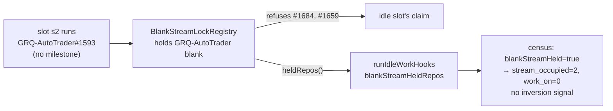

# Census counts issues behind this host's blank-stream lock as stream_occupied

## Summary

`stSoftwareAU/GRQ-AutoTrader` logged
`work_on=2 stream_occupied=0 inversion_signal=true` on three consecutive
cycles, yet the claim scan claimed nothing from that repository. The census
did not model one gate the pool applies. While slot s2 held the repo's blank
(no-milestone) stream on #1593, the host-local `BlankStreamLockRegistry`
(Issue #2335) refused the idle slot every other no-milestone issue there, for
**every** tier. The log line was `stream busy: … (blank) held by slot s2 on
#1593`. The census exempts `top-priority` / `work-on` from `stream_occupied`
(#2532), so it counted #1684 and #1659 as claimable.

- `BlankStreamLockRegistry.heldRepos()` names the repos whose blank stream
  this host holds.
- The slot's idle hooks pass that list (`blankStreamHeldRepos`) to
  `runIdleDecisionCensus`. The end-of-cycle census passes `[]`, because every
  slot has drained by then.
- The production census sets `RepoCensusInput.blankStreamHeld`, and
  `countUnblocked` counts every no-milestone issue of such a repo as
  `stream_occupied`, whatever its tier. Milestone issues are unaffected.

Closes #2800.

## Evidence

This is a backend change with no UI. Each new test failed before its change
and passed after it:

- `tests/idle_decision_census_test.ts`: three #2800 tests.
  - A held blank stream moves `work_on` issues to `stream_occupied` and clears
    the inversion signal.
  - A milestone issue in the same repo stays claimable.
  - With no hold, a blank-stream `work_on` issue stays claimable.
- `tests/stream_lock_blank_test.ts`: `heldRepos` names blank holds only and
  empties on release.
- `tests/run_core_idle_census_test.ts`: a real sibling slot runs
  GRQ-AutoTrader#1593, and the idle slot's census receives
  `["stSoftwareAU/GRQ-AutoTrader"]`. A mutation check (the slot passing `[]`)
  turns this test red.
- The existing idle-hook suites still pass: census wiring, filer, fleet
  telemetry and week-pace.

## Test Plan

- [x] `deno task test:unit` on the touched and census-faking suites
      (147 passed)
- [x] `deno check lib/run_core.ts lib/run_core_production_deps.ts`
- [x] `./quality.sh < /dev/null`
- [x] Docs updated: `docs/IDLE-TASK-FRAMEWORK.md`, `docs/INTERNALS.md`
