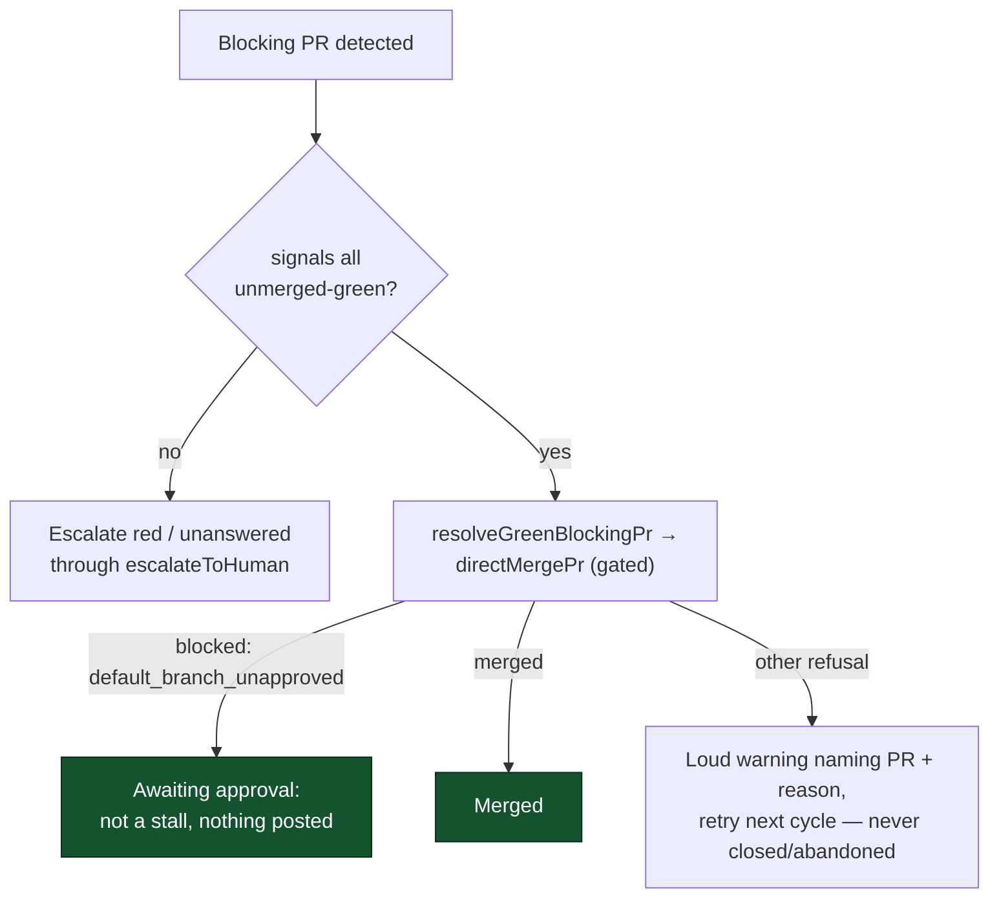

## Summary

The blocking-PR stall watchdog treated a green-but-unmerged PR (`unmerged-green`) as a stall and escalated it to `needs-human`. That was wrong: a green PR waiting on a human approval is healthy, and a green PR that needs no approval should simply merge. Since Issue #2801 the watchdog no longer escalates a green PR. It hands the PR, once per cycle, to the worker's own gated merge path (`directMergePr`), whose approval gate decides the outcome: awaiting approval → left alone (no comment, no label, no close); mergeable → merged; any other refusal → a loud warning naming the PR and the reason, and a retry next cycle. A green PR is never closed and never handed to abandon-and-redo. Closes #2801.

## Evidence

This is a backend change with no web interface, verified by unit tests rather than screenshots. The three acceptance scenarios are covered in `worker/deno/tests/blocking_pr_stall_detector_test.ts` and pass (`deno task test:unit tests/blocking_pr_stall_detector_test.ts` → 48 passed, 0 failed). `direct_merge.ts` is consumed unchanged.

## Acceptance Criteria

<!-- vibe-spec-review inputs="diff+issue-body" -->

- **met** — A green PR whose only merge blocker is missing approval produces no stall; zero `gh pr comment`, `gh issue create`, `gh pr edit --add-label`, `gh pr close` calls — evidence: `worker/deno/tests/blocking_pr_stall_detector_test.ts::a green PR awaiting approval is not a stall — no comment, label or close (Issue #2801)` — reviewer: met
- **met** — A green PR needing no approval is passed to `directMergePr` exactly once per cycle — evidence: `worker/deno/tests/blocking_pr_stall_detector_test.ts::a green PR needing no approval is passed to directMergePr exactly once per cycle (Issue #2801)` — reviewer: met
- **met** — A green PR whose merge is refused for another reason is never closed and never handed to abandon-and-redo, and the refusal is loud — evidence: `worker/deno/tests/blocking_pr_stall_detector_test.ts::a green PR whose merge is refused is never closed or re-queued, and the refusal is loud (Issue #2801)` — reviewer: met
- **met** — `direct_merge.ts` is unchanged by this PR — evidence: `git diff <base>...HEAD -- worker/deno/lib/direct_merge.ts` is empty; only consumed via `import { directMergePr }` at `worker/deno/lib/blocking_pr_stall_detector.ts:52` — reviewer: met
- **unrequested** — `docs/archive/handover/issue-2801.md` (new file, 43 lines) — reviewer: unrequested — reason: worker handover note for the interrupted prior run (Issue #769 pattern); committed by that run and referenced by the claim-release comment, so it rides the branch rather than being reverted.

Note (recorded departure, not a gap): the issue prose says to split the signal "in `detectBlockingPrStall`"; the implementation intercepts in `scanBlockingPrStalls` (`blocking_pr_stall_detector.ts:1112`). `detectBlockingPrStall` has no other production caller, and the green PR is `continue`d before the escalate path, so the outcome is equivalent and each criterion above is still satisfied.

## Standards Review

<!-- vibe-standards-review inputs="diff+CODING-STANDARDS.md" -->

- **clean** — Australian English spelling in new comments and docs ("authorised", "labelled", "behaviour"); fail-loud error handling in `resolveGreenBlockingPr` (a thrown merge error becomes `{ ok: false, error }` and a loud warning, never swallowed); no hardcoding to test inputs (production reads `opts.fleetAuthors`/`opts.ghCommandFn` and defaults `directMergeFn` to the real `directMergePr`); tests call real functions with real data and assert outcomes/side effects; no hidden files or secrets in the diff.
- **optional** — `worker/deno/tests/blocking_pr_stall_detector_test.ts:1316` pins the exact `options` object handed to the injected `directMergeFn` (a seam-contract assertion), and the "needing no approval" test's stub returns `merged: true` for a default-branch fixture. Test-only style points, no production impact.

## Test Plan

- Added `a green PR awaiting approval is not a stall — no comment, label or close (Issue #2801)`.
- Added `a green PR needing no approval is passed to directMergePr exactly once per cycle (Issue #2801)`.
- Added `a green PR whose merge is refused is never closed or re-queued, and the refusal is loud (Issue #2801)` (three refusal shapes: typed blocked, `ok:false`, thrown).
- Added `resolveGreenBlockingPr names the refusal reason and withholds the approval policy without a fleet`.

All in `worker/deno/tests/blocking_pr_stall_detector_test.ts`; the full file passes `deno task test:unit tests/blocking_pr_stall_detector_test.ts` (48 passed, 0 failed).
