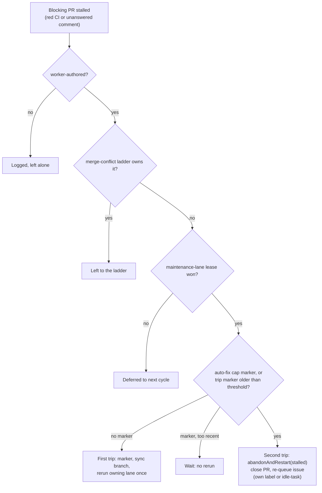

## Summary

The blocking-PR stall watchdog no longer files a `PR #N cannot land: …` issue
through `escalateAsWork` and no longer labels the PR `escalated`.
`escalateBlockingPrStall` is deleted. Stalls now go to a new stall-repair pass,
`worker/deno/lib/stall_repair.ts`. It runs at Priority 1.63 in the maintenance
lane, under that lane's lease on the repository, and works in two trips:

- **First trip.** The pass posts a hidden `<!-- vibe-stall-repair … -->`
  marker as the claim, syncs the branch through `updatePrBranch`
  (`git_pull.ts`, used as-is), and reruns the owning lane once on that PR only:
  CI fix for red CI, PR feedback for an unanswered comment.
- **Second trip.** Once the marker is older than the threshold and the PR is
  still stalled, the pass calls `abandonAndRestart` with a new `stalled` reason.
  The issue keeps its own pickup label or gets `idle-task`, never `work-on`. A
  PR with no originating issue is closed and no issue is filed.
- **Auto-fix cap.** A PR at the cap skips the rerun and goes straight to
  abandon.
- **Human-authored PRs** are logged and left alone.

Closes #2802.

## Evidence

This is a backend change with no UI. The tests below drive the real detector,
the pass and the real `abandonAndRestart` against an in-memory GitHub.

The standards reviewer found a real bug in the first draft: the trip marker is
a fleet comment and the sync is a fleet push, so the detector read either one as
the answer to the authorised comment. An unanswered-comment stall then cleared
itself and never reached the second trip. The fix is in
`detectBlockingPrStall`: once a trip is recorded after the comment, only a real
fleet reply counts as the answer. The regression test
`an unanswered comment still trips after the first trip's own marker and sync
push` failed without the fix and passes with it.

## Acceptance Criteria

<!-- vibe-spec-review inputs="diff+issue-body" -->

- **met** — No stall path calls `escalateAsWork`; each signal driven through both trips makes zero `gh issue create` calls — evidence: `worker/deno/tests/stall_repair_test.ts::red-ci / unanswered-comment: first trip syncs and reruns … second trip abandons — no issue, no escalated label` — reviewer: met
- **met** — No stall path adds the `escalated` label — evidence: same test (`forbiddenCalls` rejects any `escalated` argument) and `blocking_pr_stall_detector_test.ts::scan reports a stalled blocking PR and writes nothing` — reviewer: met
- **met** — First trip syncs and dispatches the owning lane exactly once; a repeat first trip does not rerun it — evidence: `stall_repair_test.ts` (`syncs == 1`, `lanes == [lane]`, then `awaiting-second-check`) — reviewer: met
- **met** — Second trip calls `abandonAndRestart` with the originating issue; re-queue label is the issue's own pickup label or `idle-task`, never `work-on` — evidence: `stall_repair_test.ts::second trip keeps the issue's own pickup label and applies nothing` and the per-signal test (`idle-task`) — reviewer: met
- **met** — A capped PR goes straight to abandon — evidence: `stall_repair_test.ts::a PR at the auto-fix cap skips the rerun and goes straight to abandon` — reviewer: met
- **met** — A human-authored PR is never closed — evidence: `stall_repair_test.ts::a human-authored stalled PR is logged and never touched` — reviewer: met
- **met** — The pass runs only while holding the maintenance-lane lease and skips when the lease is held elsewhere — evidence: `stall_repair_test.ts::the pass skips a PR whose repository is leased elsewhere`; the harness asserts every write happens under the lease; `run_core.ts` sets `maintenanceLane: true` — reviewer: met
- **unrequested** — Stall repair skips PRs the merge-conflict ladder owns — reviewer: unrequested — reason: required by #1213; closing is the ladder's own last rung, and abandoning here would skip its attempts
- **unrequested** — `onlyPrNumber` on `PrScanOptions`, plus the `stallLaneTarget` slot in `run_core_production_deps.ts` — reviewer: unrequested — reason: needed so "rerun the owning lane once" runs on the stalled PR rather than on whichever PR is next
- **unrequested** — `conflict_abandon_restart.ts` gains a `closed-without-issue` outcome and three stall-worded comment builders, not only a reason parameter — reviewer: unrequested — reason: this is how the close comments say "stalled" rather than "merge conflict", and how a no-issue close avoids filing an issue
- **unrequested** — Priority 1.63 renamed to "Blocking PR Stall Repair" in `run_core.ts`, `docs/USAGE.md` and `docs/workflows/README.md` — reviewer: unrequested — reason: the old name and descriptions said "detect and escalate", which is no longer true
- **unrequested** — The first-trip comment has one visible explanatory line beside the hidden marker — reviewer: unrequested — reason: a PR thread should say why the worker pushed to it
- **unrequested** — `describeStallSummary`, `BLOCKING_PR_STALL_NEXT_STEP` and `buildBlockingPrStallNextStep` removed along with their tests — reviewer: unrequested — reason: these were used only by the deleted escalation; the outsider-marker (#1216) coverage moved to `stall_repair_test.ts`

## Standards Review

<!-- vibe-standards-review inputs="diff+CODING-STANDARDS.md" -->

- **violation** — Fail loud: the watchdog's own trip marker and sync push cleared the unanswered-comment stall, so the second trip never fired — evidence: `worker/deno/lib/stall_repair.ts` first-trip comment together with `blocking_pr_stall_detector.ts` `observeBlockingPr` — reason: fixed here. The marker is read into `lastStallRepairAt`, not counted as a reply, and after a trip only a real fleet reply answers the comment. The regression test goes through detection, first trip, re-detection and second trip.
- **clean** — Australian English; behavioural tests with an in-memory GitHub fake, no source-grepping; outsider-marker coverage kept; `Result` types; the new outcome is handled; the lease is taken before any clone or GitHub write; new comments pass through `sanitiseIssueText`; log levels match the existing passes; removed symbols have no remaining references; docs updated. Optional notes: the two remaining 1.63 doc mentions were fixed here. `exhaustedEscalationRoute` maps `closed-without-issue` to `abandon-declined`, which only the stall route can produce and which no caller escalates.

## Test Plan

- New: `worker/deno/tests/stall_repair_test.ts`, 10 tests: both signals through both trips, pickup label kept, auto-fix cap, outsider markers, human-authored PR, lease held elsewhere, PR owned by the merge-conflict ladder, no originating issue, and the marker/push regression.
- Changed: `worker/deno/tests/blocking_pr_stall_detector_test.ts`. The escalation tests are removed, because escalation is a contract this issue retires. The scan test now asserts zero writes, and a new test covers parsing of the marker comment.
- `deno test tests/stall_repair_test.ts tests/blocking_pr_stall_detector_test.ts tests/conflict_abandon_restart_test.ts`: 103 passed.
- `./quality.sh` result is recorded in the PR body.
