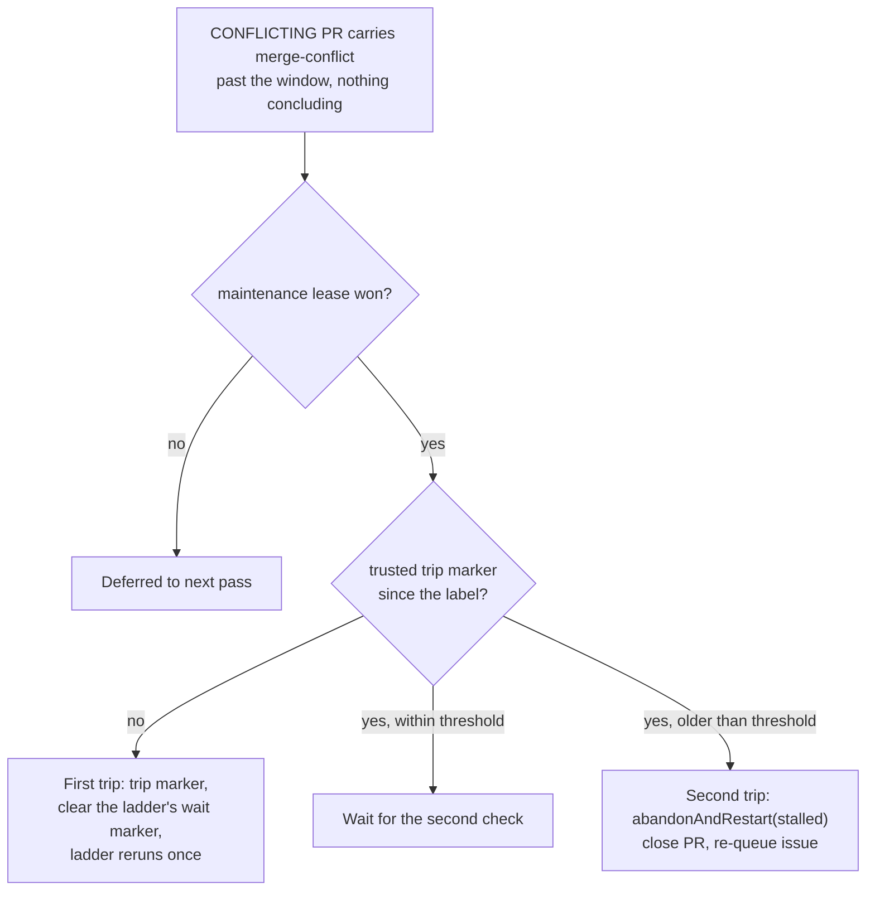

## Summary

The conflict-queue stall watchdog no longer files a `PR #N cannot land: …`
issue through `escalateAsWork` and no longer labels the PR `escalated`.
`escalateConflictQueueStall` becomes `repairConflictQueueStall` in
`worker/deno/lib/merge_conflict_stall_watchdog.ts`. Like the blocking-PR
watchdog (#2802), it now works in two trips, under the maintenance-lane lease
on the repository:

- **First trip.** Post a hidden `<!-- vibe-conflict-stall-repair trip="1" -->`
  marker on the PR, then delete the fleet's `rung="abandon"` wait markers so the
  conflict ladder reruns once.
- **Second trip.** If the trip marker is older than the stall threshold and the
  PR is still stalled, call `abandonAndRestart` (`conflict_abandon_restart.ts`,
  not edited) with the `stalled` reason. That picks the re-queue label through
  `planRequeueLabel`: the issue's own label, else `idle-task`, never `work-on`.
- `run_core_production_deps.ts` passes the fleet's `trustedAuthors` to the scan.
  Without them `abandonAndRestart` declines, and the second trip could never
  fire.
- `docs/workflows/merge-conflicts.md` describes the two-trip repair in place of
  the escalation, including the mermaid diagram and the label bullet.

Closes #2803.

## Evidence

This is a backend change with no UI. The tests drive the real detector, repair
and scan against an in-memory GitHub fake that records every `gh` call.

## Acceptance Criteria

<!-- vibe-spec-review inputs="diff+issue-body" -->

- **met** — No path in `merge_conflict_stall_watchdog.ts` calls `escalateAsWork`; the test asserts zero `gh issue create` calls on both trips — evidence: `tests/merge_conflict_stall_watchdog_test.ts::scanConflictQueueStalls - files no issue and adds no label on either trip` (`assertNoEscalation` over both scans); the lib no longer imports `escalate_as_work.ts` — reviewer: met
- **met** — No path adds the `escalated` label; the test asserts no `--add-label escalated` — evidence: same test and `assertNoEscalation`, which also rejects `needs-human` and, in the scan test, any `--add-label` — reviewer: met
- **met** — The first trip reruns the ladder once and does not abandon; the second trip calls `abandonAndRestart` exactly once — evidence: `tests/merge_conflict_stall_watchdog_test.ts::repairConflictQueueStall - the first trip reruns the ladder once and does not abandon`, `::repairConflictQueueStall - the second trip abandons and redoes exactly once`, `::scanConflictQueueStalls - two hosts in one window trip once` — reviewer: met
- **met** — `docs/workflows/merge-conflicts.md` no longer describes `escalateAsWork` or `escalated` for the stall watchdog — evidence: `docs/workflows/merge-conflicts.md` (renamed section, mermaid nodes replaced by the trips and `abandonAndRestart`, the label bullet rewritten); the remaining `escalated` mention is the general #569 section, not the watchdog — reviewer: met
- **unrequested** — `run_core_production_deps.ts` passes `trustedAuthors` to `scanConflictQueueStalls` — reviewer: unrequested — reason: `abandonAndRestart` declines with an empty trusted list, so the second trip would never fire in production without it
- **unrequested** — The maintenance-lane lease around both trips, and a re-read of the thread under the lease before choosing a trip — reviewer: unrequested — reason: the repair deletes markers and closes PRs, so it is serialised against the conflict pass and against a second host
- **unrequested** — The `gh pr view` head/base lookup, and `declined`/`failed` abandon results reported as actions — reviewer: unrequested — reason: plumbing the `abandonAndRestart` call needs; failures are reported, never swallowed

Spec-reviewer notes, not criterion failures:

- The second trip waits one full threshold after the first trip; that is how "the next check" is read here.
- The rerun may go straight to the ladder's abandon step rather than a new merge attempt. This happens when a `rung="rebase"` failure marker for the same head is still on the thread.
- The watchdog tests replace `abandon` with a fake. The `planRequeueLabel` behaviour therefore rests on the existing `conflict_abandon_restart.ts` tests, not on a new one.

## Standards Review

<!-- vibe-standards-review inputs="diff+CODING-STANDARDS.md" -->

- **violation** — Text posted to GitHub must match the code — evidence: `worker/deno/lib/merge_conflict_stall_watchdog.ts:613` passing `buildConflictStallReason(stall)` into `worker/deno/lib/conflict_abandon_restart.ts:1144-1208` — reason: stands, not fixed in this summary-only retry. The `stalled` comment builders were written for the blocking-PR route. They say the PR was "synced … and reran its owning lane once" and put the detail after "This PR …". The whole multi-paragraph reason, which starts with `owner/repo#N has carried…`, therefore reads garbled on the PR and the issue at every second trip. No test catches it because the second-trip tests use a fake `abandon`. A follow-up is needed.
- **violation** — DRY: `repairConflictQueueStall` re-implements the two-trip lease/marker/threshold/outcome flow of `stall_repair.ts` — evidence: `worker/deno/lib/merge_conflict_stall_watchdog.ts:487-700` vs `worker/deno/lib/stall_repair.ts:67-365` — reason: stands. The two copies already differ in trip-time units and log wording.
- **violation** — DRY: `isAbandonWaitMarker` parses the rung-failed marker by hand, reading the first occurrence and not checking the head SHA — evidence: `worker/deno/lib/merge_conflict_stall_watchdog.ts:531-545` vs `worker/deno/lib/conflict_verdict_ladder.ts:81-86,150-160` — reason: stands; minor.
- **violation** — Docs in step with code — evidence: `docs/workflows/merge-conflicts.md:742,782` say the wait marker "for this head" is cleared, but the code clears every trusted `rung="abandon"` marker; `docs/workflows/merge-conflicts.md:1148-1152` still mentions `escalate_as_work.ts` for conflicting PRs — reason: stands; minor.
- **violation** — Fail loud — evidence: `worker/deno/lib/merge_conflict_stall_watchdog.ts:548-549` — reason: stands. A trusted wait marker with no readable id is skipped silently, yet the pass still reports `first-trip`. This is unlikely with REST data.
- **violation** — Test coverage of error paths — evidence: `worker/deno/tests/merge_conflict_stall_watchdog_test.ts` — reason: stands. Nothing replaces the removed "failed filing" tests: no test covers a failed trip-comment post, a failed DELETE, or a malformed `gh pr view` ending as `failed` with the lease released.
- **clean** — Australian English in the added lines; behavioural tests against a fake GitHub, no source-grepping; log levels; no leftover references to `escalateConflictQueueStall`, `CONFLICT_STALL_SUMMARY`, `CONFLICT_STALL_NEXT_STEP` or `ConflictStallEscalation*` outside the archive; imports tidied; `run_core_production_deps.ts` comment and wiring updated; text passed to `abandonAndRestart` goes through `sanitiseIssueText`; trip markers are trusted only from fleet authors, with a test; `deno fmt` and `deno lint` pass.

## Test Plan

- Changed: `worker/deno/tests/merge_conflict_stall_watchdog_test.ts`. It no longer imports `escalate_as_work.ts`. The escalation tests are replaced by the trip cases: first trip, the wait inside the window, second trip, declined or failed abandon, untrusted or pre-label marker, conclusion after the trip, held lease, two hosts in one window, and no issue or label on either trip.
- `deno test -A tests/merge_conflict_stall_watchdog_test.ts`: 39 passed.
- `./quality.sh` result is recorded in the PR body.
