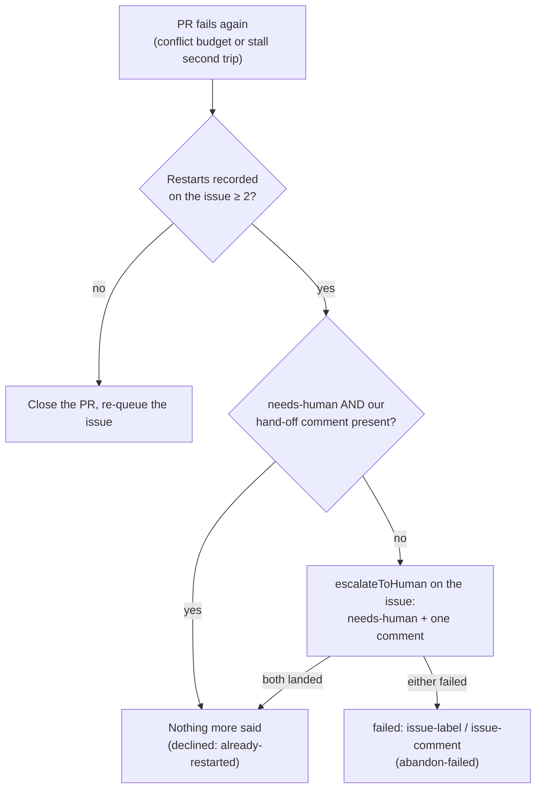

## Summary

When an issue that has already been redone `MAX_RESTARTS_PER_ISSUE` (two)
times fails again, `abandonAndRestart` now hands the **originating issue** to
a human. It adds `needs-human` and posts one comment through the shared
`escalateToHuman` chokepoint. The comment names the PR, says both redos are
used, and asks a human to fix the PR by hand, rescope the issue, or close it.
There is no third redo: the PR is not closed and the issue is not re-queued.
Before this, the PR was left open on `merge-conflict` and nobody was told.

The change lives entirely in `conflict_abandon_restart.ts`, so all three routes
into the rung inherit it with no caller edits: the blocking-PR stall, the
conflict-queue stall, and the ladder's own final rung. The outcome is still
`declined` / `already-restarted`.

- **Idempotent:** the hand-off is skipped only when the issue already carries
  `needs-human` **and** the fleet's own hand-off comment for this PR. A
  comment that failed after its label landed is therefore retried rather than
  read as done.
- **Fail loud:** a label or comment that did not land returns
  `failed` / `issue-label` or `issue-comment`, which maps to `abandon-failed`.
- A claim naming only this PR (an unfinished earlier abandon, budget not
  spent) is unchanged: nobody is asked.

Closes #2804.

## Evidence

Backend-only change; nothing to screenshot. It is verified by the tests below,
which all pass (`deno test` on the four touched test files: 190 passed,
0 failed).

<!-- vibe-quality-gate-skipped reason="./quality.sh ran every static stage and all passed (chokepoints incl. needs-human, completeness, mermaid, markdownlint, semgrep, release-tag ruleset), but its full test stage did not finish inside a single 590s foreground call; deno fmt --check, deno lint and deno check were run on the touched code (clean), plus the touched test files. CI runs the full suite." -->

## Acceptance Criteria

<!-- vibe-spec-review inputs="diff+issue-body" -->

- **met** — With `MAX_RESTARTS_PER_ISSUE` redos recorded, a further failure adds `needs-human` to the originating issue and posts exactly one comment; the test asserts both calls — evidence: `worker/deno/tests/conflict_abandon_restart_test.ts::abandonAndRestart - a spent restart budget adds needs-human and one comment to the issue` — reviewer: met
- **met** — The same state never calls `gh pr close` and never re-queues the issue — evidence: `worker/deno/tests/conflict_abandon_restart_test.ts::abandonAndRestart - a spent restart budget adds needs-human and one comment to the issue` (no `pr close`, no `issue reopen`, no `idle-task`, no new restart claim) — reviewer: met
- **met** — A second pass over the same state posts no second comment — evidence: `worker/deno/tests/conflict_abandon_restart_test.ts::abandonAndRestart - a second pass over a spent budget posts no second comment` — reviewer: met
- **met** — A failed label or comment call yields `abandon-failed`, not success — evidence: `worker/deno/tests/conflict_abandon_restart_test.ts::abandonAndRestart - a failed needs-human label is a failure, not a decline`, `::abandonAndRestart - a failed hand-off comment is a failure, not a decline`, `::abandonAndRestart - a comment that failed after the label is retried, not read as done` — reviewer: partial — reason: the reviewer found that a comment failing after the label landed was read as done on the next pass; fixed in this diff (the skip now needs both the label and the fleet's own hand-off comment), with the retry test added
- **met** — Separate tests drive the path from a blocking-PR stall second trip (#2802) and a conflict-queue stall second trip (#2803), each reaching `needs-human` — evidence: `worker/deno/tests/stall_repair_test.ts::second trip on an issue already redone twice adds needs-human and one comment, no third redo (Issue #2804)`, `worker/deno/tests/merge_conflict_stall_watchdog_test.ts::repairConflictQueueStall - a second trip on an issue already redone twice adds needs-human and one comment (Issue #2804)` — reviewer: met
- **unrequested** — `docs/MERGE.md`, `README.md`, `DESIGN-PRINCIPLES.md`, `docs/CONFIGURATION.md` and the `merge_conflict_stall_watchdog.ts` doc comment updated — reviewer: unrequested — reason: each stated the old "nobody is asked" behaviour; the standards review flagged README and DESIGN-PRINCIPLES as now false
- **unrequested** — `pr_merge_conflict_scan_test.ts`: three spent-budget tests now assert `needs-human` reaches only issue #16, never the PR — reviewer: unrequested — reason: those tests pinned the old "no needs-human anywhere" contract this issue deliberately changes
- **unrequested** — the restart comment's closing line and the `already-restarted` route detail reworded — reviewer: unrequested — reason: both promised a park with nobody asked, which is no longer true
- **unrequested** — two extra tests: the stall reason is named in the hand-off comment, and an unfinished same-PR abandon asks nobody — reviewer: unrequested — reason: they guard the stall wording and the budget boundary this change introduces
- **unrequested** — the dedup key `restartsSpentDedupKey` is keyed per PR — reviewer: unrequested — reason: a retry on the same PR never comments twice, while a new PR after a human re-queue gets its own hand-off

## Standards Review

<!-- vibe-standards-review inputs="diff+CODING-STANDARDS.md" -->

- **violation** — Fail loud: a comment that failed after its label landed was silently read as done on the next pass — evidence: `worker/deno/lib/conflict_abandon_restart.ts:1291` — reason: fixed here; the skip now needs both the label and the fleet-authored hand-off comment, and the retry test covers it
- **violation** — A code change owes a docs change: `README.md` still said a spent budget parks the PR with nobody asked — evidence: `README.md:560` — reason: fixed here
- **violation** — A code change owes a docs change: `DESIGN-PRINCIPLES.md` "Flag the fallback, ask nobody" contradicted the new hand-off — evidence: `DESIGN-PRINCIPLES.md:304-326` — reason: fixed here; the principle now names the deliberate issue-level exception
- **clean** — Australian English; every field of the `escalateToHuman` result is checked; comment text is sanitised through `sanitiseIssueText`; dedup authors are wired so a planted marker cannot suppress the hand-off; log levels; the changed scan tests are a documented contract change, not a weakening; callers untouched. Optional note acted on: `docs/CONFIGURATION.md` stall-repair section now mentions the hand-off.

## Test Plan

- `worker/deno/tests/conflict_abandon_restart_test.ts`: spent budget adds the label and one comment; second pass is silent; stall wording; failed label → `failed`; failed comment → `failed`; a failed comment is retried on the next pass; an unfinished same-PR abandon asks nobody. The existing wording assertions were updated.
- `worker/deno/tests/stall_repair_test.ts`: blocking-PR stall second trip on a twice-redone issue.
- `worker/deno/tests/merge_conflict_stall_watchdog_test.ts`: conflict-queue stall second trip on a twice-redone issue.
- `worker/deno/tests/pr_merge_conflict_scan_test.ts`: the spent-budget park tests now assert `needs-human` reaches the issue only.

🤖 Generated with [Claude Code](https://claude.com/claude-code)
