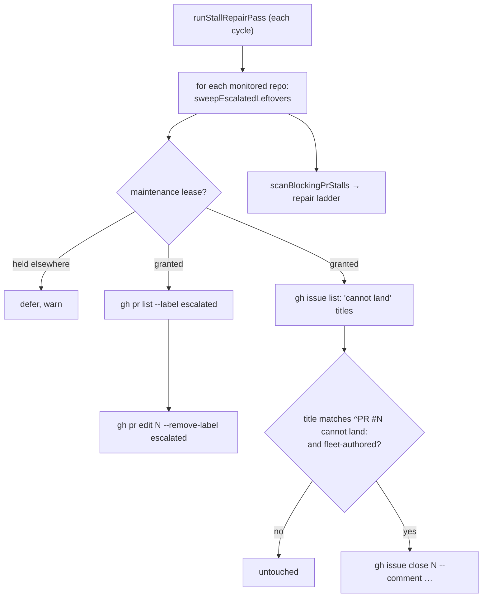

# PR Summary — Issue #2805

## Summary

Adds `worker/deno/lib/escalated_cleanup.ts`, a per-cycle sweep that
`runStallRepairPass` runs in every monitored repository under the
maintenance-lane lease. It removes the `escalated` label from open PRs, and it
comments on and closes open `PR #N cannot land: …` issues that a fleet account
filed. Authorship is checked with `selectFleetAuthoredMatches`, so a
human-filed issue is never touched. Every `gh` failure is logged with the repo
and number, and counted. The change also deletes `escalate_as_work.ts` and its
test, and drops the file's allowlist entry. Closes #2805.

- [x] Sweep module and its call site in `stall_repair.ts`
- [x] Delete `escalate_as_work.ts` and its test, and drop the allowlist entry
- [x] Fix comments and docs (`merge_fallback_issue.ts`, `idle_task_snapshot.ts`,
      `untrusted_marker_action_verification_test.ts`, SECURITY.md,
      `merge-conflicts.md`, CONFIGURATION.md)
- [x] Update the sweep-coverage ledger (`top-up-2805`) and remove the retired
      marker from the grammar registry
- [ ] Post-roll-out check across the monitored repos (see below)

## Evidence

Backend only, so there is no UI to screenshot. `./quality.sh` passed on this
branch. The final commit's edits were re-checked with `deno fmt`, `deno lint`
and the touched test files (31 passed).

**Roll-out check.** Run on 2026-09-29, before this is deployed, with
`gh search prs --owner stSoftwareAU --label escalated --state open` and the
matching `cannot land` issue search:

- open `escalated` PRs: **none**
- open fleet-filed `PR #N cannot land:` issues: **2** — `stSoftwareAU/GRQ-GTC#443`
  and `stSoftwareAU/GRQ-dividends#25`, both filed by `VibeCoderST`. The sweep
  closes both on its first cycle after roll-out. The same two searches must be
  re-run then to confirm both come back empty.

## Acceptance Criteria

<!-- vibe-spec-review inputs="diff+issue-body" -->

- **met** — Given an open `escalated` PR, the sweep removes the label, and the test asserts the `--remove-label escalated` call — evidence: `worker/deno/tests/escalated_cleanup_test.ts::escalated cleanup - removes the escalated label from an open PR` — reviewer: met
- **met** — A fleet-authored open `PR #N cannot land:` issue is commented on once and closed; a human-authored issue with the same title is untouched — evidence: `worker/deno/tests/escalated_cleanup_test.ts::escalated cleanup - comments once on and closes a fleet-filed cannot-land issue`, `worker/deno/tests/untrusted_marker_action_verification_test.ts::escalated cleanup - a planted cannot-land title is never closed` — reviewer: met
- **met** — A second sweep over a clean repo makes no write calls — evidence: `worker/deno/tests/escalated_cleanup_test.ts::escalated cleanup - a second sweep over a clean repo makes no write calls` — reviewer: met
- **met** — `escalate_as_work.ts` no longer exists and `deno task check` passes — evidence: file deleted in this diff; `deno type check` PASSED in `./quality.sh` — reviewer: met
- **partial** — After roll-out, no open `escalated` PR and no fleet-filed `PR #N cannot land:` issue in any monitored repo, recorded in the summary — evidence: the Roll-out check above — reviewer: missing — reason: the pre-roll-out state is recorded here (0 PRs, 2 issues); the post-roll-out confirmation can only be run once this is deployed
- **unrequested** — the two `escalateAsWork` tests in `untrusted_marker_action_verification_test.ts` are replaced with two `escalated_cleanup` fail-direction tests — reviewer: unrequested — reason: the import of the deleted module had to go, and the new site belongs in that fail-direction table
- **unrequested** — the `vibe-work-escalation:` entry is removed from `marker_grammar_test.ts` — reviewer: unrequested — reason: that test fails on a declared marker that is no longer emitted
- **unrequested** — SECURITY.md, `docs/workflows/merge-conflicts.md` and `docs/CONFIGURATION.md` are updated — reviewer: unrequested — reason: they referenced the deleted file or document the stall-repair pass, and a code change owes a docs change
- **unrequested** — the `lib-sweep-coverage.json` slice `top-up-2805` and `docs/audits/security-sweep-2805-escalated-cleanup.md` — reviewer: unrequested — reason: `lib_sweep_coverage_test.ts` fails on a lib module the ledger lists as missing or stale
- **unrequested** — the `acquireLease` seam, the `deferred` outcome and the lease-deferral test — reviewer: unrequested — reason: they make the required maintenance-lane lease testable
- **unrequested** — the single-page `LIST_LIMIT` of 100, marked `SIMPLE-ON-PURPOSE` — reviewer: unrequested — reason: any leftovers beyond 100 drain over later cycles
- **unrequested** — a test that a failed listing is counted — reviewer: unrequested — reason: it pins the requirement that no `gh` failure is swallowed
- **unrequested** — a summary warning in `runStallRepairPass` when a sweep had failures — reviewer: unrequested — reason: it puts the failure count in the pass log

## Standards Review

<!-- vibe-standards-review inputs="diff+CODING-STANDARDS.md" -->

- **violation** — Log Levels Are a Promise: retryable `gh` failures were logged at ERROR — evidence: `worker/deno/lib/escalated_cleanup.ts` (`fail()`) — reason: fixed in this diff; they now log at WARN, and the test reads from the warning sink
- **clean** — fail loud (a failed listing is never read as a clean repo); security (fleet-author check before the close, strict title regex, argv-only `gh`, fixed comment text); KISS/DRY (reuses the shared author helper and the lease); tests call real code with a stateful fake; no leftover references; ledger registration; docs; Australian English. Optional notes: the "a retry never stacks comments" comment overclaimed and was reworded; CONFIGURATION.md now documents the sweep.

## Test Plan

- New: `worker/deno/tests/escalated_cleanup_test.ts`. It covers label removal,
  fleet-only close, the idempotent second sweep, failure logging and counting,
  a failed listing, and lease deferral.
- Changed: `worker/deno/tests/untrusted_marker_action_verification_test.ts`,
  where section 6a now covers the sweep's close-nothing fail direction.
- Changed: `worker/deno/tests/marker_grammar_test.ts`, which drops the retired
  marker.
- Deleted: `worker/deno/tests/escalate_as_work_test.ts`, together with its
  module.
