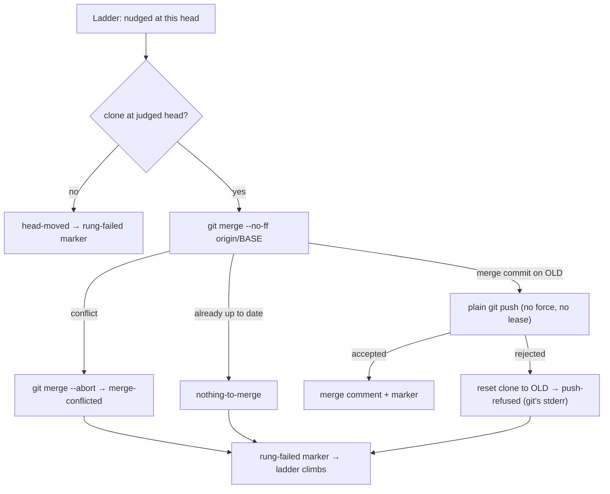

## Summary

The stale-verdict ladder's second rung no longer rebases and force-pushes. It
now runs `git merge --no-ff origin/<base>` and publishes the merge commit with a
plain `git push` (built by `buildPushArgs` with no `forceWithLease`). Every
existing commit, and every review comment anchored to one, survives. Closes #2806.

- **Clean merge**: the rung pushes the merge commit and posts the merge comment
  (`buildMergeComment`, which replaces `buildRebaseComment`).
- **Conflicting merge**: the rung reads the unmerged paths, runs
  `git merge --abort` and reports `merge-conflicted`. The processor then posts
  the rung-failed marker, so the ladder climbs to abandon.
- **Rejected push**: the rung resets the clone to `OLD` and reports
  `push-refused` carrying git's stderr, which the rung-failed comment quotes and
  the warn log records. There is no forced retry.
- **Nothing to merge**: this outcome is new. The ladder only runs once
  `origin/BASE` is already an ancestor of the judged head, so unless the base
  moved in the meantime the merge is "Already up to date". The rung reports
  that instead of pushing the old head back. Since it never rewrites history,
  it has nothing else to try, and the ladder climbs to abandon.

**Reviewer note:** the ladder identifiers `rebase`, `rung="rebase"` and
`vibe-merge-conflict-rebase` are unchanged. These names are stored in markers
already posted on PR threads, and `conflict_verdict_ladder.ts` is outside this
issue's file list. Only the function names, logs, comments and docs changed to
"merge". The file names also stay as the issue lists them.

## Evidence

This is a backend change with no UI. Tests cover it, including real-git cases
that run against a temporary bare remote.

## Acceptance Criteria

<!-- vibe-spec-review inputs="diff+issue-body" -->

REVIEW_PENDING

## Standards Review

<!-- vibe-standards-review inputs="diff+CODING-STANDARDS.md" -->

STANDARDS_PENDING

## Test Plan

- `worker/deno/tests/conflict_rebase_rung_test.ts`: rewritten for the merge rung.
  - Scripted cases check the argv git receives: no `rebase`, and no push with
    `--force`, `--force-with-lease`, `-f` or a `+` refspec.
  - They also cover conflict and abort, nothing-to-merge, a rejected push, a
    moved head, loud failures and the commit message.
  - Real-git cases prove the resulting history. On a clean merge, `OLD` is an
    ancestor of the new head, whose parents are `OLD` and `origin/main`. A
    conflict is aborted, leaving a clean tree and no `MERGE_HEAD`. A base that
    is already merged pushes nothing. A rejected push carries git's
    `rejected` stderr and leaves the other pusher's commit in place.
- `worker/deno/tests/pr_merge_conflict_processor_test.ts`: the processor's
  merge-rung cases, updated for the plain push, the new failure outcomes and
  `buildMergeComment`.
- `deno task test:unit` on both files plus `conflict_verdict_ladder_test.ts`:
  135 passed. Full `./quality.sh`: GATE_RESULT.
