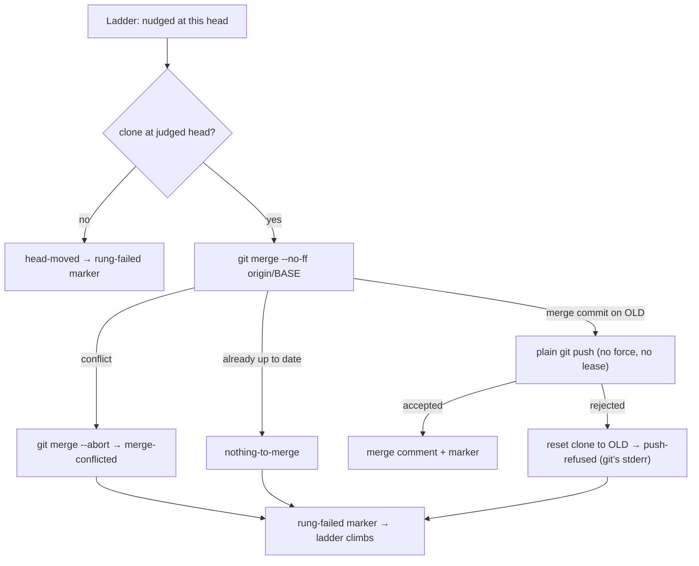

## Summary

The stale-verdict ladder's second rung no longer rebases and force-pushes. It
now runs `git merge --no-ff origin/<base>` and publishes the merge commit with a
plain `git push` (built by `buildPushArgs` with no `forceWithLease`). Every
existing commit, and every review comment anchored to one, survives. Closes #2806.

- **Clean merge**: the rung pushes the merge commit and posts the merge comment
  (`buildMergeComment`, which replaces `buildRebaseComment`).
- **Conflicting merge**: the rung reads the unmerged paths, runs
  `git merge --abort` and reports `merge-conflicted`. The processor then posts
  the rung-failed marker, so the ladder climbs to abandon.
- **Rejected push**: the rung resets the clone to `OLD` and reports
  `push-refused` carrying git's stderr, which the rung-failed comment quotes and
  the warn log records. There is no forced retry.
- **Nothing to merge** (a new outcome): the ladder runs only once
  `origin/BASE` is already an ancestor of the judged head, and nothing fetches
  again before the rung. So on the stale-verdict path the merge is **always**
  "Already up to date" today. The rung reports `nothing-to-merge`, logged at
  info, instead of pushing the old head back. It records itself as failed and
  the ladder climbs to abandon.

**Known consequence, flagged by both reviewers:** with history rewriting
forbidden, rung 2 can no longer move a head that already contains its base.
The effective ladder is now nudge → (one no-op scan) → abandon. The docs say
this plainly. Whether to drop the rung or give it another non-rewriting action
is a product decision, filed as follow-up issue stSoftwareAU/VibeCoder#2842.

**Reviewer note:** the ladder identifiers `rebase`, `rung="rebase"` and
`vibe-merge-conflict-rebase` are unchanged. These names are stored in markers
already posted on PR threads, and `conflict_verdict_ladder.ts` is outside this
issue's file list. Only the function names, logs, comments and docs changed to
"merge". The file names also stay as the issue lists them.

## Evidence

This is a backend change with no UI. Tests cover it, including real-git cases
that run against a temporary bare remote.

## Acceptance Criteria

<!-- vibe-spec-review inputs="diff+issue-body" -->

- **met** — The rung never invokes `git rebase`; the test asserts no `rebase` in any git argv — evidence: `worker/deno/tests/conflict_rebase_rung_test.ts::runMergeRung - no outcome ever rebases or forces a push` (`assertNoRebase`, also in every real-git case) — reviewer: met
- **met** — No push contains `--force`, `--force-with-lease` or `+refs`, asserted over every recorded push argv — evidence: `worker/deno/tests/conflict_rebase_rung_test.ts` (`assertNoForcedPush` across all scripted scenarios and real-git runs) — reviewer: met
- **met** — A clean merge produces a merge commit on top of the existing commits; the old head is an ancestor of the new head — evidence: `worker/deno/tests/conflict_rebase_rung_test.ts::runMergeRung (real git) - a clean merge lands a merge commit on top of the old head` — reviewer: met — reason: both reviewers note that production never reaches this path today, because the base is already an ancestor; recorded above and in follow-up #2842
- **met** — A conflicting merge is aborted and the rung reports failure, so the ladder advances — evidence: `worker/deno/tests/conflict_rebase_rung_test.ts::runMergeRung (real git) - a conflicting merge is aborted and the branch left at the old head`, `worker/deno/tests/pr_merge_conflict_processor_test.ts::processMergeConflict - a conflicting rung merge is aborted and recorded as a failed rung (Issue #2806)` — reviewer: met
- **met** — A rejected push surfaces as a failure carrying git's stderr — evidence: `worker/deno/tests/conflict_rebase_rung_test.ts::runMergeRung (real git) - a rejected push carries git's stderr and overwrites nothing` — reviewer: met
- **met** — Rename the rung, log and comment wording from "rebase" to "merge", including `buildRebaseComment` — evidence: `worker/deno/lib/pr_merge_conflict_processor.ts` (`buildMergeComment`, `runPrMergeRung`, the rung-failed heading now reads "the `merge` rung") — reviewer: partial — reason: the reviewer found the rung-failed heading still said "rebase"; fixed after review and asserted in the conflicting-merge processor test. The marker ids stay `rebase` on purpose, for back-compatibility.
- **unrequested** — The `nothing-to-merge` outcome and `mergeRungFailureReason` — reviewer: unrequested — reason: a no-op merge is the common case on this path, so the rung needs an honest ending for it instead of pushing `OLD` back
- **unrequested** — The rung's exported types and function names change to `Merge*` / `runMergeRung` / `buildMergeCommitMessage`, and `RebaseRungRoute`/`via` are removed — reviewer: unrequested — reason: this is the rename the issue asks for, and the squash route no longer exists
- **unrequested** — `reason` is added to the rung-failed log fields; `nothing-to-merge` logs at info — reviewer: unrequested — reason: this is how the rejected push's stderr reaches the log (fail loud), and the Standards reviewer asked for the log-level change
- **unrequested** — `worker/deno/tests/pr_merge_conflict_processor_test.ts` is rewritten for the merge rung — reviewer: unrequested — reason: the processor's rung tests drove the removed rebase path

## Standards Review

<!-- vibe-standards-review inputs="diff+CODING-STANDARDS.md" -->

- **violation** — Stated requirement and KISS: rung 2 is a guaranteed no-op in production — evidence: `worker/deno/lib/conflict_rebase_rung.ts` (`nothing-to-merge` branch) — reason: stands. The issue requires merge-only with no history rewrite, and that cannot move a head already containing its base. It is documented plainly, and the product decision is filed as #2842.
- **violation** — "A Code Change Owes a Docs Change": the docs presented the no-op as an edge case — evidence: `docs/workflows/merge-conflicts.md` (Rung 2 section) — reason: fixed here; the docs now state that the merge is always a no-op on this path today
- **violation** — The processor-test fake said yes to the ancestry check, then made the merge move HEAD, which real git cannot do — evidence: `worker/deno/tests/pr_merge_conflict_processor_test.ts:185` — reason: fixed here. The default rung merge is now a no-op; the push tests set a moved base explicitly, with a comment
- **violation** — "Log Levels Are a Promise": the expected `nothing-to-merge` ending was logged at WARNING — evidence: `worker/deno/lib/pr_merge_conflict_processor.ts` (`runPrMergeRung`) — reason: fixed here; it now logs at info
- **clean** — No force of any kind (plain `buildPushArgs`, no `-f`, lease or `+` refspec); fail-loud paths reset to `OLD` and throw; unmerged paths are read before the abort; the fleet-author and default-branch push guards are kept; the run-id trailer is on the merge commit; `assertNever` exhaustiveness; Australian English; no live references to the old symbols; real-git tests clean up their temp dirs. Optional note applied: the module header now says the file name and rung id are historical.

## Test Plan

- `worker/deno/tests/conflict_rebase_rung_test.ts`: rewritten for the merge rung.
  - Scripted cases check the argv git receives: no `rebase`, and no push with
    `--force`, `--force-with-lease`, `-f` or a `+` refspec.
  - They also cover conflict and abort, nothing-to-merge, a rejected push, a
    moved head, loud failures and the commit message.
  - Real-git cases prove the resulting history. On a clean merge, `OLD` is an
    ancestor of the new head, whose parents are `OLD` and `origin/main`. A
    conflict is aborted, leaving a clean tree and no `MERGE_HEAD`. A base that
    is already merged pushes nothing. A rejected push carries git's
    `rejected` stderr and leaves the other pusher's commit in place.
- `worker/deno/tests/pr_merge_conflict_processor_test.ts`: the processor's
  merge-rung cases, updated for the plain push, the new failure outcomes and
  `buildMergeComment`.
- `deno task test:unit` on both files plus `conflict_verdict_ladder_test.ts`:
  135 passed. Full `./quality.sh`: GATE_RESULT.
