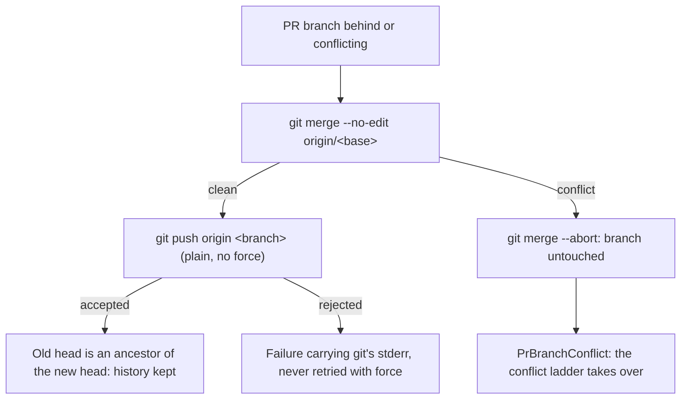

## Summary

PRs under review are no longer rebased or force-pushed when they are brought
up to date. The sync and update paths in `worker/deno/lib/git_pull.ts` now merge
the target in and push normally, so a PR keeps its commits and the review
comments anchored to them. Closes #2807.

- `syncFeatureBranchWithDefault` merges the published target
  (`origin/<default>`) instead of rebasing. On a conflict it aborts the merge,
  returns the existing `PrBranchConflict` error, and logs it, because the
  CI-fix, feedback and spelling processors discard the result. It never pushes.
- `updatePrBranch` (the per-cycle update) merges the published base in for both
  the "behind" and "conflicting" reasons. The old `resolveConflictingPrBranch`
  and the rebase path are now one helper, `mergeBaseIntoBranch`.
- `ensurePrMergeable` merges instead of rebasing. It no longer calls the
  rebase-only `resolveRebaseConflicts` side-picker. A conflict is aborted and
  reported.
- `forcePushFeatureBranch` is renamed `pushFeatureBranch` and makes a plain
  `buildPushArgs` push. `fetchAndForcePush` is removed; its fetch only existed
  to feed the lease. A rejected push fails loud with git's stderr and is never
  retried with force.
- `mergeBaseIntoBranch` aborts only a merge git actually started, and fails
  loud if `git merge --abort` itself fails.
- `scanPrBranchUpdates` needed no change. It already selects a green,
  approval-pending PR that is behind, and a new test pins that down.
- `run_core_production_deps.ts` is untouched, as the issue asks.

## Evidence

Backend/CLI change with no UI, so there are no screenshots. The evidence is the
tests below. They run real git repositories and record the argv of every git
command through `GIT_TRACE`, using the new helper
`worker/deno/tests/support/git_trace.ts`.

- New and updated tests were watched failing against the unfixed code: 7 red
  (rebase and force-push recorded), then green after the fix.
- `./quality.sh` passed after the implementation and docs commits. It was
  re-run after the review follow-up commit.

## Acceptance Criteria

<!-- vibe-spec-review inputs="diff+issue-body" -->

- **met** — No push made by `syncFeatureBranchWithDefault`, `updatePrBranch`, `resolveConflictingPrBranch` or `ensurePrMergeable` contains `--force`, `--force-with-lease` or `+refs`, and the tests assert this over recorded argv — evidence: `worker/deno/tests/git_pull_conflict_test.ts::updatePrBranch - a 'conflicting' PR whose merge is clean merges the base in and pushes without force`, `::a 'behind' PR with NO conflict merges the base in and pushes without force`, `worker/deno/tests/ensure_pr_mergeable_test.ts::merges the base in and pushes without force`, `worker/deno/tests/git_branch_sync_test.ts::syncFeatureBranchWithDefault - merges the base in …` — reviewer: partial — reason: the reviewer's only gap was that no traced test covered the clean "conflicting" merge-and-push path (the old `resolveConflictingPrBranch`); that test was added after the review and passes.
- **met** — None of them invokes `git rebase` — evidence: `recordedRebase` is asserted false in `git_branch_sync_test.ts`, `git_pull_conflict_test.ts` and `ensure_pr_mergeable_test.ts`; `buildRebaseArgs` is no longer imported by `git_pull.ts` — reviewer: met
- **met** — After a sync, the old PR head is an ancestor of the new head — evidence: `merge-base --is-ancestor` assertions in `git_branch_sync_test.ts`, `git_pull_conflict_test.ts`, `ensure_pr_mergeable_test.ts` and `pr_branch_update_test.ts` — reviewer: met
- **met** — A conflicting merge is aborted and reported as a conflict, not pushed — evidence: `git_branch_sync_test.ts::a conflicting merge is aborted and reported as a conflict`, `ensure_pr_mergeable_test.ts::a conflicting merge is aborted …`, `git_pull_conflict_test.ts::a 'behind' PR whose merge conflicts is aborted and LEFT UNTOUCHED` — reviewer: met
- **met** — A rejected push is a failure carrying stderr — evidence: `git_pull_conflict_test.ts::updatePrBranch - a rejected plain push fails loud with git's stderr and is never retried with force` (pre-receive hook) — reviewer: met
- **met** — `scanPrBranchUpdates` includes a green, approval-pending worker PR that is behind its base, and the update pushes it without force — evidence: `pr_branch_update_test.ts::scanPrBranchUpdates + executePrBranchUpdates - a green PR awaiting approval that is behind is kept current, pushed without force` — reviewer: met
- **unrequested** — `DESIGN-PRINCIPLES.md` "behind target" wording now says merge and plain push — reviewer: unrequested — reason: it described the same branch-update path, and "a code change owes a docs change".
- **unrequested** — `docs/INTERNALS.md` gains a "Merge, never force, at PR sync points" paragraph and rewritten strategy table rows — reviewer: unrequested — reason: INTERNALS.md is a listed doc, and those rows stated the old rebase/force strategy.
- **unrequested** — the Issue #586 self-healing fallback in `syncFeatureBranchWithDefault` (reset to remote, or recreate the branch from default) is removed — reviewer: unrequested — reason: the issue asks for a conflict to be aborted and reported, and recreating the branch discarded the PR's commits.
- **unrequested** — `ensurePrMergeable` no longer calls `resolveRebaseConflicts` — reviewer: unrequested — reason: that resolver only works on a rebase, and the issue asks for a conflicting merge to be aborted and reported.
- **unrequested** — a merge failure that is not a conflict now returns its own error with git's output instead of a conflict verdict — reviewer: unrequested — reason: fail-loud standard; a dirty tree must not be reported as a conflict.
- **unrequested** — reworded push error messages ("Cannot push a PR update to protected branch…", "(plain push, not retried with force)") — reviewer: unrequested — reason: the old wording said "force-push", which is no longer true.

## Standards Review

<!-- vibe-standards-review inputs="diff+CODING-STANDARDS.md" -->

- **violation** — Never Fail Silently: `syncFeatureBranchWithDefault` can now return a conflict error that its three callers (`pr_ci_processor.ts`, `pr_feedback_processor.ts`, `pr_spelling_processor.ts`) discard — evidence: `worker/deno/lib/git_pull.ts:204` — reason: fixed here without touching the callers (the issue keeps them unchanged). The refusal is now logged with `console.error("[sync] …")`, the same tag as the milestone sync, and the branch is left at the PR head for the conflict ladder.
- **violation** — Never Fail Silently: the result of `git merge --abort` was discarded in `mergeBaseIntoBranch` — evidence: `worker/deno/lib/git_pull.ts:1335` — reason: fixed here. The helper aborts only when `MERGE_HEAD` exists, and a failed abort is returned as a failure with git's output, never as a clean conflict verdict.
- **clean** — checked and found compliant:
  - Australian English.
  - KISS/DRY: one merge helper replaces three rebase and side-pick paths, and dead imports are removed.
  - `Result` types throughout.
  - The protected-branch guard is kept, and pushes still go through `buildPushArgs` with `--end-of-options`.
  - Tests call real code against real fixture repos, with no source-grepping, and pass env via options rather than `Deno.env.set`.
  - Docs are updated in the same change.
- **optional** notes:
  - A stale "rebase + force-push" comment in `pr_maintenance.ts` was also fixed.
  - Some `trace.dispose()` calls sit outside `finally`, so the temp file leaks only if an assertion fails.

## Test Plan

- `worker/deno/tests/support/git_trace.ts`: new `GIT_TRACE` argv recorder
  (`startGitTrace`, `recordedPushes`, `isForcedPush`, `recordedRebase`).
- `worker/deno/tests/git_branch_sync_test.ts`: two new
  `syncFeatureBranchWithDefault` tests, one for merge-and-keep-commits and one
  for conflict abort.
- `worker/deno/tests/git_pull_conflict_test.ts`:
  - The "behind, no conflict" test changes from rebase and force-push to merge
    and plain push. It now asserts on argv and ancestry.
  - The "behind, conflict" test now checks that the merge is aborted instead
    of looking for a `rebase-merge` directory.
  - The "conflicting" conflict test now also asserts that nothing was pushed.
  - New: a clean "conflicting" merge-and-push test, and a rejected-push test.
- `worker/deno/tests/ensure_pr_mergeable_test.ts`: the behind test changes to
  merge and plain push with argv and ancestry assertions. New: a conflict-abort
  test.
- `worker/deno/tests/pr_branch_update_test.ts`: new scan and execute test for
  a green PR awaiting approval, run with the real `updatePrBranch`.
- The existing test changes follow from the contract change (rebase → merge);
  no behavioural assertion was dropped.

🤖 Generated with [Claude Code](https://claude.com/claude-code)
