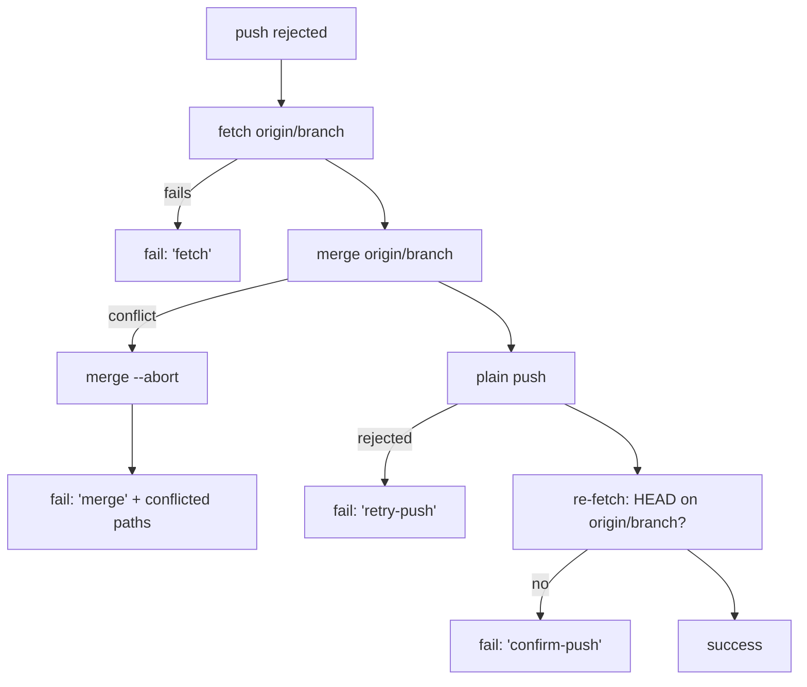

# PR Summary — Issue #2808

## Summary

`recoverFromPushRejection` no longer rebases and never forces. When a push is
rejected it fetches `origin/<branch>` into its tracking ref, merges it in and
retries a plain push. It reports success only after a re-fetch confirms HEAD is
on the remote branch. The `pull --rebase` step, the "accept remote" rebase
auto-resolution and the `--force-with-lease` last resort (#375) are all gone.
Every failure keeps the existing `Push recovery step '<step>' failed: <git
stderr>` format, and the step is one of `fetch`, `merge`, `merge --abort`,
`retry-push` or `confirm-push`. A conflicting merge is aborted, so the branch is
left exactly as it was, and the diagnostic lists the conflicted paths.
Closes #2808.

Behaviour to note: a rejected push whose remote branch does not exist used to
create the branch via a bare lease. It now fails loud at `fetch`. Callers only
invoke recovery after a non-fast-forward rejection, so the branch exists in
practice.

## Evidence

This is a backend change with no UI. The tests drive real bare remotes and
clones, and they record every git argv through `GIT_TRACE`
(`tests/support/git_trace.ts`), so the "never force / never rebase" assertions
check what git actually ran. All five new behavioural tests failed against the
previous implementation and pass now. The `confirm-push` test was added after
review, so it was not part of that red run. `./quality.sh` passes.

## Acceptance Criteria

<!-- vibe-spec-review inputs="diff+issue-body" -->

- **met** — No push made by `recoverFromPushRejection` contains `--force`, `--force-with-lease` or `+refs`, asserted over recorded argv for every recovery branch — evidence: `worker/deno/tests/git_push_recovery_test.ts` (success, merge conflict), `worker/deno/tests/git_push_recovery_diagnostics_test.ts` (untracked clash, `retry-push`, `confirm-push`, `fetch`) via `isForcedPush` — reviewer: partial — reason: the reviewer found `confirm-push` and `merge --abort` untested; a `confirm-push` test was added after review. The `merge --abort`-fails branch cannot be induced with real git and runs no push.
- **met** — No step invokes `git rebase` or `pull --rebase` — evidence: `recordedRebase` and the no-`pull` assertion in every recovery test — reviewer: met
- **met** — A recoverable rejection is resolved by a merge plus a plain push, and returns success only after the push is confirmed — evidence: `git_push_recovery_test.ts::merges the remote in and pushes plainly, keeping the other author's commit (Issue #2808)` and `git_push_recovery_diagnostics_test.ts::a push the remote does not keep fails the confirm-push step (Issue #2808)` — reviewer: met
- **met** — An unrecoverable rejection returns a failure whose diagnostic names the failing step — evidence: `git_push_recovery_diagnostics_test.ts` (`merge`, `retry-push`, `confirm-push`, `fetch`) and `git_push_recovery_test.ts` (`merge` with the conflicted path) — reviewer: met
- **unrequested** — `docs/SETUP.md`, plus comments in `git_push.ts`, `push_recovery_retry.ts` (including its log line), `git_operations.ts` and `completion_phase.ts`, and the retry commit messages in the CI, feedback and spelling processors, now say "merge"/"push recovery" instead of "rebase" — reviewer: unrequested — reason: these surfaces described the removed behaviour; required by the docs-follow-code standard
- **unrequested** — the `merge` diagnostic lists conflicted paths, and there is a new `confirm-push` step — reviewer: unrequested — reason: needed for the fail-loud and "success only once confirmed" requirements
- **unrequested** — new fixture `tests/support/push_recovery_repos.ts`; `buildForceWithLeaseArgs` tests moved to `tests/git_push_lease_args_test.ts` — reviewer: unrequested — reason: shared setup for both recovery test files. The lease builder is still used by `stale_branch_lineage.ts`, so its tests stay.

## Standards Review

<!-- vibe-standards-review inputs="diff+CODING-STANDARDS.md" -->

- **violation** — Code change owes a docs change: the "Is it pushed?" diagram still said "fetch, rebase, auto-resolve" — evidence: `docs/INTERNALS.md:2024` — reason: fixed in this diff
- **violation** — Code change owes a docs change: processor retry commit messages ("Retry after rebase recovery") and step-list comments were stale — evidence: `worker/deno/lib/pr_feedback_processor.ts:840`, `pr_ci_processor.ts:1602`, `pr_spelling_processor.ts:478`, `phases/completion_phase.ts:1300` — reason: fixed in this diff
- **clean** — Checked and compliant: fail-loud handling (every step, including `merge --abort`, returns a named failure); `Result` values; ref and argument safety (`assertSafeGitRef`, `--end-of-options`); redaction through `gitFailureDetail`; tests run real git and assert on traced argv; no orphaned code; Australian English; Mermaid.

## Test Plan

- `worker/deno/tests/git_push_recovery_test.ts`: added the merge-and-plain-push success test and the conflicting-merge-aborted test.
- `worker/deno/tests/git_push_recovery_diagnostics_test.ts`: rewritten to cover the `merge` (untracked clash), `retry-push` (pre-receive hook), `confirm-push` (post-receive hook) and `fetch` steps, each asserting no forced push, rebase or pull.
- `worker/deno/tests/git_push_recovery_lease_test.ts`: removed, since the lease path is gone. Its builder tests moved to `worker/deno/tests/git_push_lease_args_test.ts`.
- `worker/deno/tests/git_push_single_branch_test.ts`: comments updated. It still passes, and it caught the stale tracking ref that the `confirm-push` re-fetch now fixes.
- `./quality.sh` passes.

🤖 Generated with [Claude Code](https://claude.com/claude-code)
