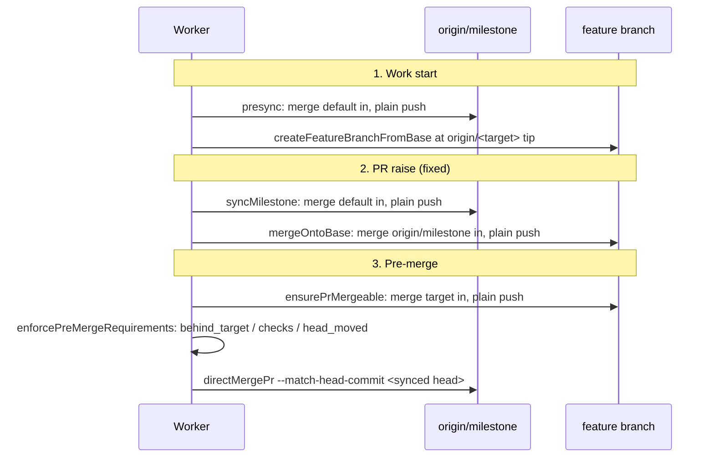

# PR Summary — Issue #2809

## Summary

This PR traces and tests the three points where a feature branch is brought up
to its target: work start, PR raise and pre-merge. Each point now syncs by
merge and a plain push, never a rebase or a force. Closes #2809.

Work start and pre-merge were already correct and are now covered by tests. PR
raise had three gaps, all fixed here:

1. **The milestone was never synced before the feature at PR raise.** The
   feature branch caught up with a milestone that could itself be behind
   default. The new `syncBranchesForPrRaise` (`lib/pr_raise_sync.ts`) first
   runs the milestone sync (`presyncMilestoneBranchForIssueRun`), then syncs
   the feature branch.
2. **The feature sync rebased.** `completion_phase.ts` passed
   `rebaseOntoBase` to `ensureBranchCurrent`. It now passes `mergeOntoBase`,
   which checks out the branch and runs `merge --no-edit origin/<base>`. It
   refuses on a dirty tree, and it aborts a conflicting merge (failing loud if
   the abort fails), so the branch is left exactly as it was.
3. **The one-pass agent prompt for a declined branch said "rebase".** It now
   tells the agent to merge the base in and never to rebase.

Behaviour to note:

- The milestone sync at PR raise is never fatal. A deferred or thrown sync is
  logged and the feature still catches up with the milestone as it stands.
- When the feature lives in the shared clone and that clone is dirty (or its
  status cannot be read), the milestone sync is skipped with a warning rather
  than resetting the uncommitted work.
- When the feature branch cannot be checked out again after the milestone sync
  in the shared clone, the PR is refused and completion fails loud.
- `run_core_production_deps.ts` is untouched. No gap needed a change there, so
  no follow-up issue was filed.

## Evidence

This is a backend change with no UI. `worker/deno/tests/sync_points_test.ts`
drives real bare remotes and clones, and records every git argv through
`GIT_TRACE` (`tests/support/git_trace.ts`). The "no force, no rebase" and order
assertions therefore check what git actually ran. `./quality.sh` passes.

## Acceptance Criteria

<!-- vibe-spec-review inputs="diff+issue-body" -->

- **met**: Work start. The feature branch starts at the current `origin/<target>` head. Evidence: `sync_points_test.ts::sync point 1, work start: the feature branch starts at the current origin/<target> head`, which moves the target after the clone and asserts that the feature equals the remote tip with no forced push and no rebase. reviewer: met
- **met**: PR raise. The milestone is synced with default before the feature is synced with the milestone, and neither push is forced. Evidence: `sync_points_test.ts::sync point 2, PR raise: the milestone syncs with default before the feature syncs with the milestone, by merge and plain push`. It asserts the milestone push precedes the feature merge, and that `isForcedPush` and `recordedRebase` are both empty. reviewer: met
- **met**: Pre-merge. A PR behind its target is synced first, and the merge is refused until CI is green on the synced head. Evidence: `sync_points_test.ts::sync point 3, pre-merge: …`. It walks `ensurePrMergeable`, then the `behind_target`, `checks_pending`, `checks_failed` and `head_moved` refusals, then `merged` with `--match-head-commit <syncedHead>`. reviewer: met
- **met**: Every gap found is fixed in this PR and listed in the summary. Evidence: the three PR-raise gaps are listed above. reviewer: partial. reason: the reviewer could not see the PR summary from the diff alone; the summary now lists every gap.
- **unrequested**: New module `lib/pr_raise_sync.ts` (`mergeOntoBase`, `syncBranchesForPrRaise`) wired into `phases/completion_phase.ts`, with a new failure path when the feature cannot be checked out again. reviewer: unrequested. reason: this is where the PR-raise gap fix lives; the refusal keeps the fail-loud rule instead of raising a PR from the wrong checkout.
- **unrequested**: `branch_conflict_pass.ts` prompt and log reworded from rebase to merge (test updated to match); comment-only rewording in `branch_currency.ts`. reviewer: unrequested. reason: this is gap 3, since the agent pass must not rebase once the sync is merge-based.
- **unrequested**: `completion_phase_branch_conflict_test.ts` fake git now simulates the conflict on `merge --no-edit`. reviewer: unrequested. reason: the existing test simulated a rebase-path conflict that no longer runs.
- **unrequested**: `docs/INTERNALS.md` rows, heading, prose and diagram; the `top-up-2809` claimed slice in `docs/audits/lib-sweep-coverage.json`. reviewer: unrequested. reason: docs-follow-code standard, and the sweep-coverage gate requires every new lib module to be claimed.

## Standards Review

<!-- vibe-standards-review inputs="diff+CODING-STANDARDS.md" -->

- **violation**: Code change owes a docs change. The `INTERNALS.md` section heading, prose and Mermaid node still described a rebase pass. Evidence: `docs/INTERNALS.md:2492`, `:2529`. reason: fixed in this diff.
- **violation**: Docs accuracy. `milestones.md` said "one test per point", but point 2 has four tests. Evidence: `docs/workflows/milestones.md:119`. reason: fixed; it now says the file covers each point.
- **violation**: DRY. The same `status --porcelain` clean check appeared twice. Evidence: `worker/deno/lib/pr_raise_sync.ts:57`, `:165`. reason: fixed; both now use one `treeState` helper.
- **violation**: The #2459 audit record still says "pre-PR rebase". Evidence: `docs/audits/security-sweep-2459-branch-conflict-pass.md:20`. reason: not changed; it is a point-in-time audit record, which the reviewer also noted may stay frozen.
- **clean**: Checked and compliant: Australian English; fail-loud handling (`merge --abort` failure, refused re-checkout); `assertSafeGitRef` plus `--end-of-options`; tests run real git and assert on traced argv; no wall-clock thresholds. The seam and function names that still say `rebase` (`rebase:`, `runDeclinedRebasePass`) are kept to stay in scope; renaming them is separate work.

## Test Plan

- `worker/deno/tests/sync_points_test.ts` (new) has six tests:
  - work start;
  - PR-raise order with merge and plain push;
  - dirty shared clone skips the milestone sync;
  - a failed re-checkout is refused;
  - a conflicting merge is aborted and leaves the branch unchanged;
  - pre-merge sync, refusals, and a merge only on the green synced head.
- `worker/deno/tests/completion_phase_branch_conflict_test.ts` simulates the conflict on the merge path, so the one-pass and conflict-comment tests still pass.
- `worker/deno/tests/branch_conflict_pass_test.ts` expects the merge wording in the prompt.
- `deno task check:manifests` and `./quality.sh` pass.

🤖 Generated with [Claude Code](https://claude.com/claude-code)
