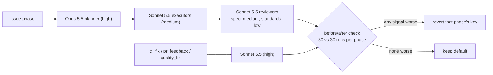

# PR Summary — Issue #2812

## Summary

Closes #2812.

Sonnet 5.5 ($2/$10 per MTok) costs half as much as Opus 5.5 ($4/$20). This PR
uses that 2× gap: Opus plans, and Sonnet implements and reviews.

- **Pricing:** an explicit `claude-sonnet-5-5` row in `MODEL_PRICING`, set to
  $2 input, $10 output, $2.50 cache write and $0.20 cache read.
  `MODEL-AND-CACHING.md` now states the gap as 2×.
- **Issue phase:** `issueExecutorSplit` and `issueReviewerAgents` both default
  to `true`.
- **Reactive phases:** `ci_fix`, `pr_feedback` and `quality_fix` default to
  `sonnet` at `high` effort.
- **Revert criteria:** the old 15% pilot threshold is replaced by a per-phase
  before/after check. It compares the first 30 runs after merge with the last
  30 before. Any of these four signals triggers a revert:
  - success rate falls;
  - first-attempt gate pass rate falls;
  - violations per PR rise;
  - USD per run rises.
- **Decision log:** entries mark the old reactive-phase decision as superseded
  and record the new issue-phase default. `CONFIGURATION.md` tables are updated
  to match.

Follow-up: #2867 (running the before/after check).

These stay as they were:

- Haiku still runs `spelling_fix`, `summarise` and `health`.
- `planning` and `quorum` still run on Opus at `high`.
- Executors still run at `medium`.

## Evidence

## Acceptance Criteria

<!-- vibe-spec-review inputs="diff+issue-body" -->

- **Sonnet 5.5 pricing row with a test** — reviewer: met. The row is in
  `worker/deno/lib/token_usage.ts`, placed before the broader `claude-sonnet-5`
  key. Tests in `tests/token_usage_test.ts` cover the plain and dated ids.
- **Pricing table and gap text state 2×** — reviewer: met. See
  `docs/MODEL-AND-CACHING.md`. No "~2.5×" text remains.
- **`issueExecutorSplit` defaults to `true`** — reviewer: met. Covered by
  `config_defaults.ts`, `issue_executor_split.ts`, their tests (including the
  opt-out test) and `CONFIGURATION.md`.
- **`issueReviewerAgents` defaults to `true`** — reviewer: met. Covered by
  `config_defaults.ts`, `issue_reviewer_agents_2575_test.ts` and the docs.
- **The three reactive phases run `sonnet` + `high`** — reviewer: met. Covered
  by `config_defaults.ts`, `config_defaults_test.ts`, `claude_executor_test.ts`
  and both doc tables.
- **Decision-log entry for each changed default** — reviewer: partial, now
  fixed.
  - The three decision-log rows are marked superseded, with a "Superseded"
    paragraph below them.
  - A new `issue`-phase entry records the split and reviewer defaults.
- **Default-on criteria rewritten as a before/after check** — reviewer: met.
  Four revert signals, no 15% threshold, and duration is reported only. The
  flowchart is updated.
- **Unchanged routing stays unchanged** — reviewer: met.
- **Unrequested additions** — reviewer: unrequested, but they support the
  change.
  - The docstring on the resolution order is updated.
  - The pilot intro is reworded as historical.
  - The revert-order note is added.
  - Control hosts must now set `issue_executor_split: false` explicitly.

## Standards Review

<!-- vibe-standards-review inputs="diff+CODING-STANDARDS.md" -->

The first pass found four violations. All are fixed in this PR:

1. The `CONFIGURATION.md` phase-model and effort tables still listed the
   reactive phases as `opus` / `medium`. They now show `sonnet` / `high`, and
   the `medium` effort description is reworded.
2. The `MODEL-AND-CACHING.md` text said "four changes" when the table has five
   rows. It is reworded.
3. A stale `token_usage.ts` comment called Sonnet 5 "the current Sonnet". It is
   reworded.
4. A key-order test only pinned the private map order. It is removed, because
   the lookup tests already cover the behaviour.

## Test Plan

- `deno task test:unit` on these files: 319 passed, 0 failed.
  - `tests/token_usage_test.ts`
  - `tests/model_routing_docs_test.ts`
  - `tests/config_defaults_test.ts`
  - `tests/claude_executor_test.ts`
  - `tests/issue_executor_split_test.ts`
  - `tests/issue_reviewer_agents_2575_test.ts`
- `./quality.sh` passes lint, type check, fmt, markdownlint, mermaid and
  semgrep.
- One Deno test fails in the full suite, and it also fails on `main`:
  - The test is `security_sweep_2839_ledger_test.ts:63`, "the recorded
    sweptAt is an ancestor of HEAD".
  - The recorded `SWEPT_AT` commit `42c876e` is not an ancestor of
    `origin/main` either.
  - It is unrelated to this change and left out of scope.
