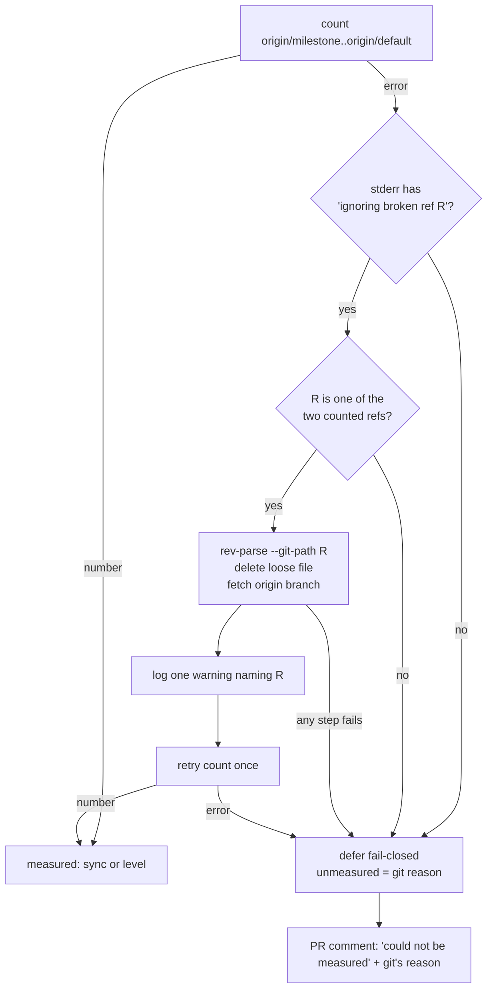

# PR Summary — Issue #2824: repair a broken remote-tracking ref before the milestone behind-count

## Summary

Closes #2824

When `refs/remotes/origin/<branch>` is corrupt, git prints
`ignoring broken ref refs/remotes/origin/<branch>` and the behind-count fails.
Every run then deferred with no branch cut and blamed the milestone for being
"still behind". A new helper, `countCommitsAheadRepairingBrokenRef` (beside
`countCommitsAhead` in `git_issue_branches.ts`), now repairs that exact ref and
counts again. It does this once, and only for the two refs being counted.

The repair has three steps: find the ref's loose file with
`git rev-parse --git-path <ref>`, delete that file, then re-fetch the branch
from origin. On git 2.47, `update-ref -d` and a plain fetch both fail on a
broken loose ref, which is why the file is deleted directly.

Each repair logs one warning line that names the ref. Both behind-count callers
use the helper: `presyncMilestoneBranchForIssueRun` and
`measureMilestoneBehindCount`.

If the retry still fails, the fail-closed deferral stays as before
(`MILESTONE_BEHIND_DEFER_REASON`, no branch cut, auto-merge armed anyway). In
that case the presync result carries `unmeasured` (git's first error line), and
`postBehindSyncReason` now says the behind-count **could not be measured** and
quotes git's reason, instead of "still behind".

- [x] Shared repair helper with an allowlist of the counted refs
- [x] Wired into both behind-count callers; repair logged at warn level
- [x] Fail-closed deferral kept; `unmeasured` passed through to the PR comment
- [x] Regression tests (real git and injected fakes)
- [x] `docs/INTERNALS.md` updated

## Evidence

Tests (`deno test -A`, 96 passed across the five touched suites):

- `tests/git_broken_ref_repair_test.ts` (new):
  - real git: a corrupt `refs/remotes/origin/main` in a plain clone and in a
    linked worktree still yields a number, with the repair line logged;
  - fakes: success, a non-warning error, an unrelated ref, a retry that fails
    again, a failed `rev-parse`, and a failed removal.
- `tests/milestone_presync_git_test.ts`: "#2824 - a broken origin/main ref is
  repaired in place and the presync still measures the branch". It uses real
  git through `presyncMilestoneBranchForIssueRun` and checks for exactly one
  warning line.
- `tests/milestone_presync_test.ts`:
  - an unreadable count defers fail-closed with `unmeasured` set;
  - a measured result leaves `unmeasured` undefined;
  - caller level: a broken ref that stays broken is repaired once, the count is
    tried twice, and the run still defers with no sync.
- `tests/milestone_behind_count_test.ts`: the repair runs through
  `measureMilestoneBehindCount`.
- `tests/pr_auto_merge_test.ts`:
  - the comment says "could not be measured", not "still behind";
  - backticks in git's reason are sanitised.

## Acceptance Criteria

<!-- vibe-spec-review inputs="diff+issue-body" -->

- **Shared repair helper beside `countCommitsAhead`, used by both behind-count
  callers; deletes the exact broken ref, re-fetches, retries once, logs one
  line** — reviewer: met
- **Retry still failing keeps the fail-closed deferral (no branch cut,
  auto-merge armed)** — reviewer: partial. The only test was at unit level.
  Fixed after review: added the caller-level test in
  `milestone_presync_test.ts` (repair attempted, count tried twice, run still
  deferred, `synced === 0`).
- **`postBehindSyncReason` says "could not be measured" and quotes git's
  reason, not "still behind"** — reviewer: met
- **Regression tests (1) real-git repair, (2) retry-fails deferral via
  `deps()`, (3) comment wording** — reviewer: partial. (1) and (3) were met;
  (2) is now covered at caller level by the fix above.
- **`docs/INTERNALS.md` update and the extra linked-worktree real-git test** —
  reviewer: unrequested. Both were kept because they document and cover the
  new behaviour.

## Standards Review

<!-- vibe-standards-review inputs="diff+CODING-STANDARDS.md" -->

- **Violation, fixed:** the repair line was logged at INFO. Both production call
  sites (`milestone_presync.ts`, `run_core_production_deps.ts`) now use
  `logger.warn`, and the real-git test captures `warn`.
- **Nit, fixed:** removed a dead `Deno.writeTextFile` to a mistyped path in
  `git_broken_ref_repair_test.ts`.
- **Compliant:**
  - Australian English;
  - failures stay loud, and every repair failure is appended to git's original
    reason;
  - KISS: one helper and one retry;
  - git args are safe: the broken ref is allowlisted against the counted refs
    and runs through `assertSafeGitRef`;
  - tests exercise real code;
  - docs are updated;
  - contract changes are additive only (optional `unmeasured`, `log`,
    `removeFileFn`).

## Test Plan

- `./quality.sh < /dev/null` — passed.
- `deno test -A` on the five touched suites after the review fixes: 96 passed,
  0 failed.
- `deno check`, `deno lint` and `deno fmt --check` on the touched files — clean.
