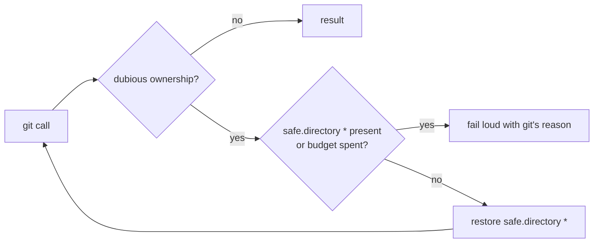

# Restore `safe.directory` when git refuses the clone as dubious ownership

## Summary

Closes #2825

Setup for `stSoftwareAU/VibeCoder` died in the first minute of every cycle:

```text
Could not repair the fetch refspec of stSoftwareAU/VibeCoder before taking a
s1 worktree: Failed to add the all-branches fetch refspec: fatal: not in a git
directory
```

The clone was fine. git was refusing it for **dubious ownership**: the work
volume is owned by another uid, and the `safe.directory = *` line that
`container/entrypoint.sh` stages into `GIT_CONFIG_GLOBAL` had gone missing.
`git config` hides that refusal. `--get-all` exits 1 as if the key were
absent, and `--add` says only "not in a git directory". So the log pointed
at the refspec, not at the real fault.

- **Self-repair** (`lib/git_timeout.ts`): when `runGitCommand` sees
  "detected dubious ownership", it restores the staged `safe.directory = *`
  line and retries once. It writes through the failed call's own
  `GIT_CONFIG_GLOBAL`. As with the Issue #564 auth repair, the budget is 3
  repairs per process. It logs a `[SECURITY]` line. If the line is already
  present, or the write fails, the original failure stays loud.
- **Honest error** (`lib/git_fetch_refspec.ts`):
  `ensureAllBranchesFetchRefspec` now probes `git rev-parse --git-dir` first.
  A directory git cannot use reports git's own reason ("not a git
  repository" or "detected dubious ownership") instead of the misleading
  `--add` error.
- **Docs:** `docs/CONTAINMENT.md` describes the new repair in the git global
  config row.

## Evidence

This is a backend-only change, so there is no screenshot. Regression tests
are in `worker/deno/tests/git_fetch_refspec_test.ts`, and the full
`./quality.sh` gate passes.



## Reproduction

- **Symptom:** `ensureAllBranchesFetchRefspec` failed with
  `fatal: not in a git directory` against a valid clone, because the global
  config it read had no `safe.directory` line.
  `GIT_TEST_ASSUME_DIFFERENT_OWNER=1` reproduces it locally.
- **Status:** verified. I watched each test below fail against the unfixed
  code and pass after the fix.
- **Regression tests:**
  - `names git's own reason when the directory is not a repository (Issue #2825)`
  - `restores safe.directory when git refuses the clone as dubious ownership (Issue #2825)`
  - `reports dubious ownership when safe.directory cannot be restored (Issue #2825)`

## Test Plan

- [x] `deno task test:unit tests/git_fetch_refspec_test.ts tests/git_timeout_test.ts tests/lane_worktree_test.ts tests/git_spawn_chokepoint_check_test.ts tests/lib_sweep_coverage_test.ts`
- [x] `deno task check:manifests`
- [x] `./quality.sh` (PASSED)
