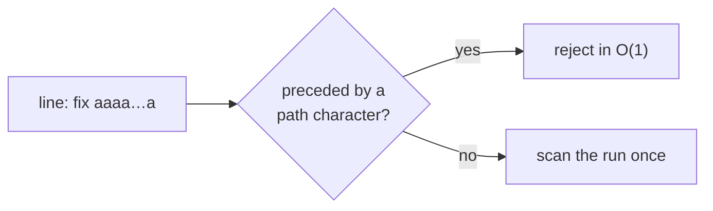

# PR Summary — Issue #2826

## Summary

Closes #2826

`detectDescribedCodeChange` ran `PATH_RE` over each intent line. The regex engine
retried the whole path pattern at every offset inside a run of path characters,
so one long word such as `"fix " + "a".repeat(n)` cost O(n²). A lookbehind now
lets a match start only at a token boundary, and leading slashes are skipped
outside the capture so absolute paths report as before. Each run is therefore
scanned once, and the cost is linear. No line is truncated, so there is no length
cap for a hostile line to hide a path behind.

- [x] Linear-growth regression tests for both hostile shapes (long word, long
      `a/` chain), plus a test that absolute paths are still found
- [x] Token-boundary lookbehind in `PATH_RE`
      (`worker/deno/lib/described_code_change.ts`)
- [x] Test file registered in `WALL_CLOCK_TEST_FILES` so the timing cases run
      in the serial pass

## Evidence

This is a backend-only change, with no visual surface. The tests that cover it
are:

- `worker/deno/tests/described_code_change_test.ts::detectDescribedCodeChange - one long word scales linearly (Issue #2826)`
- `worker/deno/tests/described_code_change_test.ts::detectDescribedCodeChange - one long slash run scales linearly (Issue #2826)`
- `worker/deno/tests/described_code_change_test.ts::detectDescribedCodeChange - an absolute path is still found`
- The 12 pre-existing tests in `worker/deno/tests/described_code_change_test.ts`
  still pass (15 passed, 0 failed).

## Reproduction

- **symptom:** `detectDescribedCodeChange("fix " + "a".repeat(n))` backtracks
  quadratically. The issue measured 6,513 ms at n = 80k.
- **status:** verified. On the unfixed code both growth tests failed:
  10,004 chars took 130 ms but 40,004 chars took 2,063 ms, against 1,037 ms
  allowed. The `a/` chain went from 101 ms to 1,681 ms, against 809 ms allowed.
  After the fix, all 15 tests pass in 13 ms.
- **regression test:**
  `worker/deno/tests/described_code_change_test.ts::detectDescribedCodeChange - one long word scales linearly (Issue #2826)`

The original trigger is closed with no trivial bypass. The independent reviewer
timed 13 hostile shapes at 20k, 80k and 320k characters: dots, `a/` runs, `a./`,
backtick runs, `:1` chains, `.ts` repeats, combining marks, slash-only runs,
`-.`, `a.ts:1a` and `a.tsa`. All grew linearly; the worst was 14 ms at 320k.

## Acceptance Criteria

<!-- vibe-spec-review inputs="diff+issue-body" -->

- **met** — `detectDescribedCodeChange` cost grows linearly with the length of
  a single long line (an `assertLinearGrowth` test) — evidence:
  `worker/deno/tests/described_code_change_test.ts::detectDescribedCodeChange - one long word scales linearly (Issue #2826)`
  — reviewer: met
- **met** — Existing `described_code_change` tests still pass — evidence:
  `worker/deno/tests/described_code_change_test.ts::detectDescribedCodeChange - strips line and column suffixes`
  (and the other 11 pre-existing cases) — reviewer: met
- **unrequested** — Absolute-path regression test — evidence:
  `worker/deno/tests/described_code_change_test.ts::detectDescribedCodeChange - an absolute path is still found`
  — reviewer: unrequested — reason: the lookbehind would otherwise stop
  `/home/...` paths matching, so this test guards the `\/*` that keeps them
  working.
- **unrequested** — Second growth test for the long `a/` chain — evidence:
  `worker/deno/tests/described_code_change_test.ts::detectDescribedCodeChange - one long slash run scales linearly (Issue #2826)`
  — reviewer: unrequested — reason: it covers the directory-segment
  repetition, which was a second quadratic shape in the same regex.

## Standards Review

<!-- vibe-standards-review inputs="diff+CODING-STANDARDS.md" -->

- **violation (fixed)** —
  `worker/deno/tests/described_code_change_test.ts:11` — the file uses
  `assertLinearGrowth` but was not listed in `WALL_CLOCK_TEST_FILES`, which
  would fail the Issue #940 manifest check. Fixed in `663a2efb` by adding the
  entry and its reason comment in
  `worker/deno/lib/parallel_unsafe_test_manifest.ts`.
- **clean** — Australian English spelling
- **clean** — KISS / DRY: the fix is one regex change, and the tests reuse the
  existing growth helper
- **clean** — Fail loud: no errors are swallowed
- **clean** — Real tests: the tests call the function and assert on its output;
  none read source code as text
- **clean** — The timing rule: tests compare a ratio, never an absolute budget
- **clean** — Parallel safety: no environment variables or global state are
  changed
- **clean** — Deno/TypeScript conventions
- **clean** — Docs: no public name, option or default changed
- **clean** — Commit safety: no hidden files or key material are staged

## Test Plan

- [x] `deno task test:unit tests/described_code_change_test.ts < /dev/null`
      — failed before the fix, and 15 passed after it
- [x] `deno task test:unit tests/parallel_unsafe_test_manifest_test.ts < /dev/null`
      — 31 passed
- [x] `deno fmt`, `deno lint` and `deno check` on the touched files
- [ ] `./quality.sh < /dev/null`
