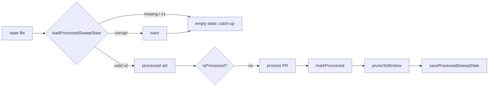

# PR Summary — Issue #2828

## Summary

Adds a merge-order-independent v2 store to
`worker/deno/lib/merged_sweep_watermark.ts`, alongside the unchanged legacy
watermark API. The legacy watermark skips every PR `<= mark`, so a
lower-numbered PR merged after a higher-numbered one was never processed. The
v2 store records the exact set of processed PR numbers per repo instead. The
three sweeps move onto it in #2833. Closes #2828.

- Format: `{ "version": 2, "repos": { "<owner/repo>": { "processed": number[] } } }`
- `loadProcessedSweepState(path, logger?)` returns empty state when the file is
  missing, is a v1 `Record<string, number>` map (the catch-up after deploy), or
  is corrupt. A corrupt or unreadable file, and any invalid PR number dropped
  from a v2 list, logs a warning.
- `saveProcessedSweepState(path, state)` writes through the existing
  `atomicWrite`.
- `isProcessed`, `markProcessed` and `pruneToWindow` are pure and return new
  state. `markProcessed` throws a `RangeError` on a non-positive or
  non-integer PR number.

## Evidence

This is a backend library change with no UI. It is verified by
`worker/deno/tests/merged_sweep_watermark_test.ts`, where all 14 tests pass.
`deno check` also passes on every existing consumer of the legacy API.

## Reproduction

- **symptom** — once PR 200 is processed, a later-merged PR 150 counts as
  processed (`150 <= mark`), so its issue never closes and its branch is never
  cleaned
- **status** — `verified` — I temporarily swapped `isProcessed` back to a
  max-number comparison. The out-of-order test then failed ("order of marking
  does not matter ... FAILED", 13 passed / 1 failed). With the set semantics
  restored, it passes.
- **regression test** — `worker/deno/tests/merged_sweep_watermark_test.ts::markProcessed/isProcessed - order of marking does not matter`

## Acceptance Criteria

<!-- vibe-spec-review inputs="diff+issue-body" -->

- **met** — New v2 functions are exported from `lib/merged_sweep_watermark.ts`; the legacy API is unchanged and all existing consumers still compile — evidence: `worker/deno/lib/merged_sweep_watermark.ts`, plus `deno check` on `lib/branch_cleanup.ts`, `lib/merged_pr_issue_sweep.ts`, `lib/pr_issue_linking.ts`, `lib/run_core_production_deps.ts` and `commands/merged_pr_issue_sweep.ts` — reviewer: met
- **met** — Missing, v1 and corrupt files load as empty state (corrupt logs a warning) — evidence: `worker/deno/tests/merged_sweep_watermark_test.ts::loadProcessedSweepState - missing file…`, `…legacy v1 number map…`, and five `…corrupt file (…) loads as empty and warns` cases — reviewer: met
- **met** — `markProcessed` then `isProcessed` returns true regardless of marking order (mark 200 then 150 → both processed, 175 not) — evidence: `worker/deno/tests/merged_sweep_watermark_test.ts::markProcessed/isProcessed - order of marking does not matter` — reviewer: met
- **met** — `pruneToWindow` drops numbers absent from the window and keeps those present — evidence: `worker/deno/tests/merged_sweep_watermark_test.ts::pruneToWindow - keeps numbers in the window and drops the rest` — reviewer: met
- **met** — Save/load round-trips through `atomicWrite` — evidence: `worker/deno/tests/merged_sweep_watermark_test.ts::saveProcessedSweepState - round-trips through load in the v2 format` — reviewer: met
- **met** — The `deno task` quality gate (fmt, lint, check, test) passes — evidence: fmt, lint and check on the changed files, the targeted tests, and the full `./quality.sh` run — reviewer: met — reason: the reviewer called this only partly verified because it did not run the full gate; `./quality.sh` was run here
- **unrequested** — the `emptyProcessedSweepState()` helper is exported — reviewer: unrequested — reason: it is the single source of the empty v2 value, which the loader and callers both need
- **unrequested** — optional `logger` parameter on `loadProcessedSweepState` — reviewer: unrequested — reason: it makes the required "corruption is logged" behaviour testable; the default is `defaultLogger`
- **unrequested** — load de-duplicates and sorts v2 lists and drops invalid numbers — reviewer: unrequested — reason: keeps the state canonical; after review, dropped numbers now also log a warning (fail loud)
- **unrequested** — `markProcessed` throws a `RangeError` on an invalid PR number — reviewer: unrequested — reason: fail loud on a caller bug rather than recording garbage
- **unrequested** — an unreadable file (any error other than NotFound) logs a warning and loads as empty — reviewer: unrequested — reason: extends the "corrupt reads as empty, logged" rule to I/O errors
- **unrequested** — idempotency test for `markProcessed` — reviewer: unrequested — reason: pins the purity requirement ("keep all functions pure")

## Standards Review

<!-- vibe-standards-review inputs="diff+CODING-STANDARDS.md" -->

- **clean** — Australian English, fail loud and log levels, KISS/DRY (reuses `atomicWrite`), strict TypeScript (no `any`, `unknown` narrowed), tests call real code and are parallel-safe, no docs owed, no secrets or hidden files staged. I also acted on the reviewer's optional notes: dropped invalid numbers now warn and a test asserts it, `repos` is built with `Object.fromEntries` so a `"__proto__"` key cannot re-parent the object, and `pruneToWindow` documents that callers should prune only after a successful fetch.

## Test Plan

- Added `worker/deno/tests/merged_sweep_watermark_test.ts` (14 tests): missing, v1, corrupt (five shapes) and invalid-number loads; out-of-order `markProcessed`/`isProcessed`; purity and idempotency; invalid-number `RangeError`; `pruneToWindow` keep/drop and unknown repo; save→load round-trip with the on-disk v2 format.
- Re-ran `tests/branch_cleanup_test.ts` and `tests/merged_pr_issue_sweep_test.ts` (legacy consumers): pass.
- `./quality.sh` run in full.
