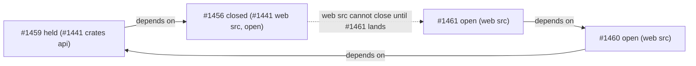

# PR Summary — Issue #2829

## Summary

Adds `worker/deno/lib/milestone_deadlock.ts`, a pure detector
(`detectMilestoneDeadlocks`) for cross-milestone dependency deadlocks. It
derives the held set itself, using the same rule as the Issue #2173 hold in
`isDependencyBlocked`: a closed same-repo dependency in a different
milestone that is still open. It reports a milestone B as deadlocked when an
open issue in B depends on the held issue, directly or through a chain. The
traversal uses a visited set, so cycles terminate. It returns at most one
result per milestone, `{ milestone, heldIssue, closedDependency,
blockingOpenIssues }`, and does no I/O. Closes #2829.

## Evidence

Backend-only: there is nothing to screenshot. Running
`deno test tests/milestone_deadlock_test.ts` passes all 11 tests, and
`deno lint` and `deno fmt` are clean on both files.

## Acceptance Criteria

<!-- vibe-spec-review inputs="diff+issue-body" -->

- **met** — the #1456/#1459/#1460/#1461 fixture reports one deadlock for "#1441 web src" with held issue 1459 — evidence: `worker/deno/tests/milestone_deadlock_test.ts::detectMilestoneDeadlocks - reports the GRQ-AutoTrader deadlock` — reviewer: met
- **met** — a held issue with no path back from the dependency's milestone reports nothing — evidence: `worker/deno/tests/milestone_deadlock_test.ts::detectMilestoneDeadlocks - a held issue with no path back reports nothing` — reviewer: met
- **met** — dependency cycles terminate (visited set) and do not duplicate results — evidence: `worker/deno/tests/milestone_deadlock_test.ts::detectMilestoneDeadlocks - dependency cycles terminate without duplicate results` — reviewer: met
- **met** — multiple held issues against the same milestone yield exactly one result for that milestone — evidence: `worker/deno/tests/milestone_deadlock_test.ts::detectMilestoneDeadlocks - multiple held issues against one milestone yield one result` — reviewer: met
- **met** — dependencies in closed milestones, or in the same milestone, are not treated as held — evidence: `worker/deno/tests/milestone_deadlock_test.ts::detectMilestoneDeadlocks - a dependency in a closed milestone is not held`, `... - a dependency in the same milestone is not held` — reviewer: met
- **met** — the `deno task` quality gate passes — evidence: `./quality.sh < /dev/null` run after the final edit — reviewer: met — reason: the reviewer ran only the targeted checks; the full gate was run here
- **unrequested** — deterministic output: results sorted by milestone, the lowest deadlocking held issue and dependency named, `blockingOpenIssues` ascending — reviewer: unrequested — reason: "at most one result per milestone" needs a stable choice so repeated scans report the same issue
- **unrequested** — `milestone: string | null` on inputs, plus the no-milestone test — reviewer: unrequested — reason: mirrors the real hold, which exempts a dependency with no milestone
- **unrequested** — each issue's `dependsOn` is de-duplicated — reviewer: unrequested — reason: a body naming the same dependency twice must not produce two held pairs
- **unrequested** — extra tests (chain through another milestone, separate milestones, empty graph) — reviewer: unrequested — reason: they pin the transitive-chain and one-result-per-milestone requirements from the issue body

## Standards Review

<!-- vibe-standards-review inputs="diff+CODING-STANDARDS.md" -->

- **violation** — PR summary file absent from the reviewed diff — evidence: `docs/archive/pr-summaries/pr-summary-2829.md` — reason: fixed here; this file adds it
- **clean** — the held rule matches `isDependencyBlocked` (`lib/issue_finder_common.ts:855-889`); tests call real code with no source grepping; Australian English; KISS/DRY; no new dependency; no secrets or hidden files; commit carries the run-id trailer. Also acted on the optional note: `MilestoneDependencyGraph` now documents that it holds same-repo dependencies only.

## Test Plan

- New `worker/deno/tests/milestone_deadlock_test.ts` with 11 cases: the GRQ-AutoTrader fixture, a chain through another milestone, no path back, a dependant outside the milestone, a cycle, de-duplication across held issues, separate blocked milestones, closed, same and no milestone, and the empty graph.
