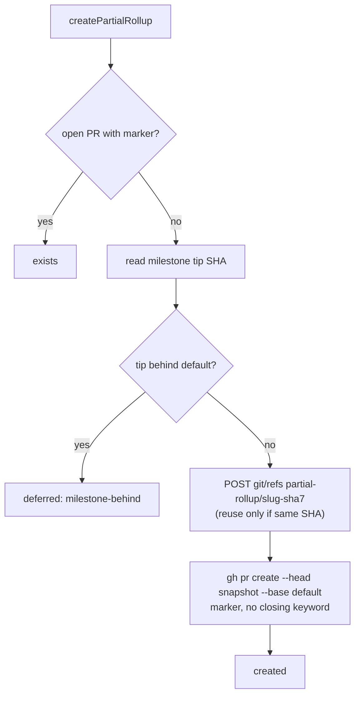

# PR Summary — Issue #2830

## Summary

Adds `worker/deno/lib/milestone_partial_rollup.ts`. It raises a **partial
rollup** PR from an immutable snapshot of a deadlocked milestone's branch into
the default branch, so work already merged into the milestone can land while
the milestone stays open. Wiring it into the scan loop is a separate
sub-issue of #2794. Closes #2830.

- `createPartialRollup({ repo, milestone, milestoneBranch, defaultBranch, ghFn })`
  returns `created` | `exists` | `deferred` (`milestone-behind` /
  `nothing-to-roll-up`) | `failed`.
- `listMergedPartialRollupHeads(repo, milestone, ghFn)` returns the head SHAs
  of merged partial rollups for the hold release. It throws on a failed or
  possibly truncated lookup rather than reporting "none merged".
- Marker lookups keep only fleet-authored PRs (`selectFleetAuthoredMatches`,
  Issue #1246). A marker planted by anyone else can neither suppress a partial
  rollup nor release the hold.
- Never merges, rebases, updates or force-pushes. A behind milestone is
  deferred to the sync path. An existing snapshot ref is reused only when it
  already points at the tip; otherwise the call fails loud.

## Evidence

This is a backend-only change with no UI. It is verified by
`worker/deno/tests/milestone_partial_rollup_test.ts` (18 tests), which runs the
creator and the existing full-rollup gates against a stateful fake `gh`.
`./quality.sh` passed.

The snapshot head is not a `milestone/` branch. So `hasExistingMilestoneSummaryPr`
and `decideMilestoneBaseMerge`, which both look up PRs by `--head <milestone branch>`,
never treat the partial rollup as the milestone's own rollup.

Out of scope, noted for the wiring sub-issue: GitHub also acts on closing
keywords in *commit messages* that reach the default branch. The PR body is
free of them, but child commits in the snapshot are not rewritten.

## Acceptance Criteria

<!-- vibe-spec-review inputs="diff+issue-body" -->

- **met** — Milestone behind default → `deferred`; no ref or PR created — evidence: `worker/deno/tests/milestone_partial_rollup_test.ts::createPartialRollup - milestone behind default is deferred and creates nothing` — reviewer: met
- **met** — 0 behind → snapshot ref at the milestone tip and PR against default with the marker and no closing keywords — evidence: `worker/deno/tests/milestone_partial_rollup_test.ts::createPartialRollup - level milestone snapshots the tip and opens a marked PR with no closing keyword` — reviewer: met
- **met** — Second call with an open marked PR → `exists`, no new ref or PR — evidence: `worker/deno/tests/milestone_partial_rollup_test.ts::createPartialRollup - second call with an open marked PR reports exists and creates nothing` — reviewer: met
- **met** — Existing snapshot ref is reused, never updated or forced — evidence: `worker/deno/tests/milestone_partial_rollup_test.ts::createPartialRollup - existing snapshot ref at the tip is reused, never updated` — reviewer: met — reason: the reviewer flagged that a ref at a *different* SHA fails rather than being reused; that is deliberate, because reusing it would mean updating it, which the criterion forbids
- **met** — `isMilestoneBranch("partial-rollup/...")` is false — evidence: `worker/deno/tests/milestone_partial_rollup_test.ts::isMilestoneBranch - a partial-rollup snapshot is not a milestone head` — reviewer: met
- **met** — `hasExistingMilestoneSummaryPr` returns `null` while a partial rollup is open and after it merges — evidence: `worker/deno/tests/milestone_partial_rollup_test.ts::hasExistingMilestoneSummaryPr - null while a partial rollup is open and after it merges` — reviewer: met
- **met** — `decideMilestoneBaseMerge` still allows a child PR into the milestone after a partial rollup merges — evidence: `worker/deno/tests/milestone_partial_rollup_test.ts::decideMilestoneBaseMerge - a child PR into the milestone is still allowed after a partial rollup merges` — reviewer: met
- **met** — `deno task` quality gate passes — evidence: `./quality.sh < /dev/null` run after the final edit, `Result: PASSED` — reviewer: missing — reason: the reviewer was read-only and could not run the gate; it was run here and passed
- **met** — Validate repo and branch names with the existing allowlist patterns — evidence: `worker/deno/lib/milestone_partial_rollup.ts` (`isValidRepoSlug`, `isValidBranchName`) and the test `createPartialRollup - invalid names fail before reaching gh` — reviewer: partial — reason: the reviewer found copied patterns that accepted `..`; fixed in this diff by reusing `isValidRepoSlug` (`repo_slug.ts`) and `isValidBranchName` (`repo_rulesets.ts`)
- **unrequested** — `deferred` reason `nothing-to-roll-up` when the tip is 0 ahead — reviewer: unrequested — reason: `gh pr create` would otherwise fail with "no commits between", so this reports the case clearly instead
- **unrequested** — Milestone-title allowlist and closing-keyword self-check on the built body — reviewer: unrequested — reason: the untrusted title is embedded in the HTML marker and body, so this stops it breaking out of the comment or adding a closing keyword
- **unrequested** — Extra exports (`partialRollupMarker`, `partialRollupBranchName`, `buildPartialRollupBody`, `PARTIAL_ROLLUP_BRANCH_PREFIX`) and `reusedRef`/`headSha` in the `created` result — reviewer: unrequested — reason: the tests and the follow-up wiring/hold-release sub-issue use them
- **unrequested** — Extra negative tests (another milestone's PR, ref at another SHA, invalid names, failed lookup) — reviewer: unrequested — reason: they cover the fail-loud and allowlist paths the issue requires
- **unrequested** — Fleet-author verification of the marker lookups — reviewer: unrequested — reason: added after review. The repo's `marker_dedup_author_cap_test.ts` invariant requires every body-marker lookup to verify its author, so a planted marker cannot steer the module
- **unrequested** — `docs/audits/lib-sweep-coverage.json` entry — reviewer: unrequested — reason: `lib_sweep_coverage_test.ts` requires every new lib module to belong to a sweep slice; it is in 12c because it parses `gh` JSON

## Standards Review

<!-- vibe-standards-review inputs="diff+CODING-STANDARDS.md" -->

- **violation** — The fake ignored `--search`, so the production PR lookup was untested — evidence: `worker/deno/lib/milestone_partial_rollup.ts` (`listPartialRollupPrs`) — reason: fixed here. The lookup now uses the repo's established `"<marker>" in:body` search, and the fake models that search and rejects any search it does not model
- **violation** — The merged-PR history was cut off at 100 without an error (Never Fail Silently) — evidence: `worker/deno/lib/milestone_partial_rollup.ts` (`LIST_LIMIT`) — reason: fixed here. A full page now throws; covered by `listMergedPartialRollupHeads - a full page throws rather than reporting a truncated history`
- **violation** — The closing-keyword guard missed the issue-URL form — evidence: `worker/deno/lib/milestone_partial_rollup.ts` (`CLOSING_KEYWORD_PATTERN`) — reason: fixed here. The pattern now matches `KEYWORD https://…/issues/N`; covered by `a closing keyword with an issue URL in the title is refused`
- **violation** — Gate finding after the review fixes: the new `"marker" in:body` lookup trusted the marker without checking its author — evidence: `worker/deno/tests/marker_dedup_author_cap_test.ts` flagged `lib/milestone_partial_rollup.ts` — reason: fixed here. The lookup requests `author` and filters through `selectFleetAuthoredMatches`; covered by `a marker planted outside the fleet neither suppresses the rollup nor counts as merged`
- **clean** — Australian English; fail-loud error handling; `SIMPLE-ON-PURPOSE` format; input allowlists before every `gh` call; no merge, rebase or force-push; tests call real code against a stateful fake with no wall-clock waits; ledger registration. The optional DRY note on copied patterns was also addressed by reusing the shared validators

## Test Plan

- Added `worker/deno/tests/milestone_partial_rollup_test.ts` (18 tests) covering: deferred when behind, created at 0 behind, exists on a second call, snapshot reuse, and a ref at another SHA that fails. It also covers nothing ahead, invalid names including `..`, closing keywords in `#N` and URL form, a marker planted outside the fleet, a lookup failure, merged-head listing, a truncated listing, `isMilestoneBranch`, `hasExistingMilestoneSummaryPr` and `decideMilestoneBaseMerge`.
- `deno task test:unit tests/milestone_partial_rollup_test.ts tests/marker_dedup_author_cap_test.ts tests/lib_sweep_coverage_test.ts` passed.
- `./quality.sh < /dev/null` passed.

🤖 Generated with [Claude Code](https://claude.com/claude-code)
