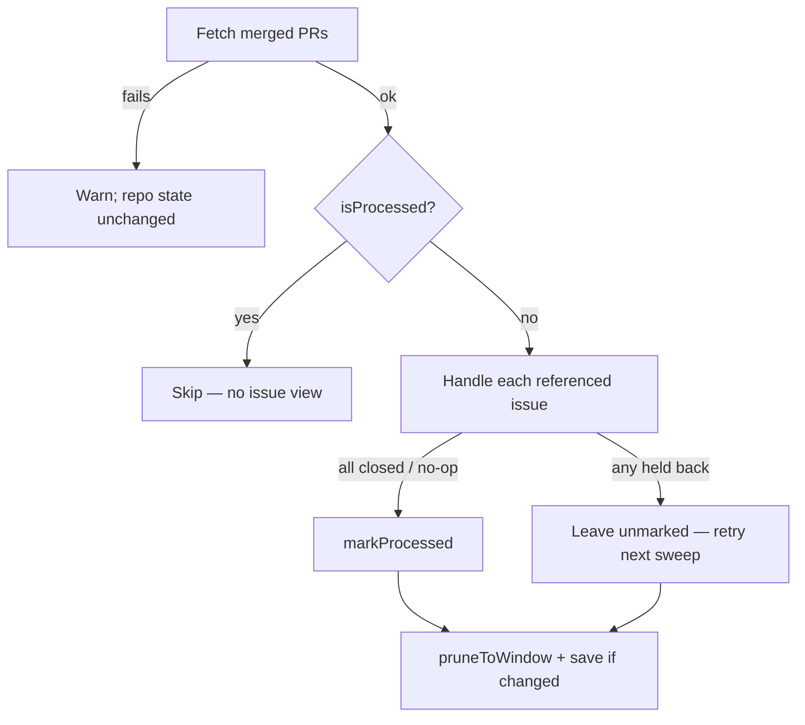

## Summary

`closeIssuesForMergedPrs` skipped every merged PR at or below a number
watermark, so a lower-numbered PR merged after a higher-numbered one never
closed its issue. The sweep now uses the v2 processed-set store from #2828
(`loadProcessedSweepState` / `isProcessed` / `markProcessed` /
`pruneToWindow` / `saveProcessedSweepState`) on the same
`merged_reconcile_watermarks.json` file and the same 30-PR window. Closes #2831.

- A PR is marked processed only when every issue it references was closed or
  was a positive no-op (already closed, or an issue filed after the merge).
  Anything held back — failed view or close, planning label, unknown ordering,
  unlanded merge, unreadable or rolled-back thread — stays unmarked and is
  retried.
- A failed merged-PR fetch logs a warning and leaves that repo's state
  untouched (no prune, no mark); the file is only saved when a repo's set
  changed. A failed save is now logged instead of swallowed.
- A legacy v1 file loads as empty, so the first run after deploy re-examines
  the window once; already-closed issues are skipped, so the catch-up closes
  nothing twice.
- Production passes its `logger` through a new optional `logger` option.

## Evidence

Backend-only change; no UI. Verified by the tests below.

## Reproduction

- **symptom** — a merged PR numbered below an already-reconciled PR (e.g. a
  milestone child merged late) never had its issue closed
- **status** — `verified` — the four new tests failed against the unfixed code
  (the out-of-order case closed nothing, since PR 150 sat below the watermark)
  and pass after the fix
- **regression test** — `worker/deno/tests/pr_issue_linking_test.ts::a lower-numbered PR merged after a processed higher one still closes its issue (Issue #2831)`

## Acceptance Criteria

<!-- vibe-spec-review inputs="diff+issue-body" -->

- **met** — Out-of-order: with PR 200 processed, merged PR 150 is still processed and its issue closed — evidence: `worker/deno/tests/pr_issue_linking_test.ts::a lower-numbered PR merged after a processed higher one still closes its issue (Issue #2831)` — reviewer: met
- **met** — Catch-up: a v1 watermark file causes every PR in the window to be examined once, then marked — evidence: `worker/deno/tests/pr_issue_linking_test.ts::a legacy v1 watermark file re-examines the whole window once (Issue #2831)` — reviewer: met
- **met** — Failed fetch leaves the state file byte-identical — evidence: `worker/deno/tests/pr_issue_linking_test.ts::a failed merged-PR fetch leaves the state file byte-identical and is logged (Issue #2831)` — reviewer: met
- **met** — A PR whose issue close failed is not marked and is retried next sweep — evidence: `worker/deno/tests/pr_issue_linking_test.ts::a PR whose issue close failed is not marked and is retried next sweep (Issue #2831)` — reviewer: met
- **met** — `deno task` quality gate passes — evidence: `./quality.sh` run after the final edit — reviewer: partial — reason: the reviewer ran only the touched test file, lint and fmt; the full gate was run here and passed
- **unrequested** — a failed state save is now logged via `logger.warn` rather than swallowed — reviewer: unrequested — reason: the fail-loud standard; the replaced save call sat in an empty catch
- **unrequested** — new optional `logger` option, wired in `run_core_production_deps.ts` — reviewer: unrequested — reason: plumbing so the failed fetch the issue says must be logged reaches the worker log
- **unrequested** — removed the early `continue` for PRs with no issue reference, so they are marked processed — reviewer: unrequested — reason: without it they would be re-examined every cycle; the number watermark used to move past them
- **unrequested** — two Issue #4256 tests now assert the processed set instead of a number watermark — reviewer: unrequested — reason: the store changed; same behaviour (failed view / planning label held back) still protected

## Standards Review

<!-- vibe-standards-review inputs="diff+CODING-STANDARDS.md" -->

- **clean** — fail loud (fetch and save failures logged at warn, through the redacting logger), mark-only-on-success, no prune on failed fetch, no shared-file hazard with the other two v1 sweeps, tests call real code in temp dirs, Australian English, commit trailer. Optional notes: the pre-existing per-issue `catch {}` still retries without logging (unchanged, out of scope); test declaration order tidied in this diff.

## Test Plan

- `worker/deno/tests/pr_issue_linking_test.ts`: four new Issue #2831 cases
  (out-of-order, v1 catch-up, failed fetch, failed close); two Issue #4256
  cases updated to assert the v2 processed set.
- Ran `pr_issue_linking_test.ts`, `close_merged_pr_ordering_482_test.ts`,
  `close_merged_pr_any_author_2537_test.ts`,
  `merged_pr_close_rollback_1770_test.ts`, `merged_sweep_watermark_test.ts`,
  `pr_maintenance_test.ts` — all pass.
- `./quality.sh` — full gate.
