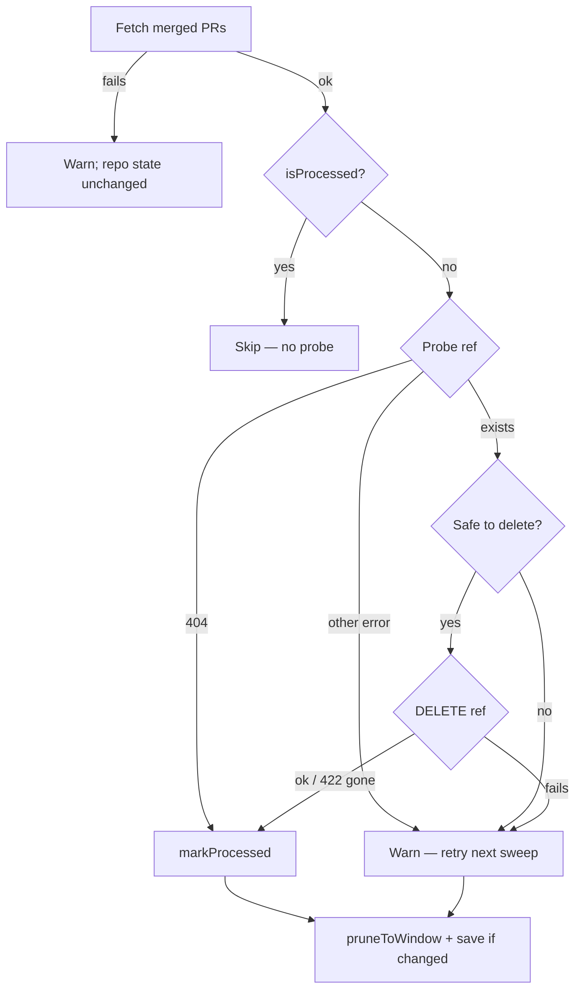

## Summary

`cleanupMergedPrBranches` skipped every merged PR at or below a number
watermark. A lower-numbered PR that merged after a higher-numbered one never
had its branch deleted.

The sweep now uses the v2 processed-set store from #2828:
`loadProcessedSweepState`, `isProcessed`, `markProcessed`, `pruneToWindow` and
`saveProcessedSweepState`. It keeps the same watermark file and the same window.
Closes #2832.

- **When a PR is marked processed:** its branch was deleted, or was already
  gone (404 on the probe, or 422 "Reference does not exist" on the delete).
- **When it is left unmarked:** a failed delete, a non-404 probe error, or an
  unsafe skip. The PR is retried next sweep; failures are logged at warn.
- **A failed merged-PR fetch:** logs a warning and leaves that repo's state
  untouched (no prune, no mark).
- **Saving:** the file is saved only when a set changed. A failed save is now
  logged, where before it was swallowed.
- **Legacy v1 files:** load as empty, so the first sweep after deploy
  re-examines the window once. Branches already gone are cheap 404 probes.

## Evidence

Backend-only change; no UI. Verified by the tests below.

## Reproduction

- **symptom** — the branch of a merged PR numbered below an already-swept PR
  (e.g. a milestone child merged late) was never deleted
- **status** — `verified` — the new tests failed against the unfixed code (8
  failures; the out-of-order case never deleted `issue-150-fix`) and pass after
  the fix
- **regression test** — `worker/deno/tests/branch_cleanup_test.ts::a PR merged out of order is still swept when a higher one is processed (Issue #2832)`

## Acceptance Criteria

<!-- vibe-spec-review inputs="diff+issue-body" -->

- **met** — Out-of-order: with PR 200 processed, merged PR 150's branch is still deleted — evidence: `worker/deno/tests/branch_cleanup_test.ts::a PR merged out of order is still swept when a higher one is processed (Issue #2832)` — reviewer: met
- **met** — An already-gone branch is marked processed — evidence: `worker/deno/tests/branch_cleanup_test.ts::an already-gone branch is marked processed (Issue #2832)` (probe 404 and DELETE 422) — reviewer: met
- **met** — A failed delete is not marked and is retried, with its error logged — evidence: `worker/deno/tests/branch_cleanup_test.ts::a failed delete is logged, left unprocessed and retried next sweep (Issue #2832)` — reviewer: met
- **met** — A failed fetch leaves the state file unchanged — evidence: `worker/deno/tests/branch_cleanup_test.ts::a failed merged-PR fetch leaves the state file unchanged (Issue #2832)` — reviewer: met
- **met** — A v1 file reads as empty (catch-up) — evidence: `worker/deno/tests/branch_cleanup_test.ts::a legacy v1 watermark file reads as empty so the window is caught up (Issue #2832)` — reviewer: met
- **met** — `deno task` quality gate passes — evidence: `./quality.sh` run on the final HEAD — reviewer: partial — reason: the reviewer's full-gate run hit its 580s timeout; it ran the touched tests, check, lint and fmt clean. The full gate was run here.
- **unrequested** — a non-404 ref-probe error is now logged and retried instead of being counted as missing — reviewer: unrequested — reason: only 404 or 422 counts as "already gone", so an inconclusive probe must not be marked processed; covered by `an inconclusive ref probe is logged and left unprocessed (Issue #2832)`
- **unrequested** — a 422 "gone" on DELETE now skips the local `git branch -d` and the `failed` self-heal event — reviewer: unrequested — reason: this matches the existing probe-404 path; before, a branch that was simply gone reported a misleading `failed` event
- **unrequested** — new optional `CleanupOptions.logger` — reviewer: unrequested — reason: lets the required failure logging be asserted in tests; production uses the default logger
- **unrequested** — failed state save and failed fetch are logged at warn — reviewer: unrequested — reason: the fail-loud standard; the save previously sat in an empty catch
- **unrequested** — comment-only update in `worker/deno/lib/run_core_production_deps.ts` — reviewer: unrequested — reason: the caller's comment described the number watermark
- **unrequested** — two Issue #4255 tests now assert the processed set instead of a number watermark — reviewer: unrequested — reason: the store format changed; the behaviour they protect (unsafe skip retried, corrupt file treated as empty) is unchanged

## Standards Review

<!-- vibe-standards-review inputs="diff+CODING-STANDARDS.md" -->

- **clean** — no violations introduced by the diff. Checked: fail-loud logging at warn, tests calling real code in temp dirs, KISS/DRY (the private `errorMessage` helper follows the existing lib pattern), no docs owed, Australian English and concise comments. The optional note that the new helpers sat under a detached JSDoc was addressed in this diff.

## Test Plan

- `worker/deno/tests/branch_cleanup_test.ts`:
  - six new Issue #2832 cases: out-of-order, already-gone, failed delete,
    inconclusive probe, failed fetch and v1 catch-up;
  - two Issue #4255 cases updated to assert the v2 processed set.
- `deno task test:unit tests/branch_cleanup_test.ts` and
  `merged_sweep_watermark_test.ts` — pass.
- `./quality.sh` — full gate.
