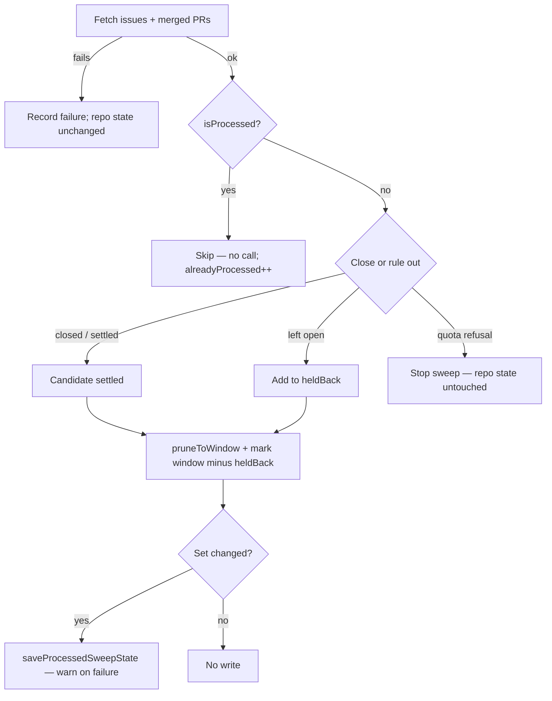

## Summary

`sweepMergedPrIssues` skipped every candidate whose merged PR was at or below
a number watermark (`belowWatermark`). A lower-numbered PR that merged after a
higher-numbered one never had its issues closed.

The sweep now uses the v2 processed-set store from #2828:
`loadProcessedSweepState`, `isProcessed`, `markProcessed`, `pruneToWindow` and
`saveProcessedSweepState`. It keeps the same state file
(`merged_issue_sweep_watermarks.json`) and the same window. This was the last
consumer of the legacy API, so `loadSweepWatermarks`, `saveSweepWatermarks`
and `SweepWatermarks` are removed from `lib/merged_sweep_watermark.ts`.
Closes #2833.

- **When a PR is marked processed:** the repo's loop completed and every issue
  the PR names was closed or ruled out for good.
- **When it is left unmarked:** an issue it names was left open
  (`needs-human`, change not landed, failed close), or the sweep stopped on
  quota before the repo's loop finished.
- **A failed fetch:** leaves that repo's state untouched (no prune, no mark).
- **Saving:** only when a set changed. A failed save is now logged at warn,
  where before it was swallowed.
- **Legacy v1 files:** load as empty, so the first sweep after deploy
  re-examines the window once. Re-sweeping a PR is idempotent.
- The result field `belowWatermark` is renamed `alreadyProcessed`, and the log
  note reads "N already processed".

## Evidence

Backend-only change; no UI. Verified by the tests below.

## Acceptance Criteria

<!-- vibe-spec-review inputs="diff+issue-body" -->

- **met** — Out-of-order: with PR 200 processed, merged PR 150 is still swept — evidence: `worker/deno/tests/merged_pr_issue_sweep_test.ts::sweepMergedPrIssues - a PR merged out of number order is still swept (Issue #2833)` — reviewer: met
- **met** — Quota stop leaves unreached PRs unmarked — evidence: `worker/deno/tests/merged_pr_issue_sweep_test.ts::sweepMergedPrIssues - a quota stop mid-repo leaves the unreached PRs unmarked (Issue #2833)` and `::sweepMergedPrIssues - a quota stop between repos records nothing for the refused repo (Issue #1477)` — reviewer: met
- **met** — Failed fetch leaves the state file unchanged — evidence: `worker/deno/tests/merged_pr_issue_sweep_test.ts::sweepMergedPrIssues - a failed fetch leaves the state file unchanged (Issue #2833)` (byte comparison, with an out-of-window entry a prune would drop) — reviewer: met
- **met** — v1 file reads as empty (catch-up); re-sweeping a PR is idempotent — evidence: `worker/deno/tests/merged_pr_issue_sweep_test.ts::sweepMergedPrIssues - a legacy v1 watermark file reads as empty and the window is caught up (Issue #2833)` and `::sweepMergedPrIssues - a processed PR is skipped without a call, and a re-sweep is idempotent (Issue #1477, #2833)` — reviewer: met
- **met** — `grep -r "loadSweepWatermarks\|saveSweepWatermarks\|SweepWatermarks\b" worker/deno` returns nothing — evidence: grep on the final HEAD exits 1 with no output; `worker/deno/lib/run_core_production_deps.ts` imports only the path helpers, and was already clean on the milestone base — reviewer: met
- **partial** — `deno task` quality gate passes — evidence: the two touched test files (44 passed, 0 failed), `deno task check` on `**/*.ts`, and `deno lint` / `deno fmt --check` on the touched `.ts` files, all clean — reviewer: partial — reason: the reviewer's full `./quality.sh` run hit its timeout at 470s, and every stage that had reported by then passed; the worker's own quality gate on this branch passed
- **unrequested** — a failed state save is now logged at warn instead of being swallowed — reviewer: unrequested — reason: the fail-loud standard; it matches what #2832 did in `branch_cleanup.ts`
- **unrequested** — result field `belowWatermark` renamed `alreadyProcessed`, and the log note reads "N already processed" — reviewer: unrequested — reason: once the number watermark is gone, "below watermark" no longer describes the skip; the only caller does not read the field

## Standards Review

<!-- vibe-standards-review inputs="diff+CODING-STANDARDS.md" -->

- **violation** — DRY: `sameNumbers` and the per-repo prune/mark/compare block repeat what is in `branch_cleanup.ts` — evidence: `worker/deno/lib/merged_pr_issue_sweep.ts:266`, `worker/deno/lib/merged_pr_issue_sweep.ts:578` — reason: stands, non-blocking; best folded into one shared helper in `merged_sweep_watermark.ts` once all three sweeps are on the store, rather than in this child issue
- **violation** — TDD: the new warn on a failed save has no test — evidence: `worker/deno/lib/merged_pr_issue_sweep.ts:594` — reason: stands, non-blocking; the same path in `branch_cleanup.ts` is also untested, and a follow-up can cover both
- **violation** — naming nit: `watermarkPath` / `mergedIssueSweepWatermarkPath` now point to a processed set — evidence: `worker/deno/lib/merged_pr_issue_sweep.ts:119` — reason: stands; the doc comments explain it, and the on-disk filename is kept on purpose
- **violation** — KISS nit: in `watermarkPath && state && stateDirty`, the `watermarkPath` check is redundant — evidence: `worker/deno/lib/merged_pr_issue_sweep.ts:592` — reason: stands; harmless, and it mirrors `branch_cleanup.ts`
- **clean** — Australian English, fail-loud logging levels, Deno/TypeScript conventions, removal of the legacy exports (no references left), docs updated (`docs/INTERNALS.md`), tests calling real code against a temp-dir state file, accurate comments, and input validation on load

## Test Plan

- `worker/deno/tests/merged_pr_issue_sweep_test.ts`:
  - new Issue #2833 cases: out-of-order, quota stop mid-repo, failed fetch,
    and v1 catch-up;
  - existing Issue #1477 cases updated to assert the v2 processed set, with a
    byte comparison for idempotence.
- `deno test -A tests/merged_pr_issue_sweep_test.ts tests/merged_sweep_watermark_test.ts`
  — 44 passed, 0 failed.
- `deno task check`, `deno lint`, `deno fmt --check` on the touched files — clean.
