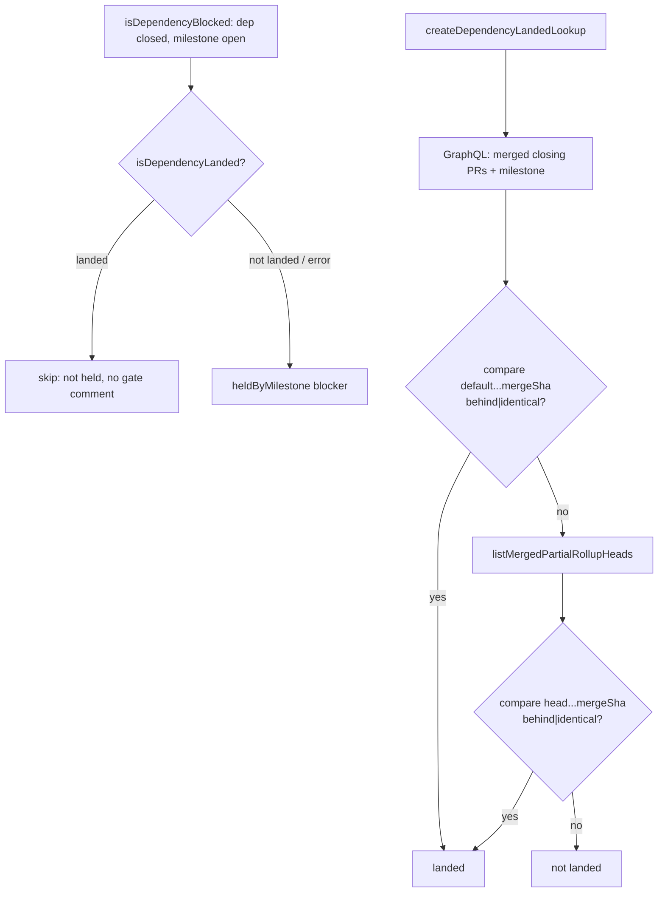

# PR Summary — Issue #2834

## Summary

Releases a cross-milestone hold once the dependency's code has actually landed,
instead of holding until the dependency's whole milestone closes. Closes #2834.

- New `worker/deno/lib/dependency_landed.ts` exports
  `createDependencyLandedLookup(repo, defaultBranch, ghFn)`. It reads the
  dependency's merged closing PRs (`closedByPullRequestsReferences`) and their
  `mergeCommit`. The dependency counts as landed when a merge commit is an
  ancestor of the default branch, or of a head from
  `listMergedPartialRollupHeads` (#2830). Ancestry is checked with
  `compare/{target}...{sha}`, where `behind` or `identical` means landed.
  Checking against the rollup head covers squash-merged rollups.
- It fails safe. Any `gh` error, missing data or missing `mergeCommit` returns
  "not landed" and logs why. Results are memoised per issue, and the default
  branch is resolved once, lazily.
- `MilestoneScope` gains an optional `isDependencyLanded`.
  `createOpenMilestoneLookup` attaches the lookup to the function it returns, so
  every collector picks it up without editing any call site. In
  `isDependencyBlocked`, a landed dependency is skipped before a
  `heldByMilestone` blocker is recorded. Because of that, no held-issue gate
  comment is posted for a released issue.

## Evidence

This is a backend-only change with no UI. `./quality.sh < /dev/null` passed.

## Reproduction

- **Symptom:** a candidate whose dependency is closed, and whose code is
  already on the default branch or in a merged partial rollup, stayed held
  because the dependency's milestone was still open. That deadlocks milestones
  that depend on each other (#2794).
- **Status:** verified
- **Regression test:**
  `worker/deno/tests/cross_milestone_dependency_gate_test.ts`, cases (a), (b)
  and (d) of "Release once the dependency has landed (Issue #2834)".
  - Against the unfixed `issue_finder_common.ts` from `c90418e7`, the file ran
    `FAILED | 24 passed | 3 failed`, with exactly those three release cases
    failing.
  - With the fix it runs `ok | 27 passed`.

## Acceptance Criteria

<!-- vibe-spec-review inputs="diff+issue-body" -->

- **met** — Dependency whose merge commit is on the default branch → not held — evidence: `worker/deno/tests/dependency_landed_test.ts` ("landed via a closing PR merge commit already behind the default branch" and "…identical…"); `cross_milestone_dependency_gate_test.ts` case (a) — reviewer: met
- **met** — Merge commit only in a merged partial-rollup head → not held — evidence: `dependency_landed_test.ts` ("landed via a merged partial-rollup head when the closing PR itself has not reached default"), which asserts the compare targets the rollup head — reviewer: met
- **met** — Not landed → still held — evidence: `dependency_landed_test.ts` ("not landed — every signal diverged or ahead of default"); `cross_milestone_dependency_gate_test.ts` case (c) — reviewer: met
- **met** — `gh` error or missing `mergeCommit` → still held, error logged — evidence: `dependency_landed_test.ts` ("a gh failure fails safe…" and "an unmerged closing PR or a missing merge commit is not treated as landed", which asserts the log line and that no compare was issued) — reviewer: met
- **met** — Memoised, one compare per dependency per iteration — evidence: `dependency_landed_test.ts` ("results are memoised — the second lookup issues no further gh calls") — reviewer: met
- **met** — Existing `cross_milestone_dependency_gate_test.ts` cases pass unchanged — evidence: the diff only appends to that file; all 24 pre-existing cases pass (27 in total) — reviewer: partial — reason: the reviewer was read-only and could not run the tests; they were run here and passed
- **met** — `deno task` quality gate passes — evidence: `./quality.sh < /dev/null` → `Result: PASSED` — reviewer: partial — reason: the reviewer could not run the gate; it was run here and passed
- **met** — Wired via the factory, with no edits to the ~9 collector call sites — evidence: `worker/deno/lib/issue_finder_common.ts` (`createOpenMilestoneLookup`, `isDependencyBlocked`); `cross_milestone_dependency_gate_test.ts` case (d) runs a real collector — reviewer: met
- **met** — The held-issue gate comment is no longer posted for a released issue — evidence: `isDependencyBlocked` records no blocker for a landed dependency, and `held_issue_gate_comment.ts` builds only from blockers — reviewer: met
- **unrequested** — `isValidRepoSlug` / `isValidBranchName` checks before any `gh` call — reviewer: unrequested — reason: allowlist validation at the trust boundary, as the secure-coding standards require
- **unrequested** — `docs/audits/lib-sweep-coverage.json` entry — reviewer: unrequested — reason: `lib_sweep_coverage_test.ts` requires every new lib module to be registered

## Standards Review

<!-- vibe-standards-review inputs="diff+CODING-STANDARDS.md" -->

- **clean** — No violations found. The review covered Australian English, fail-loud and fail-safe logging, tests that call real code against a fake `gh`, ledger registration, and validation at the trust boundary. It also noted, as optional taste, that `compute()` is long and that the lookup can be supplied two ways; neither was changed.

## Test Plan

- Added `worker/deno/tests/dependency_landed_test.ts` (8 tests) covering:
  - landed via the default branch (`behind` / `identical`);
  - landed via a partial-rollup head;
  - not landed;
  - a `gh` error;
  - an unmerged PR or missing merge commit;
  - memoisation;
  - lazy default-branch resolution.
- Added four release cases to `cross_milestone_dependency_gate_test.ts`: landed, fallback to the lookup on `isMilestoneOpen`, not landed or rejected, and collector wiring.
- `deno task test:unit tests/dependency_landed_test.ts tests/cross_milestone_dependency_gate_test.ts < /dev/null` → 35 passed.
- `./quality.sh < /dev/null` passed.

🤖 Generated with [Claude Code](https://claude.com/claude-code)
