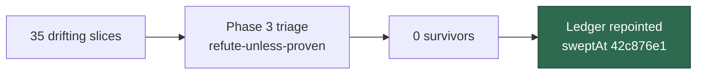

# PR Summary — Issue #2839

## Summary

Closes #2839

This is the delta re-sweep of the 35 top-up and chunk-12 slices that drift and
were not repointed by #2754. Each module was triaged under refute-unless-proven
(`docs/SECURITY-SCAN.md`, Phase 3), and **nil survived**. Every swept slice now
points at the new record at the swept merge-base.

- [x] Compute per-slice drift, since `sweep-drift` exits 1 on unresolvable #2754
      `sweptAt` values.
- [x] Triage all 35 slices and record them in
      `docs/audits/security-sweep-2839-top-up-delta.md`.
- [x] Check #2722 sibling coverage (PR #2845) for the chunk-12 slices first.
- [x] Repoint the 35 slices in `docs/audits/lib-sweep-coverage.json`, setting
      `ledger` to the new record and `sweptAt` to
      `42c876e1aa6f8df81177cc19ddb807dd7912bf63`.
- [x] Add a regression test pinning the repoint.
- [x] File surviving findings. There were none, so no issues were filed.

## Evidence

- **Test added:**
  `worker/deno/tests/security_sweep_2839_ledger_test.ts::security sweep #2839 - every swept slice points at the record and its merge-base`,
  together with
  `worker/deno/tests/security_sweep_2839_ledger_test.ts::security sweep #2839 - the record names every module its slices claim`.
  A third test, `the recorded sweptAt is an ancestor of HEAD`, is ignored in
  shallow clones.
- **Fail before, pass after:** run against the un-repointed ledger (`HEAD~`'s
  `lib-sweep-coverage.json`), the first two tests **fail** (1 passed, 2 failed).
  The 35 slices still pointed at their old records and `sweptAt` values. With
  the repoint, all 3 pass.
- **Trigger closed:** the trigger was drift on slices whose `sweptAt` predates
  their modules' current content. Every slice named in the record now carries
  `sweptAt` 42c876e1, and the record names each of their modules with a nil
  triage row. The test derives the chunk list from the record's own table, and
  it also requires the ledger's set of slices pointing at the record to equal
  that table. A slice therefore cannot be dropped from the table, or repointed
  without a row, without failing the test. That leaves no trivial bypass.
- The ledger merges cleanly with
  `milestone/2722-docs-audits-lib-sweep-cover-security-sweep-le`
  (`git merge-tree`, no conflicts).

## Test Plan

- `deno task test:unit tests/security_sweep_2839_ledger_test.ts tests/lib_sweep_coverage_test.ts < /dev/null`
- `deno task check:manifests < /dev/null`
- `./quality.sh < /dev/null`

## Security self-check

- [x] Input validation: no new external input; the test reads committed files
      only.
- [x] Secrets: no hidden or credential files are staged.
- [x] Injection surface: the git calls use a fixed argv via `sweepGitRunnerFor`.
- [x] Output encoding, auth, error handling and dependencies: not applicable,
      because this change is docs, ledger and test only.
