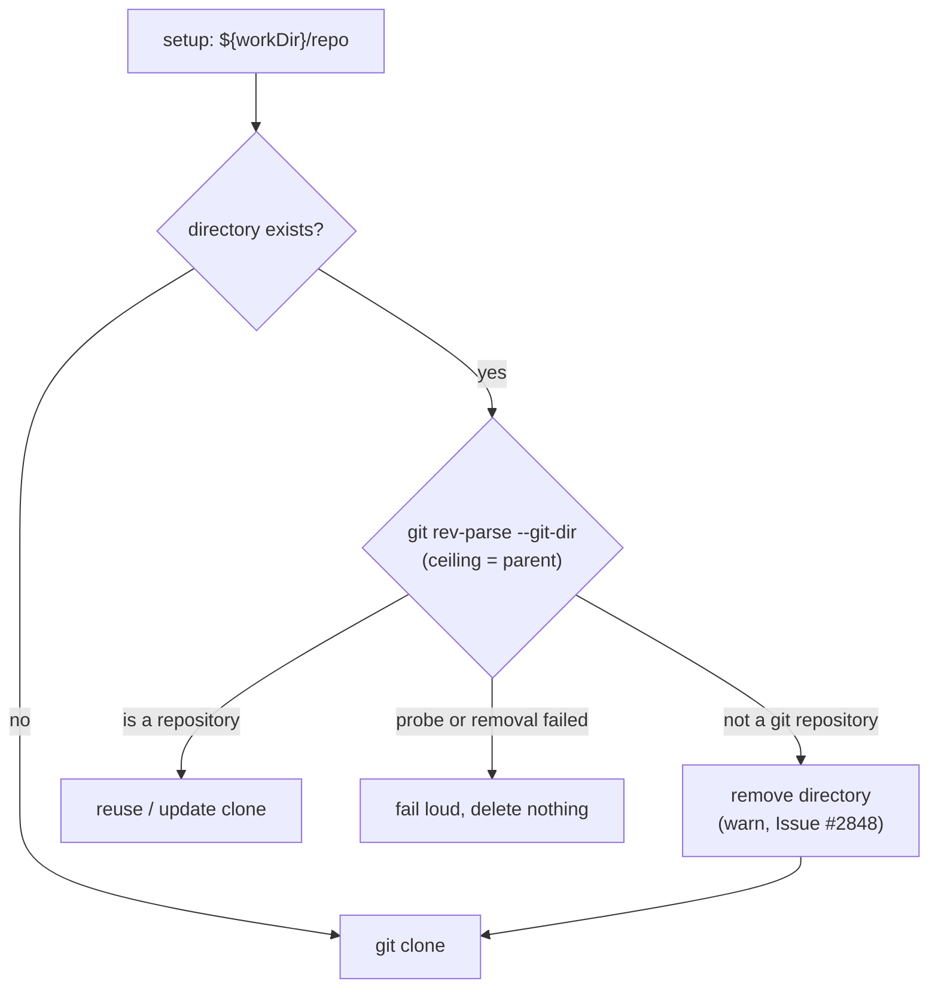

# PR Summary — Issue #2848

## Summary

Closes #2848

`ensureRepoClone` and `setupRepo` treated any directory at `${workDir}/<repo>` as
a clone. An interrupted clone leaves a directory with no valid `.git`, and every
later run reused it and died at setup with `fatal: not a git repository`. The
fast-failure record then kept only git's trailer line,
`Stopping at filesystem boundary (GIT_DISCOVERY_ACROSS_FILESYSTEM not set).`,
which hid the cause.

- [x] `discardBrokenClone` (`worker/deno/lib/broken_clone.ts`) asks git whether
      the directory holds a repository. It sets `GIT_CEILING_DIRECTORIES` to the
      parent, so a directory nested in another repository still counts as broken.
      Only an explicit `not a git repository` answer causes the directory to be
      removed. If the probe or the removal fails, the function fails loud and
      nothing is deleted.
- [x] `ensureRepoClone` and `setupRepo` now re-clone a broken directory instead
      of reusing it.
- [x] `diagnosticErrorLine` skips the `Stopping at filesystem boundary` trailer,
      so the fast-failure issue shows the real cause.
- [x] `docs/IDLE-TASK-FRAMEWORK.md` updated, and the new module is registered in
      `docs/audits/lib-sweep-coverage.json`.

## Evidence

This is a backend-only change, with no visual surface. The tests that cover it
are:

- `worker/deno/tests/ensure_repo_clone_test.ts::ensureRepoClone - a directory holding no repository is re-cloned, not reused (Issue #2848)`
- `worker/deno/tests/ensure_repo_clone_test.ts::ensureRepoClone - default directory probe reuses a real clone untouched`
- `worker/deno/tests/broken_clone_test.ts` — five cases:
  - a README-only directory is removed;
  - an empty `.git` is removed;
  - a real repository is kept;
  - a plain directory nested in a repository is removed while the parent is
    untouched;
  - a missing path is a no-op.
- `worker/deno/tests/repo_fast_failure_tracker_test.ts::diagnosticErrorLine - git's discovery-boundary trailer does not displace the cause (Issue #2848)`
- `./quality.sh` passed: deno tests, lint, type check, fmt and completeness
  checks all pass. Config integration was skipped because there is no
  `.config.json` in the worktree.

## Reproduction

- **symptom:** A clone directory left without a valid `.git` is reused on every
  run, so setup fails within the first minute with
  `Stopping at filesystem boundary (GIT_DISCOVERY_ACROSS_FILESYSTEM not set).`
- **status:** verified. On the unfixed code:
  - `ensureRepoClone` returned `cloned: false` for the broken directory.
  - `diagnosticErrorLine` returned the boundary trailer.
  - `broken_clone_test.ts` failed because the module did not exist.

  All of these pass after the fix.
- **regression test:**
  `worker/deno/tests/ensure_repo_clone_test.ts::ensureRepoClone - a directory holding no repository is re-cloned, not reused (Issue #2848)`

## Test Plan

- [x] `deno task test:unit tests/broken_clone_test.ts tests/ensure_repo_clone_test.ts tests/repo_fast_failure_tracker_test.ts`
- [x] `deno task test:unit tests/lib_sweep_coverage_test.ts`
- [x] `timeout 900 ./quality.sh < /dev/null` — passed; config integration was
      skipped (no `.config.json`)
