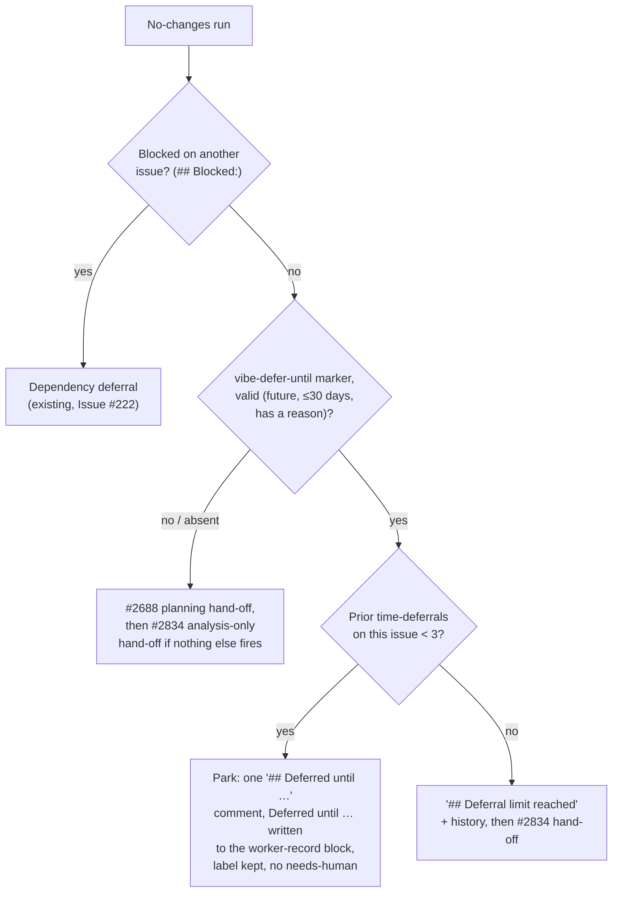
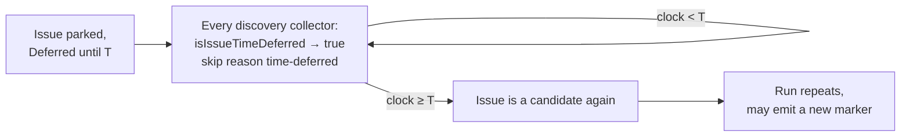

## Summary

Closes #2873.

An analysis-only run can now end its final message with
`<!-- vibe-defer-until until="<ISO>" reason="..." -->` to say the issue is
correct but its answer cannot exist yet — a wait on the calendar, not a
dependency on another issue and not a human decision. Only a time is
supported: the marker's sole parameter is `until`; the run-count variant the
issue sketched (`vibe-defer-until-runs`) is not implemented, and the docs and
prompt say so explicitly so nobody emits it expecting it to work.

`workOnIssueHandleNoChanges` (`worker/deno/lib/phases/handle_no_changes_phase.ts`)
checks the marker immediately after the existing `## Blocked:` dependency
deferral and before the #2688 planning hand-off and the #2834 analysis-only
hand-off. A valid marker **parks** the issue rather than escalating it: no
`needs-human`, the discovery label stays, exactly one `## Deferred until
<time>` comment is posted (carrying a hidden `vibe-time-deferral` record so a
later run can count it), and a `Deferred until YYYY-MM-DDTHH:MM:SSZ` line is
written into the machine-owned worker-record block that already carries
`Depends on owner/repo#N` (`worker/deno/lib/worker_record_block.ts`).

Every discovery collector — `collect_label_candidates.ts`,
`collect_idle_task_candidates.ts`, `collect_low_priority_candidates.ts`,
`collect_self_diagnostic_candidates.ts` and `collect_work_on_candidates.ts` —
now calls the shared `isIssueTimeDeferred` helper
(`worker/deno/lib/time_deferral.ts`) and skips the issue with skip reason
`time-deferred` until the recorded time passes, then re-runs it automatically
on the first scan after. The idle-decision census (`idle_decision_census.ts`),
`idle_detect_diagnostics.ts` and `diagnose_issue.ts` read the same
machine-owned line through the same helper, so an operator's `[idle-census]`
line, `ISSUE_FINDER_DEBUG=true` trace and `diagnoseIssue` check all agree with
what discovery actually did.

After `MAX_TIME_DEFERRALS` (3) deferrals on the same issue, the next
`vibe-defer-until` marker is not honoured: the worker posts a `## Deferral
limit reached` comment listing the prior deferral history and falls back to
the existing #2834 analysis-only `needs-human` hand-off. An analysis-only run
that never emits a marker at all is unaffected — it still gets the ordinary
#2834 hand-off, exactly as before this change.





**Gap 2 (out of scope):** the issue described a second gap — a single-host
analysis run cannot see fleet-wide measurement data (`fleet_telemetry_*.json`
snapshots, credit logs from every host). That gap is not addressed here; it is
tracked in follow-up issue #2930.

**Known limitation:** the prior-deferral count is read from hidden
`vibe-time-deferral` comment markers, not from a counter in the body. If a
human re-queues an issue after a limit hand-off and the next run emits another
`vibe-defer-until` marker, the history already carries `MAX_TIME_DEFERRALS`
entries, so that single request escalates again immediately rather than being
granted one more deferral. This is bounded — it cannot loop — and the
`## Deferral limit reached` comment states the full history, so the human who
re-queued it can see exactly why it bounced straight back.

### Checklist

- [x] Marker parsing and validation (`detectTimeDeferral`, strict ISO check,
      30-day horizon, reason cap) — `worker/deno/lib/time_deferral.ts`
- [x] The `handle_no_changes` handler branch — `worker/deno/lib/phases/handle_no_changes_phase.ts`
- [x] The discovery gate across all five collectors — `collect_label_candidates.ts`,
      `collect_idle_task_candidates.ts`, `collect_low_priority_candidates.ts`,
      `collect_self_diagnostic_candidates.ts`, `collect_work_on_candidates.ts`
- [x] Census/diagnostics parity — `idle_decision_census.ts`, `idle_detect_diagnostics.ts`,
      `diagnose_issue.ts`
- [x] The escalation limit (`MAX_TIME_DEFERRALS`) and its comment
- [x] Prompt and docs updated — `prompts/issue/prompt.md`,
      `docs/workflows/issue-processing.md`, `DESIGN-PRINCIPLES.md`,
      `SECURITY.md`, `docs/THREAT-MODEL.md`
- [x] The security sweep ledger — `docs/audits/lib-sweep-coverage.json`,
      `docs/audits/security-sweep-2873-time-deferral.md`
- [x] Tests — `worker/deno/tests/time_deferral_test.ts`,
      `handle_no_changes_time_deferral_test.ts`,
      `collect_label_candidates_test.ts`, `idle_decision_census_test.ts`,
      `worker_record_block_test.ts`
- [x] The local quality gate

## Evidence

`./quality.sh < /dev/null`: **Result: PASSED (with skipped checks)**. The only
skip is config integration (no `.config.json` in the sandbox). Deno tests
passed: parallel in 4m55s, serial in 1m22s. Lint, type check, fmt, semgrep,
markdownlint, mermaid and the manifest-completeness check (`check:manifests`)
all passed.

New/relevant tests, by file:

- `worker/deno/tests/time_deferral_test.ts` — marker parsing and the
  discovery-side read: `detectTimeDeferral - valid, Z offset`,
  `detectTimeDeferral - valid, +10:00 offset canonicalised to UTC`,
  `detectTimeDeferral - invalid: in the past`,
  `detectTimeDeferral - invalid: exactly now`,
  `detectTimeDeferral - invalid: beyond the horizon`,
  `detectTimeDeferral - invalid: date-only`,
  `detectTimeDeferral - invalid: missing reason`,
  `isTimeDeferred - true before the time, false after`,
  `isTimeDeferred - a user-typed line outside the block never defers`,
  `isIssueTimeDeferred - true while the deferral is in the future`,
  `isIssueTimeDeferred - false once the deferral time has passed`,
  `isIssueTimeDeferred - a getIssueBody failure fails loud, not deferred`,
  `priorTimeDeferrals - counts park comments oldest first`,
  `deferIssueUntil - posts a comment and records the body line`,
  `deferIssueUntil - replaces an older Deferred-until line`,
  `buildDeferralExhaustedComment - lists prior deferrals and the latest reason`,
  `MAX_TIME_DEFERRALS and MAX_DEFERRAL_HORIZON_MS are sane bounds`.
- `worker/deno/tests/handle_no_changes_time_deferral_test.ts` —
  `handle_no_changes_phase - valid time-deferral marker parks the issue, no needs-human`,
  `handle_no_changes_phase - analysis output with no marker still hands off (#2834)`,
  `handle_no_changes_phase - deferral limit reached hands off to a human`,
  `handle_no_changes_phase - a past 'until' is not deferred, falls through to hand-off`,
  `handle_no_changes_phase - blocked output wins over a defer-until marker`.
- `worker/deno/tests/collect_label_candidates_test.ts` —
  ``collect_label_candidates - a future `Deferred until` line skips the issue as time-deferred``,
  ``collect_label_candidates - a past `Deferred until` line is a candidate again``,
  ``collect_label_candidates - a `Deferred until` line outside the worker record block does not skip``.
- `worker/deno/tests/idle_decision_census_test.ts` —
  `#2873 - an issue both dependency-blocked and time-deferred counts as time-deferred, matching the scan`,
  `#2873 - a plain time-deferred issue counts in timeDeferred, not unblocked`.
- `worker/deno/tests/worker_record_block_test.ts` —
  `worker record block - accepts a Deferred until line`,
  `worker record block - rejects malformed Deferred until variants`,
  `worker record block - replaces an earlier Deferred until line`,
  `worker record block - replaces Deferred until while keeping Depends on lines`.

The two directions the issue asked for are both covered:

- an empty-window issue is deferred, not given `needs-human`, and re-runs once
  the time has passed — `handle_no_changes_phase - valid time-deferral marker
  parks the issue, no needs-human` plus ``collect_label_candidates - a future
  `Deferred until` line skips the issue as time-deferred`` /
  ``a past `Deferred until` line is a candidate again``;
- an analysis-only issue with nothing to wait for still gets the #2834
  hand-off — `handle_no_changes_phase - analysis output with no marker still
  hands off (#2834)`.

## Test Plan

From `worker/deno`:

```
deno task test:unit tests/time_deferral_test.ts tests/handle_no_changes_time_deferral_test.ts tests/collect_label_candidates_test.ts tests/idle_decision_census_test.ts tests/worker_record_block_test.ts
```

And from the repo root:

```
./quality.sh < /dev/null
```

## Acceptance Criteria
<!-- vibe-spec-review inputs="diff+issue-body" -->

- An analysis-only run may end with a `vibe-defer-until` marker carrying an
  ISO time, and the time-only format is documented. Evidence:
  `detectTimeDeferral` in `worker/deno/lib/time_deferral.ts`; the
  "Data not there yet → emit the defer-until marker" section of
  `prompts/issue/prompt.md`.
  reviewer: MET
- The worker parks the issue without `needs-human`, keeps its discovery label,
  and comments once. Evidence: `handle_no_changes_phase - valid time-deferral
  marker parks the issue, no needs-human`.
  reviewer: MET
- Discovery skips the issue until the time, then re-runs it automatically.
  Evidence: `isIssueTimeDeferred` used in every collector
  (`collect_label_candidates.ts`, `collect_idle_task_candidates.ts`,
  `collect_low_priority_candidates.ts`, `collect_self_diagnostic_candidates.ts`,
  `collect_work_on_candidates.ts`); ``collect_label_candidates - a future
  `Deferred until` line skips the issue as time-deferred`` and ``a past
  `Deferred until` line is a candidate again``.
  reviewer: MET
- After 3 deferrals it escalates with the deferral history. Evidence:
  `MAX_TIME_DEFERRALS` in `time_deferral.ts`; `handle_no_changes_phase -
  deferral limit reached hands off to a human`.
  reviewer: MET
- Tests in both directions: the empty-window deferral tests, and an
  analysis-only issue with nothing to wait for still gets the #2834 hand-off.
  Evidence: the tests listed under Evidence above, and
  `handle_no_changes_phase - analysis output with no marker still hands off
  (#2834)`.
  reviewer: MET
- Docs and prompt updated in the same change. Evidence: `prompts/issue/prompt.md`,
  `docs/workflows/issue-processing.md`, `DESIGN-PRINCIPLES.md`, `SECURITY.md`,
  `docs/THREAT-MODEL.md`.
  reviewer: MET

## Standards Review
<!-- vibe-standards-review inputs="diff+CODING-STANDARDS.md" -->

Verdict: PASS WITH NOTES.

- Fail-loud, DRY, Australian English, test quality, docs parity and security
  were all compliant: the discovery gate is one shared `isIssueTimeDeferred`
  helper rather than five re-implementations, a read failure is reported
  through `onReadError` rather than swallowed, and the census/diagnostics
  parity work keeps the operator-visible tooling honest about what discovery
  actually did.
- The single note was that the "not-time-deferred" catch in
  `worker/deno/lib/diagnose_issue.ts` swallowed the error. It is fixed: the
  catch now binds the error and reports its message in the check's `detail`
  field (`` `Could not check time deferral (assuming not deferred): ${error instanceof Error ? error.message : String(error)}` ``).
- Also note that semgrep's `detect-non-literal-regexp` was resolved by making
  every regex in `time_deferral.ts` a literal (`REQUEST_RE`, `UNTIL_RE`,
  `REASON_RE`, `STRICT_ISO_RE`, `RECORD_LINE_RE`, `RECORD_MARKER_RE` — none
  built with `new RegExp` from a runtime string), and that the module is
  registered in the security sweep ledger
  (`top-up-2873`, `docs/audits/security-sweep-2873-time-deferral.md`).

## Security self-check

- **Input validation**: `until` must be strict ISO-8601 with an explicit `Z`
  or `±HH:MM` offset (`STRICT_ISO_RE`); it is rejected if in the past, or more
  than `MAX_DEFERRAL_HORIZON_MS` (30 days) in the future, so a mistaken or
  malicious far-future value cannot park an issue indefinitely under a label
  that still reads as active. `reason` is required, trimmed, whitespace-
  collapsed and capped to 500 characters before it ever reaches a public
  comment, and is run through `neutraliseAgentMarkers` and `redactSecrets`
  first — both the park comment and the deferral-exhausted comment.
- **Forgery resistance**: `isTimeDeferred` / `parseTimeDeferralUntil` read the
  `Deferred until` line only from the machine-owned worker-record block
  (`readWorkerRecordLines`), the same author-blind grammar the existing
  `Depends on owner/repo#N` line uses. Free-text elsewhere in the issue body —
  including text a human typed that looks identical — is never read as a
  deferral, and the content-approval gate strips only that one line shape
  before hashing, so writing it is a denial (it can only make discovery skip
  the issue), never a path to smuggling unapproved content past approval.
- **Fail-safe discovery read**: `isIssueTimeDeferred` treats a `getIssueBody`
  failure as **not** deferred — the issue stays a candidate rather than being
  silently parked forever — but the failure is reported through the
  `onReadError` callback (wired to `console.error`/`log` in each collector),
  so a persistently unreadable body is visible in the logs rather than a
  silent blind spot.
- **Dependencies**: none added; `worker/deno/deno.lock` is unchanged by this
  diff.
- **Secrets**: none staged; nothing in this change touches credentials or
  `.env`-shaped files.

---

`deno fmt` was run on this file; the repository's markdownlint and mermaid
checks (both part of `./quality.sh < /dev/null`, reported above) pass on it.
