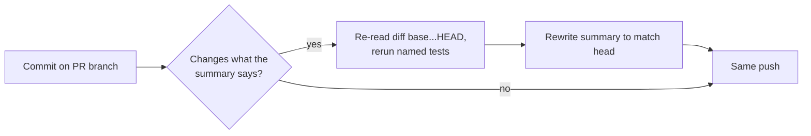

## Summary

Fleet PR reviews kept sending back PRs whose committed
`docs/archive/pr-summaries/pr-summary-<issue>.md` (also the PR body) described an
earlier iteration of the branch — a "known defect", a `partial` reproduction, a
red test — when the head held a working, tested fix. The summary was written once
and never refreshed after later commits changed what the PR does.

This change makes the final-state rule explicit wherever a run writes or changes
code on a PR branch. Closes #2879.

- `prompts/issue/prompt.md`, **PR Summary File**: the summary describes the final
  state of the branch. Before the last commit, re-read `git diff <base>...HEAD`
  and rerun the named tests, and rewrite (never append to) the summary so every
  claim matches the head: reproduction status, test results, "known defect"
  notes, named functions/files/helpers. Interim notes from earlier attempts are
  dropped. This also covers in-run review fixes, check retries and resumed
  attempts.
- `prompts/pr_feedback/prompt.md` and `prompts/ci_fix/prompt.md`: when the
  branch carries a committed PR summary and the change invalidates what it says,
  refresh it in the same push (ci_fix: do not create one on a bot's PR).
- `CODING-STANDARDS.md` and `docs/USAGE.md`: the same rule on the human-facing
  surfaces, so the standard has one source of truth.

The issue's **optional** guardrail (a completion-phase check flagging a summary
that claims `not-run`/failing tests after a green gate) is not in this PR. This
PR covers only the required guidance changes.

## Evidence

Prompt and documentation change only; no UI.

- `deno test -A tests/pr_summary_final_state_2879_test.ts` plus the existing
  prompt suites (`issue_prompt_v38_*`, `issue_prompt_v39_*`, `ci_fix_prompt_v4`,
  `prompt_prose`, `prompt_house_vocabulary_drift`, `prompt_presence_gaps`,
  `prompt_best_practices_checklist`, `prompt_manager`, `prompt_immutability`,
  `prompt_hash`, `issue_prompt_executor_split_2343`): 144 passed, 0 failed.
- Doc-pinning suites (`agents_md_pointer_anchors`, `coding_guidelines_twin_drift`,
  `markdown_anchors`, `documentation_drift_policy`, …): 77 passed, 0 failed.
- `./quality.sh`: every stage passed (markdownlint, mermaid, semgrep, lint, type
  check, fmt, etc.) except **deno tests**: 24,682 passed, 1 failed. The one
  failure is `security_sweep_2839_ledger_test.ts::the recorded sweptAt is an
  ancestor of HEAD`. It fails because of the environment, not this change: the
  run's worktree is a shallow clone grafted at base `427a8fc`, so
  `git merge-base --is-ancestor 42c876e HEAD` cannot walk back to `42c876e`,
  which really is on `main` (it is `427a8fc`'s grandparent in
  `git log origin/main`). The test's own shallow-clone guard only checks that
  the object exists, not that its history does. This diff touches neither the
  test nor the ledger it reads.

## Test Plan

- Added `worker/deno/tests/pr_summary_final_state_2879_test.ts`: loads the
  `issue`, `pr_feedback` and `ci_fix` templates through `loadPrompt` and asserts
  each carries the final-state / keep-true-to-the-head rule, so a later edit that
  drops it fails in CI.
