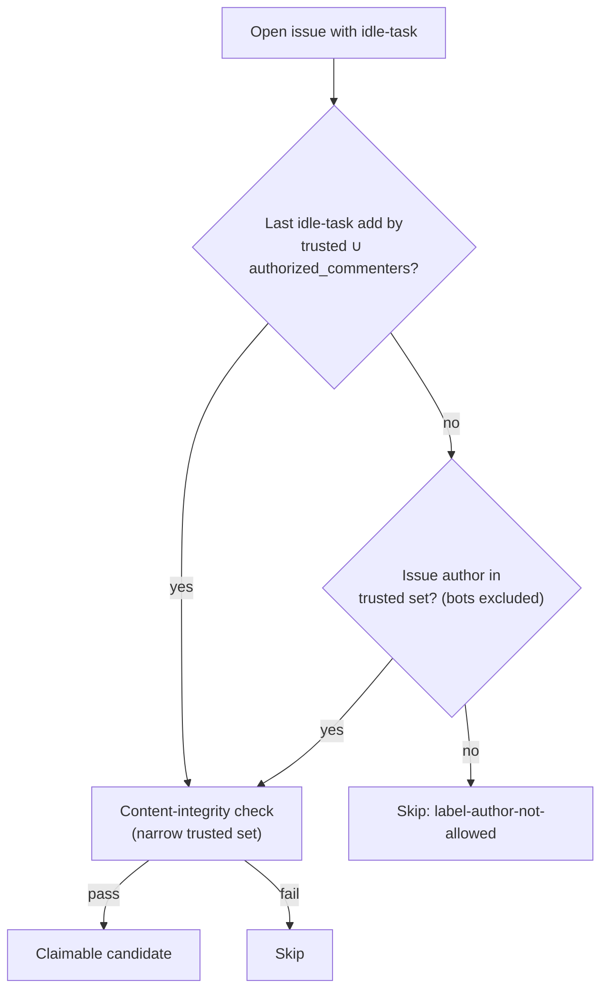

## Summary

The fleet PR-reviewer App (`stsoftware-pr-reviewer[bot]`) files improvement
issues through the `review-fleet-prs` skill. Nothing told it which label to
apply, and the idle-task collector trusted only humans and fleet logins as the
adder. So a bot-filed issue was either unclaimable or labelled with a reserved
label the worker strips. Closes #2882.

- [x] `.claude/skills/review-fleet-prs/SKILL.md` step 3.4: apply `idle-task`
      and no reserved label (`work-on`, `top-priority`, `low-priority`,
      `planning`).
- [x] `worker/deno/lib/collect_idle_task_candidates.ts`: a new
      `idleTaskTrustedAdders` set (the existing idle-task trust set plus
      `authorized_commenters`) is used **only** for the "who added `idle-task`"
      check.
  - The issue-author check and the content-integrity/TOCTOU check still use
    the narrow set.
  - No other label is widened, so a listed bot's `work-on`, `top-priority`,
    `low-priority` or `planning` add is still ignored.
- [x] Docs record this exception:
  - `docs/CONFIGURATION.md` ("Two axes of trust", the key table and the
    Authorised Commenters note);
  - `docs/SETUP.md`;
  - `docs/THREAT-MODEL.md`;
  - the header table in `worker/deno/lib/derived_authors.ts`.
- [x] Tests: three collector cases and a guard test on the SKILL.md labels.
- [ ] Operator follow-up (human): relabel #2883 with `idle-task`. No host
      config change is needed, because the reviewer App is already in
      `authorized_commenters` on fleet hosts.

## Evidence

Regression linkage: the "claimed" collector test failed against the unfixed
code (actual 0 candidates, expected 1) and passes with the fix.

- `deno test --allow-all tests/collect_idle_task_candidates_test.ts`: 14
  passed.
- `deno test --allow-all tests/review_fleet_prs_skill_labels_2882_test.ts`: 2
  passed.
- `./quality.sh`: PASSED. The config integration check was skipped because
  it isn't configured in this environment.

## Test Plan

- `collect_idle_task_candidates_test.ts`, Issue #2882 cases:
  - (a) a listed bot adds `idle-task` → claimed;
  - (b) the same bot is not in `authorized_commenters` → skipped;
  - (c) the bot authored the issue but an untrusted user added `idle-task` →
    skipped. This shows the bot is not trusted as the author.
- `review_fleet_prs_skill_labels_2882_test.ts`: parses the "apply …" clauses
  in the real SKILL.md. It asserts `idle-task` is present and no reserved
  label is, and a negative case proves the guard fires.

## Pre-PR Security Self-Check

- [x] Input validation: the new trust set reuses `resolveFleetAuthors`, which
      trims and dedupes case-insensitively. Login comparison stays
      case-insensitive.
- [x] Least privilege: this is a single, adder-only grant for the
      lowest-priority label. The author trust and content-integrity sets are
      not widened.
- [x] Secrets: none staged.
- [x] Injection surface: no new shell, SQL, filesystem or HTTP calls.
- [x] Authorisation: reserved labels added by a listed bot are still refused.
      Test (c) covers the author-spoof path.
