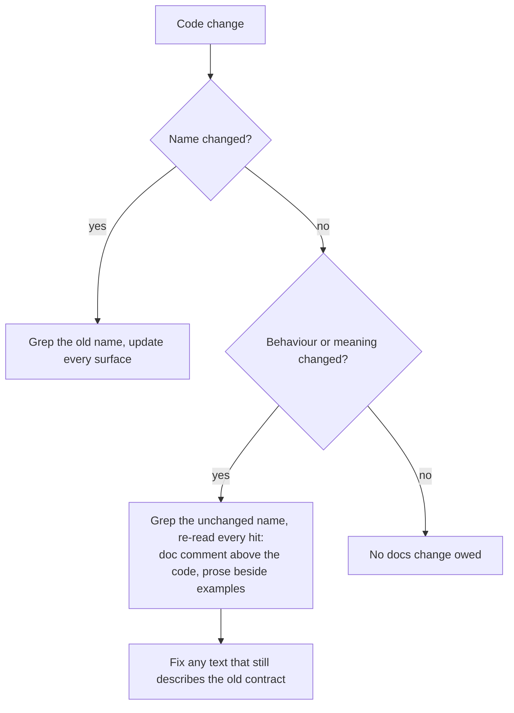

# Docs-change guidance: cover behaviour changes that keep the same name

## Summary

The rule *A Code Change Owes a Docs Change* only triggered on a rename, a
signature or default change, or a flag change, and told the agent to grep for
the **old** name. A change to behaviour that keeps the name has no old name to
grep for, so stale doc comments and API prose slipped through. Two examples
from GRQ-AutoTrader are `roll_over_carried` and `kept_reason`.

This change adds three bullets to that section in both twins,
`CODING-STANDARDS.md` and `prompts/coding_guidelines/prompt.md`:

- A change to behaviour or meaning under an unchanged name also owes a docs
  change.
- Grep for the unchanged name and re-read every hit, including the doc comment
  above the changed code and the prose beside any updated example.
- Updating the example alone is not enough if the prose still describes the old
  contract.

Closes #2883

## Evidence

This change touches documentation and prompt text only; there is no runtime
behaviour to screenshot.

## Test Plan

- [x] `deno task test:unit` on the coding-guidelines twin-drift, layers,
      overlay, v42 and model-agnostic tests: 47 passed.
- [x] markdownlint on both files: no new findings. The existing MD018 at
      `CODING-STANDARDS.md:555` is unrelated.
- [x] `./quality.sh < /dev/null`
