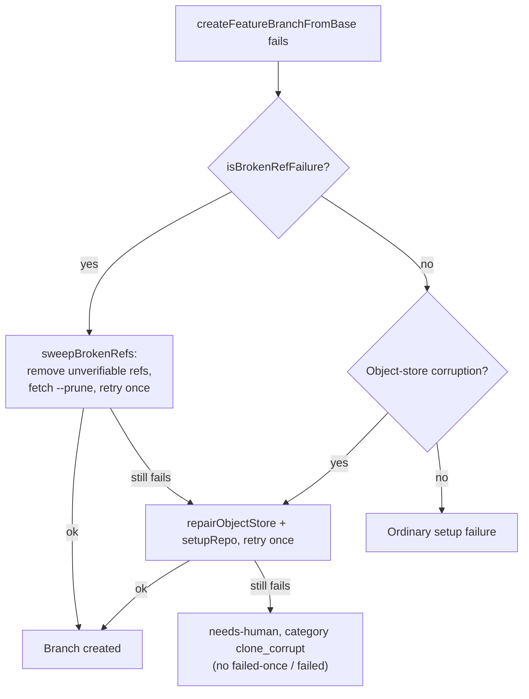

## Summary

When a shared clone had a broken ref (`fatal: bad object refs/heads/…`,
`warning: ignoring broken ref
refs/remotes/origin/…`),
`createFeatureBranchFromBase` failed for every issue. Each failure was
categorised `unknown` and charged `failed-once`/`failed`. Setup now repairs the
clone, and a clone-level failure never charges the issue. Closes #2884.

- [x] **Detect narrowly.** `isBrokenRefFailure()` (`lib/broken_ref_repair.ts`)
      matches only `bad object refs/…` or `ignoring broken ref refs/…` in the
      `refs/heads` or `refs/remotes` namespaces.
- [x] **Repair cheapest first.** `sweepBrokenRefs()` runs these steps and fails
      loud on any git error:
  1. Lists refs with `git for-each-ref refs/heads refs/remotes`.
  2. Removes each ref that `git rev-parse --verify <ref>^{commit}` cannot
     confirm.
  3. Runs `git fetch --prune origin`.
- [x] **Retry, then fall back.** `lib/phases/setup_branch_phase.ts` retries
      branch creation once. If it still fails, setup falls back to the #1093
      re-clone, now in a shared `reCloneAndRetry()` closure used by both rungs.
- [x] **Once per repo, then escalate.** The existing
      `claimObjectStoreRepair(repo)` claim limits the whole ladder to one run
      per repository. A failure that survives it escalates as `needs-human` with
      the heading "Broken refs in shared clone" and dedup key
      `broken-refs-<repo>`.
- [x] **Never charge the issue.** A new `clone_corrupt` category (display and
      class `clone-corrupt`) is detected from a worker-authored
      `CLONE_CORRUPT_MARKER`:
  - `coding_failure_ladder.ts` treats it as transient.
  - `label_failure.ts` short-circuits, so neither `failed-once` nor `failed` is
    applied.
  - `run_outcome_classifier.ts` maps it to `not_code_fixable`.
- [x] Docs: `docs/INTERNALS.md` and `docs/workflows/README.md`.

Out of scope, as the issue says: #2889 and #2890.

## Evidence

Tests, all passing:

- `tests/broken_ref_repair_test.ts`:
  - Detector cases, including negative ones: `is not a commit` alone, an invalid
    reference, and `refs/tags/…`.
  - The sweep fails loud when git fails.
  - A **real-git** test: a corrupted `refs/remotes/origin/main` is repaired, and
    then `createFeatureBranchFromBase` succeeds.
  - An invalid base name still fails and is not read as a broken-ref failure.
- `tests/setup_broken_ref_repair_test.ts`, covering the setup phase:
  - The sweep fixes it, with no re-clone.
  - The sweep fails, then the re-clone fixes it.
  - A persistent failure escalates, categorised `clone_corrupt`.
  - A second issue in the same repo does not sweep again.
  - An ordinary failure is untouched.
- `tests/failure_diagnosis_test.ts`, `run_outcome_classifier_test.ts`,
  `coding_failure_ladder_test.ts` and `label_manager_test.ts`: `clone_corrupt`
  is categorised, and it never adds `failed-once` or `failed`.
- `./quality.sh`: **PASSED**. Config integration was skipped because there is no
  `.config.json` in the container.

## Reproduction

Status: **partial**. The real-git test reproduces the production fault. A raw
`git checkout -B feat origin/main` fails while `origin/main` points at a missing
SHA, and succeeds after the sweep. The new setup-phase and labelling tests were
not run against the unfixed code, because the APIs they call did not exist
there.

## Acceptance Criteria

<!-- vibe-spec-review inputs="diff+issue-body" -->

- Narrow broken-ref detection — reviewer: met
- Cheapest-first repair: `for-each-ref` + `rev-parse --verify`,
  `fetch --prune origin`, retry once — reviewer: met
- Fall back to the #1093 re-clone — reviewer: met
- At most once per repository per run; escalate with the repo named — reviewer:
  met
- Clone-level setup failure releases without `failed-once`/`failed` — reviewer:
  met
- Categorised `clone-corrupt`, not `unknown` — reviewer: met
- Test: a missing-SHA ref is repaired and the issue proceeds — reviewer: met
- Test: an invalid base name still fails — reviewer: met
- Test: a clone-level failure never adds `failed-once` — reviewer: met
- `reCloneAndRetry()` extracted from the #1093 branch — reviewer: unrequested —
  reason: needed so both rungs share one fallback, rather than duplicating the
  re-clone logic.
- Docs updates in `INTERNALS.md` and `workflows/README.md` — reviewer:
  unrequested — reason: the repo's "A Code Change Owes a Docs Change" standard
  requires them.

## Standards Review

<!-- vibe-standards-review inputs="diff+CODING-STANDARDS.md" -->

- Australian English — reviewer: met
- Fail loud — reviewer: met
- Log levels — reviewer: met
- Real behavioural tests, no source-grepping — reviewer: met
- Parallel-safe unit tests — reviewer: met
- KISS / DRY — reviewer: met
- A code change owes a docs change — reviewer: met
- Commit safety / path confinement — reviewer: met
- `Result<T>` / strict TypeScript — reviewer: met

## Test Plan

- [x] `deno task test:unit` on the touched test files
- [x] `timeout 900 ./quality.sh < /dev/null`: PASSED
- [x] Mermaid and markdownlint checks pass

## Final branch state

The branch holds the fix, its tests, the docs and this summary, on top of
`19665578`.
