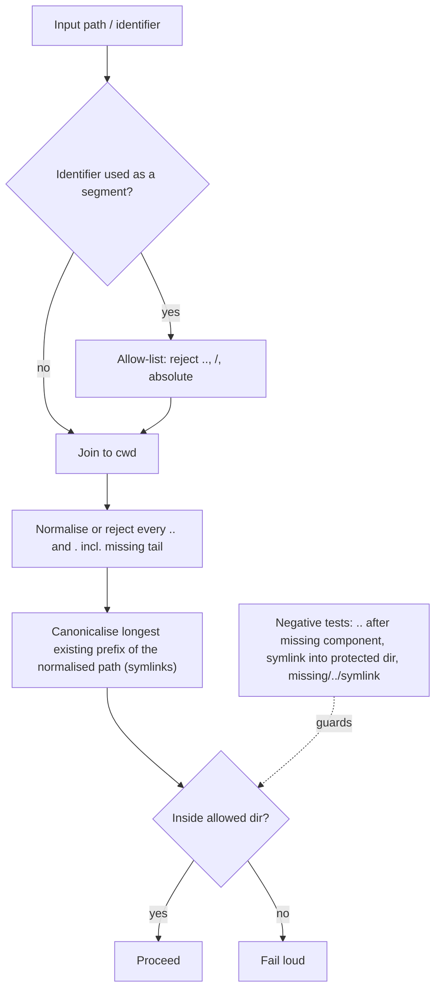

# Path confinement guidance: resolve before you check, test `..` and symlinks

## Summary

Closes #2885.

Path-confinement guards keep missing `..` traversal because they check a
partly resolved path. Two examples:

- VibeCoder#2881: `assertSafeGitRef` accepts `..`.
- GRQ-GTC#448: a non-existent tail containing `..` is appended after
  canonicalisation.

This PR adds a short **Path Confinement** rule with four parts:

1. Resolve the path fully before checking it, in a fixed order: join it to the
   cwd, normalise or reject every `..`/`.` (including in a not-yet-existing
   tail), then canonicalise the longest existing prefix of the normalised
   path, then compare, and act on the checked path. Canonicalising first
   would let `<dir>/missing/../link/file` collapse onto a symlink after the
   symlink check had run.
2. Validate identifiers that become path segments with an allow-list that
   rejects `..`, `/` and absolute paths. Never reuse a validator written for
   another purpose.
3. Ship negative `..` tests with every guard (including `..` after a missing
   component), a symlink test on Unix, and the combined case of `..` after a
   missing component landing on a symlink that points out.
4. Never claim in a PR summary that a traversal case is impossible unless a
   test proves it.

- [x] `CODING-STANDARDS.md`: new **Path Confinement — Resolve Before You
      Check** section beside Secret Redaction.
- [x] `prompts/coding_guidelines/prompt.md`: the same rule in its
      code-layer **Pre-PR Security Self-Check**, with a new checklist item. This
      is the implementation-run surface. It avoids repo-specific references
      because it is injected into other repositories.
- [x] `prompts/security_scan/prompt.md`: the A01 path-traversal bullet now also
      flags partly-resolved guards and borrowed validators.
- [x] `worker/deno/tests/coding_guidelines_layers_2574_test.ts`: adds the new
      `### Path Confinement` heading to the pinned code-phase heading list.

## Evidence

This change touches only documentation and prompts, so there is nothing to
screenshot. The rule's flow:

## Test Plan

- [x] Coding-guidelines twin-drift, layer, overlay and version tests pass.
- [x] The security-scan prompt tests pass.
- [x] `./quality.sh < /dev/null` passes.
