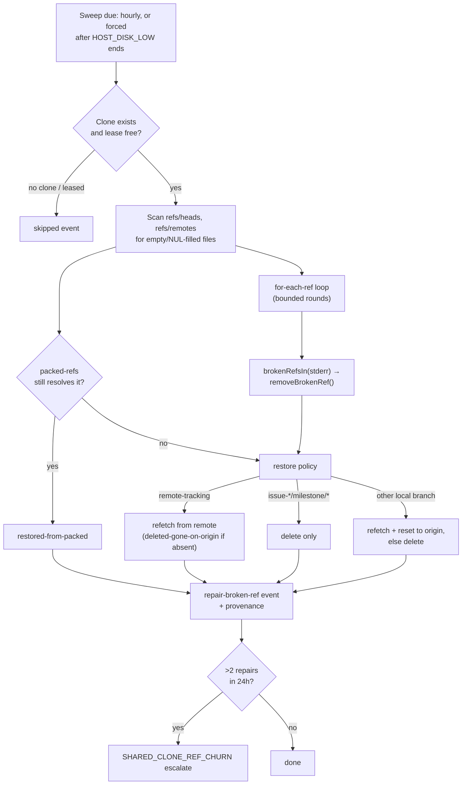

## Summary

Broken refs in the shared clones (Issue #2880/#2824) were only ever repaired
on-demand, when something happened to touch the exact broken ref. Nothing swept
the clones proactively, and nothing recorded who last wrote a ref, so the root
cause — a fetch or ref write interrupted by low disk — kept recurring unnoticed.
Closes #2889.

- `worker/deno/lib/shared_clone_ref_sweep.ts`: a new priority-1.73
  maintenance-lane handler, `Shared Clone Ref Sweep`, wired into
  `buildPriorityDispatchTable` (`worker/deno/lib/run_core.ts`) and the
  production dependency `sweepSharedCloneRefs`
  (`worker/deno/lib/run_core_production_deps.ts`). It runs roughly hourly
  (`isSweepDue`) and is forced on the first cycle after a `HOST_DISK_LOW`
  episode ends, skipping the cycle instead while disk is low.
- For each shared clone it detects the 41-byte NUL-filled loose ref files
  directly (bypassing `for-each-ref`, which silently skips them) and the
  `warning: ignoring broken ref` / missing-object refs that `for-each-ref` does
  surface (looping in bounded rounds to work around its abort-on-first-fatal
  behaviour). A broken ref is removed so git falls back to `packed-refs` when
  that still resolves it; otherwise a remote-tracking ref or a local branch that
  still exists on origin is refetched, and a local `issue-*`/`milestone/*`
  branch is deleted only, never resurrected. A clone whose repo lock is already
  held is skipped.
- `worker/deno/lib/shared_clone_ref_provenance.ts`: logs last-writer provenance
  for every repair — the loose ref file's mtime, the last reflog line, which
  worktrees have the branch checked out, and any `oom-*` log under `~/logs` near
  the mtime.
- `worker/deno/lib/shared_clone_repair_history.ts`: escalates, naming the repo,
  when a clone needs more than 2 repairs in 24 hours.
- Every repair and escalation is emitted as a self-heal event
  (`self-heal.jsonl`).
- `HOST_DISK_LOW` now also pauses maintenance-lane passes generally — not just
  this sweep — because those are exactly the passes that write the shared
  clones. The existing one-time warning changed to:
  `[HOST_DISK_LOW]
  … claiming no new issues and pausing maintenance-lane passes this cycle;
  serial maintenance continues (Issue #226, #2889).`
  Serial maintenance (landing PRs, disk reclaim) still runs every cycle.
- Docs: `docs/INTERNALS.md` (new "Shared clone ref sweep" section and flowchart)
  and `docs/CONTAINER.md` (the pause extended to maintenance-lane passes).
  Alongside this PR: `docs/audits/lib-sweep-coverage.json` gets a ledger slice
  top-up (`top-up-2889`) plus a security-sweep record
  (`docs/audits/security-sweep-2889-shared-clone-ref-sweep.md`), and
  `docs/workflows/README.md` / `docs/USAGE.md` gain tier 1.73 in the
  dispatch-tier table and diagrams.

## Reproduction

Partial. The NUL-filled loose-ref state and the
missing-object/`warning:
ignoring broken ref` state are both reproduced
directly: the test suite builds real temporary git clones, writes a genuine
41-byte NUL-filled ref file into one and points a branch/remote-tracking ref at
a SHA that does not exist in another, then asserts the sweep leaves no
`warning:` output and no broken ref behind. The live host corruption path — a
`HOST_DISK_LOW` episode actually interrupting a fetch or ref write mid-flight
and leaving the broken ref — was not reproduced; that requires an operator
follow-up watching a real low-disk episode.

## Evidence

`deno test --allow-all tests/shared_clone_ref_sweep_test.ts
tests/run_core_shared_clone_sweep_2889_test.ts
tests/run_core_maintenance_lane_test.ts < /dev/null`:
**30 passed, 0 failed**. Notably: a missing-object local `issue-*` ref and a
missing-object remote-tracking ref are both repaired with no warnings left; a
NUL-filled ref with a valid `packed-refs` copy is restored from packed; a
healthy clone is untouched; a leased clone is skipped; three sweeps each
repairing a ref escalate on the third, pruning entries older than 24 hours; a
failing `update-ref -d` is recorded as a failure rather than a false repair; the
dispatch table entry is maintenance-lane and calls the dependency, tolerates it
being absent, and propagates an error `Result`; and the existing
maintenance-lane pause tests still pass unchanged.

## Test Plan

- [x] `cd worker/deno && deno test --allow-all
      tests/shared_clone_ref_sweep_test.ts
      tests/run_core_shared_clone_sweep_2889_test.ts
      tests/run_core_maintenance_lane_test.ts < /dev/null`
      — 30 passed, 0 failed
- [ ] After merge, watch a real `HOST_DISK_LOW` episode end and confirm the
      forced sweep fires and the `[SHARED_CLONE_REF_SWEEP]` log line appears

## Pre-PR Security Self-Check

- [x] Input validation: ref names are validated with `assertSafeRefComponent`
      before use in git commands
- [x] Secrets: none staged
- [x] Injection surface: git invocations go through `runGitCommand`, no shell
      interpolation of untrusted strings
- [x] Least privilege: the sweep only touches shared clones it already has a
      maintenance lease for; a leased or missing clone is skipped, not forced
- [x] Error handling: a failed delete is surfaced as a failure, not silently
      swallowed or misreported as a repair
- [x] Dependencies: none added

Closes #2889.
