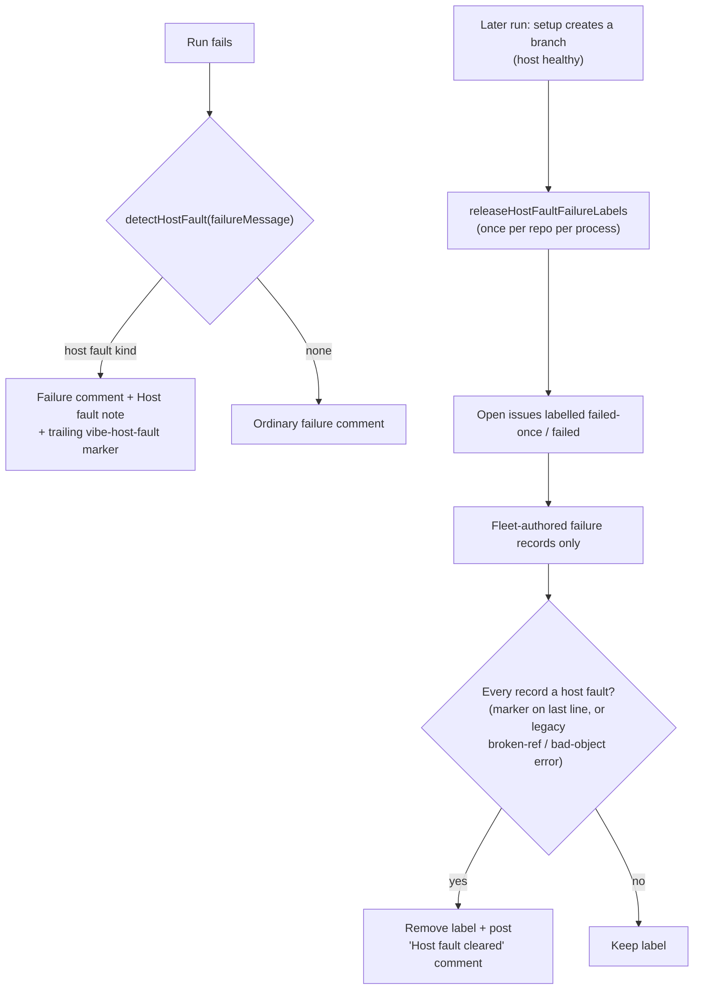

## Summary

A host or infra setup fault, such as a corrupt clone cache, left `failed-once`
or `failed` on an issue that the agent never got to work. Once the host had
healed, nothing took the label off, so the issue sat out of the queue for good.

Closes #2890.

- `worker/deno/lib/host_fault.ts` (new) detects four host-fault kinds from a
  failure message: `clone-corrupt`, `disk-full`, `container-build-failed` and
  `clone-failed`. Auth and missing-repo clone errors are excluded. It also
  builds and parses an allow-listed `<!-- vibe-host-fault kind="…" -->` marker.
- `worker/deno/lib/label_failure.ts`: `markIssueAsFailedOnce` and
  `markIssueAsFailed` add a `**Host fault:**` note to the failure comment and
  end it with the marker, which is kept last even after the worker footer.
- `worker/deno/lib/host_fault_release.ts` (new) sweeps open issues labelled
  `failed-once` or `failed`. It reads only fleet-authored failure records, and
  it releases an issue only when **every** record is a host fault. A record
  counts when it ends with the marker or, for legacy unmarked records, carries a
  git broken-ref or bad-object error. Releasing removes the label and posts a
  comment naming the fault. The sweep runs once per repo per process.
- `worker/deno/lib/phases/setup_branch_phase.ts` runs the sweep after the setup
  phase has created a feature branch, which proves the host is healthy. Sweep
  errors are logged at WARNING and never change the phase result.
- `worker/deno/lib/issue_sweep_parse.ts` (new) holds the issue-list and comment
  parsers, moved unchanged from `milestone_branch_refusal_release.ts` so both
  sweeps share one copy.
- Docs: `docs/INTERNALS.md` and `docs/TROUBLESHOOTING.md`, plus a lib sweep
  ledger slice (`docs/audits/lib-sweep-coverage.json`) and its record
  (`docs/audits/security-sweep-2890-host-fault-release.md`).

## Evidence

Tests (`worker/deno/tests/host_fault_release_test.ts`):

- `a legacy unmarked clone-corrupt record is released`, and
  `a marked record is released`: the label is removed and the comment names the
  fault.
- `a host fault plus a genuine agent failure keeps its label`.
- `an ordinary setup failure is not a host fault`: an invalid base branch name
  keeps the label.
- Negative and error cases:
  - a forged record from a non-fleet author;
  - a marker placed mid-body;
  - a `gh` view error, which keeps the label;
  - an edit error, after which no comment is posted;
  - the once-per-process claim.

`worker/deno/tests/host_fault_test.ts` covers detection of every kind, the
exclusions (invalid branch name, invalid reference, auth and missing-repo), the
marker round trip and last-line rule, and the failure-comment marking.

## Reproduction

- **symptom** — an issue whose only failure was a corrupt clone (`bad object` /
  broken refs during setup) kept `failed-once` or `failed` after the host
  recovered, so it was never picked up again.
- **status** — `partial` — reason: the fix adds a release sweep that did not
  exist before. The regression tests exercise the new modules, so against the
  pre-fix tree they can only fail to import; no meaningful fail-before run was
  observed. After the fix, they pass under the full gate.

## Acceptance criteria

- **met** — setup failures that are host faults are marked on the failure
  comment — evidence: `label_failure.ts` plus
  `host_fault_test.ts::label_failure - markIssueAsFailedOnce marks a host fault in the comment`
  — reviewer: met — reason: the detector runs on every failure comment, not only
  setup ones; its patterns only match clone, disk and build errors.
- **met** — a sweep releases issues whose failures were all host faults,
  including legacy `no_pr/setup` records with a git ref or object error —
  evidence:
  `host_fault_release_test.ts::a legacy unmarked clone-corrupt record is released`
  — reviewer: met
- **met** — an issue that also has a non-host-fault failure is left alone —
  evidence:
  `host_fault_release_test.ts::a host fault plus a genuine agent failure keeps its label`
  — reviewer: met
- **met** — test: a clone-corrupt issue is released with a comment — reviewer:
  met
- **met** — test: a host fault plus an agent failure keeps the label — reviewer:
  met
- **met** — test: an invalid base branch setup error keeps the label — reviewer:
  met
- **met** — the sweep runs only after setup has created a feature branch —
  evidence: `setup_branch_phase.ts`, after `state.repoPath = repoPath` —
  reviewer: met
- **partial** — no test covers the wiring in `setup_branch_phase.ts` itself; the
  sweep is tested at unit level — reviewer: partial — reason: the three tests
  the issue asked for exist; a phase-level test would need the full setup-phase
  doubles and is left as a possible follow-up.
- **unrequested** — `issue_sweep_parse.ts` extracted from
  `milestone_branch_refusal_release.ts` — reviewer: unrequested — reason: both
  sweeps need the same two parsers; the code is moved unchanged rather than
  duplicated.
- **unrequested** — the lib sweep ledger slice and its audit record — reviewer:
  unrequested — reason: `tests/lib_sweep_coverage_test.ts` fails the gate unless
  every new `worker/deno/lib` module is claimed by a slice.

## Standards

Standards reviewer: no violations. Every area checked was met, or not applicable
where noted:

- fail loud;
- log levels;
- real tests;
- DRY;
- TypeScript strictness;
- Australian English;
- path confinement and commit safety (not applicable);
- docs owed;
- KISS.

## Residual risks

- Legacy (unmarked) detection counts any fleet failure record carrying a
  broken-ref or bad-object error as clone-corrupt, because the phase was never
  recorded. An old agent failure that quoted such an error could therefore be
  released. This follows the issue's legacy instruction.
- `container-build-failed` looks forward: no current path passes a container
  build failure into a per-issue `failureMessage` yet.

## Test Plan

- [x] `deno task test:unit tests/host_fault_test.ts tests/host_fault_release_test.ts tests/milestone_branch_refusal_release_test.ts tests/lib_sweep_coverage_test.ts`
- [x] `timeout 900 ./quality.sh < /dev/null` —
      `Result: PASSED (with skipped checks)`. Every check passed; only config
      integration was skipped, because there is no `.config.json` in the
      container.
- [ ] After merge, a host whose clone cache was repaired releases the
      clone-corrupt issues on its next successful setup and posts
      `## Host fault cleared — failure label released`.

## Checklist

- [x] Host-fault detection and allow-listed marker
- [x] Failure comments carry the marker
- [x] Release sweep with fail-closed author filter and all-records rule
- [x] Sweep wired after a successful setup, errors logged only
- [x] Three required tests, plus negative and error cases
- [x] Docs and lib sweep ledger updated
- [x] Quality gate green

## Security self-check

- [x] Input validation: comment bodies are untrusted. Only fleet-authored
      records count, the marker must be on the last line, and its kind is
      allow-listed.
- [x] Secrets: none staged
- [x] Injection surface: `gh` is called with argv arrays and no shell; issue
      numbers are integers
- [x] Output encoding: the release comment prints only allow-listed kind names
      and fixed descriptions
- [x] Authentication and authorisation: unchanged; uses the worker's existing
      `gh` identity
- [x] Error handling: every `gh` failure is recorded in `errors` and logged at
      WARNING, and the label is kept
- [x] Dependencies: none added
- [x] Path confinement: not applicable

## Final branch state

Branch `issue-2890-release-issues-that-a-host-fault-marked-failed-onc`, based on
`1c32005e`. It has 13 files changed: 5 new library/test modules, 3 edited
library modules, 4 docs files and this summary.
