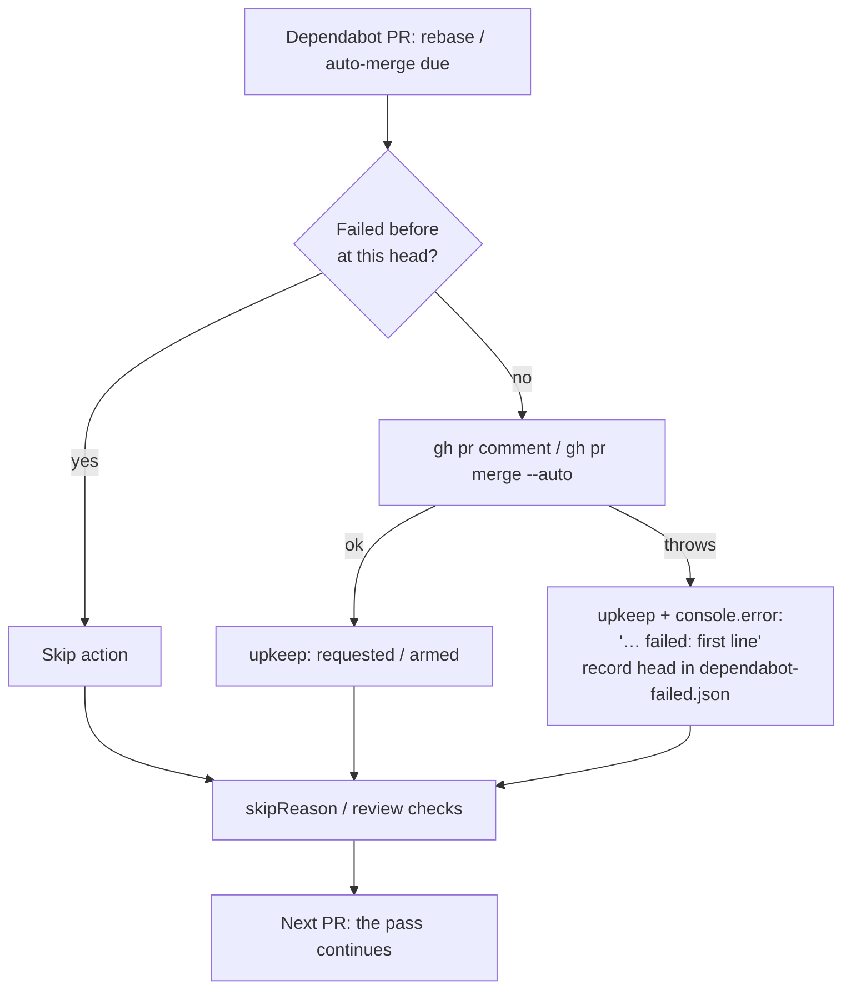

## Summary

One failed Dependabot upkeep action no longer aborts the whole
`review-fleet-prs` gate pass. Before this change, a `gh pr merge --auto` refused
by GitHub (GRQ-actual#183: `Resource not accessible by integration`) threw out
of `pass()`. No fleet PR was reviewed, and every later pass failed again on the
same PR. Closes #2891.

- [x] **Isolate each action.** In `.claude/skills/review-fleet-prs/gate.ts`, the
      rebase comment and the auto-merge are each wrapped in their own try/catch.
      A failure:
  - adds `<repo>#<n> auto-merge failed: <first line>` (or `rebase failed: …`) to
    `upkeep`;
  - is logged with `console.error`;
  - falls through to the normal review checks, so the pass continues.
- [x] **Remember failures per head commit.** A new `dependabot-failed.json`, in
      the same form as `dependabot-rebase.json`, is keyed `<repo>#<n> <action>`
      → `headRefOid`. A failed action is skipped until the PR's head commit
      changes.
- [x] **Test seam.** `pass()` is exported with optional `deps: { gh, dir }`.
      `main()` is unchanged, so production behaviour still uses the real `gh`
      and `stateDir()`. `readRebaseAsked`/`writeRebaseAsked` became
      `readMemory`/`writeMemory`, shared by both memory files.
- [x] **Docs: App permissions.** `SKILL.md` and `docs/CONFIGURATION.md` now
      list:
  - **Contents: Read and write**, because `gh pr merge --auto` merges at once
    when the PR is already clean, and arming auto-merge needs it too;
  - **Workflows: Read and write**, because Dependabot's Actions bumps change
    `.github/workflows/*`.

  `SKILL.md` also documents how a failed upkeep action is reported.

## Evidence

The change is backend only, so there is nothing to screenshot.

`worker/deno/tests/review_fleet_prs_upkeep_failure_2891_test.ts` calls the real
`pass()` with a stub `gh` and a temporary state directory:

- **"a failing Dependabot auto-merge is reported and does not stop the pass".**
  The stub `gh pr merge` throws the incident's two-line error. The green fleet
  PR is still in `ready`, and `upkeep` holds exactly the one-line failure.
- **"a failed auto-merge is not retried at the same head, but is retried once
  the head changes".** A second pass at the same head makes no `pr merge` call.
  A new head commit is retried.

## Reproduction

- **Symptom:** a refused `gh pr merge --auto` on one Dependabot PR throws out of
  `pass()`, so the pass returns nothing and every later pass fails the same way.
- **Status: partial.** The regression test above encodes the incident.
  - It was not run as a behavioural red against the unfixed code. `pass()` was
    neither exported nor injectable there, so the test failed to compile
    (TS2459) rather than throwing at runtime.
  - In the old code the `gh pr merge` call sat with no handler between the
    search and the `ready.push`, so the throw would have escaped `pass()`.

## Acceptance Criteria

<!-- vibe-spec-review inputs="diff+issue-body" -->

- Wrap each upkeep action per PR. On failure, add
  `<repo>#<n> auto-merge failed: <first line>` to `upkeep`, log it, and continue
  the pass — reviewer: met
- Remember the failure per head commit, as `dependabot-rebase.json` does —
  reviewer: met
- Document Contents and Workflows as Read and write in `SKILL.md` and
  `docs/CONFIGURATION.md` — reviewer: met
- Test: a stubbed `gh pr merge` failure still returns the ready fleet PRs and
  reports the failure in `upkeep` — reviewer: met
- Test: the same failure at the same head is not attempted again on the next
  pass — reviewer: met
- `pass()` exported with a `deps: { gh, dir }` seam, and `gh` threaded into
  `fleetActiveRepos`/`searchOpenPrs` — reviewer: unrequested — reason: needed to
  run the requested tests without a real `gh` or the host's state directory.
- `readMemory`/`writeMemory` generalised from the rebase helpers — reviewer:
  unrequested — reason: one helper pair serves both memory files, so the code is
  not duplicated.

The reviewer also noted that the rebase failure path mirrors the auto-merge path
but has no dedicated test. The issue's two requested tests both target the
auto-merge incident.

## Standards Review

<!-- vibe-standards-review inputs="diff+CODING-STANDARDS.md" -->

- Fail loud — reviewer: met. Each failure is reported in `upkeep` and logged,
  not swallowed.
- Tests exercise real code — reviewer: met
- Fake the external service, do not assert the request — reviewer: met
- A code change owes a docs change — reviewer: met
- Australian English — reviewer: met
- KISS / DRY — reviewer: met
- Unit-test state isolation — reviewer: met

## Test Plan

- [x] `deno test --allow-all` on the new test and the existing
      `review_fleet_prs_*` tests: 20 passed
- [x] `deno task test:unit` on the touched tests: 12 passed
- [x] `./quality.sh < /dev/null`: PASSED. Config integration was skipped because
      there is no `.config.json` in the container.
