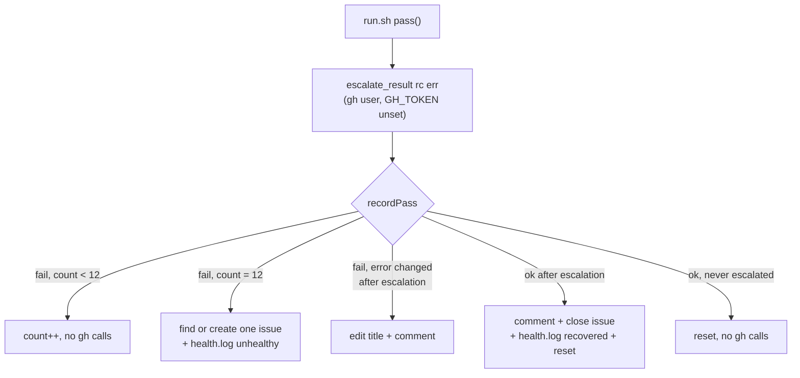

## Summary

Closes #2892.

The review-fleet-prs runner no longer fails silently.

- **Permission check at mint.** `getInstallationToken`
  (`worker/deno/lib/github_app_auth.ts`) now returns the token's
  `permissions`. `mintReviewerToken` (`.claude/skills/review-fleet-prs/app_token.ts`)
  checks them against `REQUIRED_PERMISSIONS`: pull_requests, issues, contents
  and workflows `write`, and checks and statuses `read`. If any are missing it
  fails with one message that names each one. Permissions the App itself lacks
  point to the App's settings URL. Permissions the App has but the installation
  has not accepted get "accept the new permissions" and the installation URL.
- **Escalation.** The new `escalate.ts` keeps a consecutive-failure count in
  `<state>/failures.json`. On the 12th failed pass it finds or creates one
  issue in stSoftwareAU/VibeCoder titled `review-fleet-prs runner failing on
  <host>: <error>`, and appends a `status=unhealthy` line to `<state>/health.log`.
  `run.sh` copies that line into `runner.log`. The first successful pass after
  that comments on the issue, closes it, writes a `status=recovered` line and
  resets the count. `run.sh` runs it as the gh user, with `GH_TOKEN` unset.
  The error is passed through `redactSecrets` and `neutraliseAgentMarkers`
  before it is stored or posted.
- **`--once` and tracing.** `run.sh --once` now runs `housekeep`. Xtrace is
  switched off from the mint through to the login extraction, so `bash -x` never
  prints the token.



### Checklist

- [x] Return `permissions` from `getInstallationToken`
- [x] `REQUIRED_PERMISSIONS`, `missingPermissions`, `permissionError`, check in `mintReviewerToken`
- [x] `escalate.ts` with dedup, title update, close on recovery, health line
- [x] Sanitise the error before it reaches the public issue
- [x] `run.sh`: `--once` housekeep, xtrace suspended around the token, `escalate_result`
- [x] SKILL.md documents permissions, escalation and `--once`/`bash -x`
- [x] Tests and quality gate

## Evidence

`./quality.sh < /dev/null`: **Result: PASSED (with skipped checks)**. The only
skip is config integration, because the sandbox has no `.config.json`.

New tests:

- `worker/deno/tests/review_fleet_prs_app_reviewer_test.ts`:
  - `mintReviewerToken rejects naming a missing permission the installation has not accepted`
  - `mintReviewerToken rejects naming a permission the App itself lacks, with the settings URL`
  - `missingPermissions reports absent and under-scoped permissions`
  - `permissionError names every missing permission in one message`
  - `permissionError lists several missing permissions in one message`
- `worker/deno/tests/review_fleet_prs_escalate_test.ts`:
  - `recordPass: 11 failures make no gh calls; the 12th opens exactly one issue; a 13th with the same error makes no further create; a success then closes it and resets`
  - `recordPass: an existing open issue with a matching title is reused on escalation, not recreated`
  - `recordPass: a changed error after escalation edits the title and comments, without creating`
  - `recordPass: a health.log line is written on escalation and on recovery`
  - `recordPass: a token or agent marker in the error never reaches the issue or health.log raw`
  - `recordPass: a failing issue create rejects, leaves no issue recorded, and the next failure retries`
  - `recordPass: a success with no prior escalation makes no gh calls`
  - `recordPass: a corrupt state file throws with context instead of silently resetting`
- `worker/deno/tests/review_fleet_prs_runner_test.ts`:
  - `run.sh --once also runs housekeep, pruning old round directories`
  - `run.sh never traces the minted App token, even under bash -x`
  - `run.sh escalates a failing gate pass without leaking the App token to escalate.ts`
  - `run.sh logs gate.ts's non-fatal stderr even when the gate pass succeeds`
  - `run.sh escalates a successful pass as ok`
  - `run.sh logs, but does not fail on, an escalate.ts failure`

### Reproduction

Before this change, `mintReviewerToken` returned a token that lacked
`contents: write`, and the pass failed later in a way that looked like a flaky
run. Both `mintReviewerToken rejects …` tests reproduce that: they fail on the
unfixed code, where the call resolved, and pass now.

## Test Plan

From `worker/deno`:

```
deno test -A tests/review_fleet_prs_app_reviewer_test.ts tests/review_fleet_prs_escalate_test.ts tests/review_fleet_prs_runner_test.ts < /dev/null
```

From the repo root:

```
./quality.sh < /dev/null
```

## Acceptance Criteria
<!-- vibe-spec-review inputs="diff+issue-body" -->

- At mint, check the App permissions and fail with one message naming each
  missing permission and where to grant it. Evidence: `app_token.ts`, and the
  `mintReviewerToken rejects …` and `permissionError …` tests.
  reviewer: MET
- A missing `contents: write` exits non-zero and names `contents`. If the App
  has the permission but the installation has not accepted it, the message says
  "accept the new permissions". Evidence: the two `mintReviewerToken rejects …`
  tests. `main()` exits 1 on any thrown error.
  reviewer: MET
- After 12 consecutive failures, open or update one deduplicated issue titled
  with the host and the error, add a host health line, and close the issue on
  the first success. Evidence: `escalate.ts` and the `recordPass: 11 failures …`
  test.
  reviewer: MET
- `--once` runs `housekeep`, and `bash -x` never prints the token. Evidence: the
  two runner tests named above.
  reviewer: MET

The spec reviewer noted that `Installation.permissions` was unused. It has been
removed. The reviewer also noted that the health signal is a new
`<state>/health.log` plus a `runner.log` line, not the worker's `worker.log`
signal. The skill runs on its own, outside the worker loop, so it has no
`worker.log` to write to.

## Standards Review
<!-- vibe-standards-review inputs="diff+CODING-STANDARDS.md" -->

Verdict: PASS WITH NOTES. No material departures. Optional notes:

- `recordPass` is long and has many branches. It is kept as one state machine
  so the transitions read in order.
- `permissionError` is a little dense. A `levels()` helper keeps each clause on
  one line.

## Security self-check

- **Token never traced**: xtrace is off from the mint through to the login
  extraction, and the `bash -x` runner test asserts the token is absent.
- **Least privilege**: `escalate.ts` runs as the gh user with `GH_TOKEN` unset
  and `--allow-run=gh --allow-read --allow-write` only. The App token never
  reaches it.
- **Output encoding**: the error is passed through `redactSecrets` and
  `neutraliseAgentMarkers` before it is written to state, the issue title, body
  or comment, or `health.log`. A regression test covers this.
- **Injection surface**: every gh call passes an argv array, never a shell
  string.
- **Fail loud**: a corrupt state file throws. A failed escalation is logged in
  `runner.log` and retried on the next failure.
- **Dependencies**: none added.
- **Secrets**: none staged.

🤖 Generated with [Claude Code](https://claude.com/claude-code)
