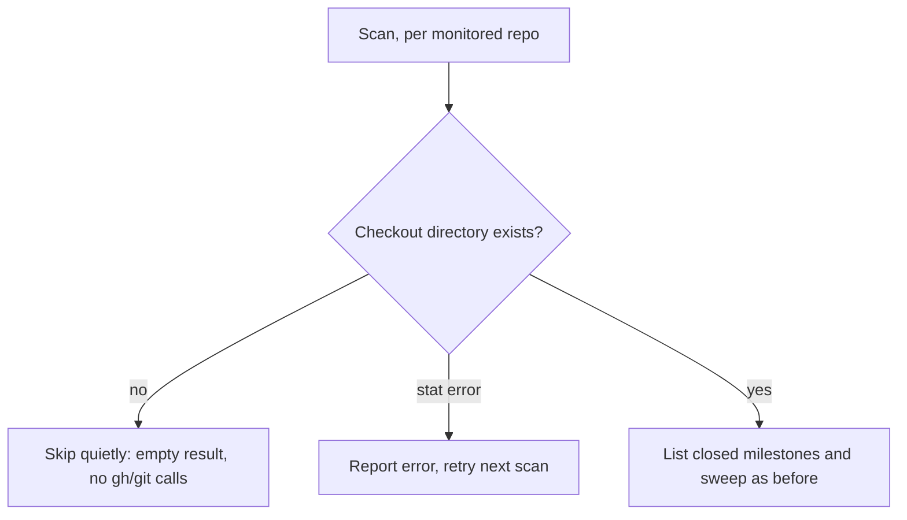

# PR Summary — Issue #2894

## Summary

Milestone-close housekeeping no longer warns on every scan for a monitored
repository that has no checkout directory on this host. `sweepClosedMilestones`
now checks for the checkout once, right after resolving `repoPath` and before
the closed-milestone listing. A missing directory (`Deno.errors.NotFound`)
returns an empty, error-free result. That means no `Could not list the local
branches` warning, no `gh` calls and no `git` calls. Any other `stat` failure
is still reported. A checkout that exists but whose `git for-each-ref` fails
reports its error exactly as before.

Closes #2894

- [x] Skip a missing checkout before the milestone listing
  (`worker/deno/lib/milestone_close_housekeeping.ts`)
- [x] Tests for the missing-directory case and the existing-but-git-fails case
- [x] `docs/INTERNALS.md`: added a "No checkout, nothing to sweep" boundary
- [x] `./quality.sh` passed

## Evidence

This is a backend-only change, so the evidence is the tests in
`worker/deno/tests/milestone_close_housekeeping_test.ts`:

- `sweepClosedMilestones - a repository with no checkout directory is skipped
  quietly with no gh or git calls`: asserts empty `errors`, `failures` and
  `considered`, zero `gh` and `git` calls, and no state file written.
- `sweepClosedMilestones - a checkout whose branch listing fails still reports
  the error`: asserts that `Could not list the local branches of` is still
  reported and nothing is swept.

`deno task test:unit tests/milestone_close_housekeeping_test.ts`: 12 passed,
0 failed. `./quality.sh`: PASSED (one check skipped: config integration).

## Acceptance Criteria

<!-- vibe-spec-review inputs="diff+issue-body" -->

- **met** — A repo with no checkout directory produces no `Could not list the
  local branches` warning, and no gh calls are spent on its milestones —
  evidence: `worker/deno/lib/milestone_close_housekeeping.ts` `Deno.stat`
  NotFound early return before the gh listing; test `sweepClosedMilestones - a
  repository with no checkout directory is skipped quietly with no gh or git
  calls` — reviewer: met
- **met** — A checkout that exists but where `git for-each-ref` fails still
  reports the error as it does today — evidence: `milestoneBranches` unchanged;
  test `sweepClosedMilestones - a checkout whose branch listing fails still
  reports the error` — reviewer: met
- **met** — Add a test for the missing-directory case — evidence: test
  `sweepClosedMilestones - a repository with no checkout directory is skipped
  quietly with no gh or git calls` — reviewer: met
- **met** — Skip before sweeping each closed milestone, so the check isn't
  repeated once per milestone — evidence: the single check sits before the
  `for (const milestone of pending)` loop in `sweepClosedMilestones` —
  reviewer: met

## Standards Review

<!-- vibe-standards-review inputs="diff+CODING-STANDARDS.md" -->

- **clean** — Never Fail Silently: only `NotFound` is skipped; any other `stat`
  error is pushed to `result.errors`.
- **clean** — Tests exercise the real `sweepClosedMilestones` through injected
  `gh` and `git` seams, using per-test temp directories and no ambient state.
- **clean** — A Code Change Owes a Docs Change: `docs/INTERNALS.md` milestone-close
  section updated in the same change.

## Test Plan

- [x] `deno task test:unit tests/milestone_close_housekeeping_test.ts`
- [x] `./quality.sh < /dev/null`

🤖 Generated with [Claude Code](https://claude.com/claude-code)
