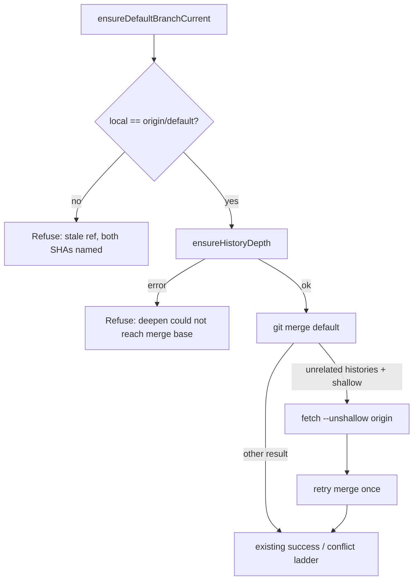

# PR Summary — Issue #2896: milestone sync no longer merges a stale default ref or gives up on shallow "unrelated histories"

Closes #2896

## Summary

`syncMilestoneBranchWithDefault()` (`worker/deno/lib/git_pull.ts`) ignored
two results:

- `ensureDefaultBranchCurrent()`, which always returns ok, even when its own
  `branch -f` / `reset --hard` was refused (for example because another
  worktree holds the branch, #394).
- `ensureHistoryDepth()`.

In a `--depth=1` clone the sync could therefore merge a stale local
`Develop`. It would then hit "refusing to merge unrelated histories" and
report that as a permanent non-conflict failure.

The sync now does three things differently:

1. It refuses loudly unless local `<default>` positively equals
   `origin/<default>`. Both short SHAs are named in the error.
2. It refuses loudly when the shallow deepen cannot reach the merge base.
3. It merges through a new `mergeWithUnshallowRetry()`
   (`worker/deno/lib/git_merge_unshallow_retry.ts`). When the merge is
   refused as unrelated histories in a shallow clone, it runs
   `git fetch --unshallow origin` and retries the merge once. On a full clone
   the refusal is returned unchanged, because there it is a genuinely
   unrelated history.

The stale-ref check is deliberately strict. A ref that cannot be moved now
fails the sync with a clear cause. Previously it silently merged the wrong
commit.

Out of scope, for a follow-up: `syncFeatureBranchWithDefault`,
`updatePrBranch` and `ensurePrMergeable` in `git_pull.ts` also ignore
`ensureHistoryDepth`.

## Evidence

- New real-git tests in
  `worker/deno/tests/milestone_sync_shallow_stale_default_test.ts`
  (4 tests, no mocks):
  - **T1 (regression):** a shallow clone, a milestone forked beyond the
    depth, and a local default held by another worktree, so it is stale. The
    test was RED on the unfixed code:
    `Values are not equal: a stale local default ref must not be merged in silently — Actual: true, Expected: false`.
    It is green after the fix, and origin's milestone branch is left
    untouched.
  - **T2:** a shallow clone whose merge base is beyond depth 1. The sync
    succeeds and the milestone contains the new default tip.
  - **T3:** a plain `git merge` first fails with unrelated histories. The
    helper then unshallows, and the retried merge succeeds.
  - **T4:** a genuinely unrelated (orphan) history on a full clone. The
    failure is returned as-is and no unshallow is attempted.
- Targeted runs:
  - 43 passed across the git_pull_conflict, milestone_default_tip,
    setup_repo_default_branch_cache, git_history and
    shallow_clone_feature_workflow tests.
  - 188 passed across every `milestone_sync_*` test plus selfheal, presync
    and sync_points.
- `./quality.sh`: **PASSED**. Only `config integration` was skipped, which is
  standard in the container.

## Acceptance Criteria

<!-- vibe-spec-review inputs="diff+issue-body" -->

- **met** — The sync does not merge a stale local ref when updating the
  default fails — evidence: `git_pull.ts` positive local/origin SHA check;
  test T1 — reviewer: met
- **met** — "Unrelated histories" in a shallow clone triggers an unshallow
  and a retry, not a permanent deferral — evidence:
  `mergeWithUnshallowRetry()`; tests T3 and T4 — reviewer: met
- **met** — There is a regression test covering a shallow clone, a stale
  local default and a merge base beyond the shallow depth — evidence: T1, T2
  and T3 — reviewer: met
- **partially met** — NEAT-AI-Snapshot `milestone/scan-20260910` syncs and
  its issues are no longer deferred — evidence: the mechanism is fixed and
  tested. This can only be confirmed on the live repo after the change is
  deployed — reviewer: partially met (needs a runtime check)

## Standards Review

<!-- vibe-standards-review inputs="diff+CODING-STANDARDS.md" -->

No material departures were found. The reviewer confirmed:

- The fail-loud checks replace the ignored results.
- The `Result` convention is used throughout.
- The tests use real git.
- The lib-sweep ledger entry and the `DESIGN-PRINCIPLES.md` update are in
  place.

## Test Plan

- [x] RED regression test (T1) on the unfixed code
- [x] Targeted unit tests: new file plus the 17 existing sync and shallow
      test files
- [x] `./quality.sh` passes
- [x] Docs: `DESIGN-PRINCIPLES.md` shallow-clone section and the
      `syncMilestoneBranchWithDefault` doc comment
- [ ] After deployment: check that the NEAT-AI-Snapshot milestone syncs
